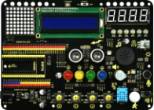
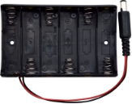
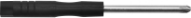
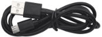
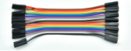
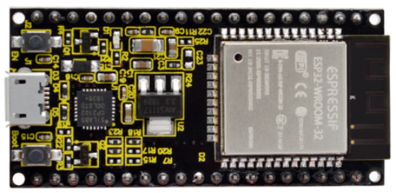
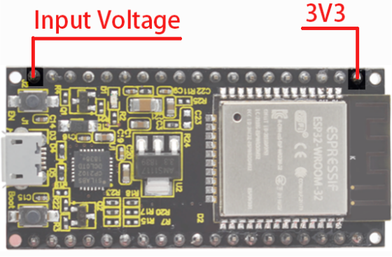
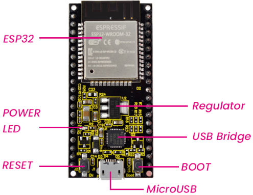
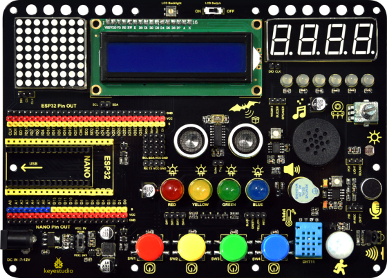

# 1. Introduzione al Prodotto

## 1.1 Descrizione

Questo kit didattico è uno strumento programmabile specializzato per bambini sopra i 6 anni, che vanta 15 moduli e sensori come LED, pulsanti, un LCD, un fotosensore, un sensore sonoro, un ricevitore IR, un sensore di temperatura e umidità oltre a più di 30 progetti interessanti.

È fornito il linguaggio Arduino C, che permette di sviluppare il pensiero di programmazione.

## 1.2 Caratteristiche

1. Cablaggio semplice: Il cablaggio di VCC e GND è nascosto

2. Funzioni multiple: Schede di sviluppo Nano o ESP32 sono disponibili come scheda di controllo e 15 sensori sono integrati. Quando l'alimentazione esterna è collegata, l'interruttore DIP può essere usato per controllare la tensione VCC a 3.3V o 5V.

3. Struttura semplice: Utilizza pilastri in rame a doppio passaggio da 6mm per collegare la scheda in acrilico.

4. Alta espandibilità: Sono forniti i pin VCC e GND

5. Apprendimento della programmazione: È disponibile il linguaggio Arduino C.

## 1.3 Parametri

- **Tensione di lavoro:** 5V o 3.3V  
- **Alimentazione DC:** 7-12V  

- **Alimentazione USB:** 5V  
- **Corrente di lavoro:** ≥35mA  

- **Temperatura di lavoro:** –10°C ~ +65°C  

## 1.4 Lista del Kit

| No.  | Componenti                                  | QTY  | Immagine                              |
| ---- | ------------------------------------------- | ---- | ------------------------------------ |
| 1    | Keyestudio Circuit Integrated board         | 1    |  |
| 2    | Keyestudio ESP32 Board                      | 1    |  |
| 3    | Portabatterie 3XAA (batterie non incluse)  | 1    |  |
| 4    | Servo                                       | 1    |  |
| 5    | Cacciavite a taglio                         | 1    |  |
| 6    | Cacciavite a croce                          | 1    |  |
| 7    | Telecomando IR                              | 1    |  |
| 8    | Cavo USB                                    | 1    |  |
| 9    | Vite testa tonda M2.5*6MM                   | 22   |  |
| 10   | Pilastro in rame a doppio passaggio M2.5*9MM | 10   |  |
| 11   | Fili DuPont F-F 20CM                        | 20   |  |
| 12   | Fili DuPont F-F 10CM                        | 20   |  |
| 13   | Scheda in acrilico                          | 1    |  |
| 14   | Gommini                                    | 4    |  |
| 15   | Cappuccio per potenziometro                 | 1    |  |
| 16   | Cappuccio pulsante rosso                    | 1    |  |
| 17   | Cappuccio pulsante verde                    | 1    |  |
| 18   | Cappuccio pulsante giallo                   | 1    |  |
| 19   | Cappuccio pulsante blu                      | 1    |  |

## 1.5 Scheda di Controllo ESP32

**Introduzione**

La scheda Core Keyestudio ESP32 è una scheda di sviluppo Mini basata sul modulo ESP-WROOM-32. La scheda ha portato la maggior parte delle porte I/O a header a pin con passo 2.54mm. Questi forniscono un modo semplice per collegare periferiche secondo le proprie esigenze.

Quando si tratta di sviluppare e fare il debug con la scheda di sviluppo, gli header standard su entrambi i lati rendono l'operazione più semplice e pratica.

Il modulo ESP-WROOM-32 è la soluzione integrata leader nel settore per WiFi + Bluetooth con meno di 10 componenti esterni. Integra switch per antenna, RF balun, amplificatori di potenza, amplificatori a basso rumore, filtri e moduli di gestione dell'alimentazione. Allo stesso tempo, integra la tecnologia a basso consumo TSMC a 40nm, prestazioni di potenza e RF, rendendolo sicuro, affidabile e facile da espandere in varie applicazioni.

**Specifiche**

- Microcontrollore: Modulo ESP-WROOM-32

- Chip porta seriale USB: CP2102-GMR

- Tensione di lavoro: DC 5V

- Corrente di lavoro：80mA

- Corrente di alimentazione：500mA

- Intervallo di temperatura di lavoro : -40°C ~ +85°C 

- Modalità WiFi：Station/SoftAP/SoftAP+Station/P2P

- Protocollo WiFi ：802.11 b/g/n/e/i（802.11n, velocità fino a 150 Mbps）

- Gamma di frequenza WiFi：2.4 GHz ~ 2.5 GHz

- Protocollo Bluetooth ：conforme a Bluetooth v4.2 BR/EDR e BLE Standard

- Dimensioni：55*26*13mm

- Peso：9.3g

**Pin out**

ESP32 ha meno pin rispetto ai processori comunemente usati, ma non ha problemi a riutilizzare più funzioni sui pin.

**Avvertenza**: Il livello di tensione dei pin dell'ESP32 è 3.3V. Se si desidera collegare l'ESP32 a un altro dispositivo con tensione di funzionamento di 5V, si dovrebbe usare un convertitore di livello per adattare il livello di tensione.

- **Pin di alimentazione:** Il modulo ha due pin di alimentazione +5V e 3.3V. Puoi usare questi due pin per alimentare altri dispositivi e moduli.

- **Pin GND**：Il modulo ha tre pin di massa.  
- **Pin Enable (EN) :** Questo pin serve per abilitare e disabilitare i moduli. Il pin abilita il modulo a livello alto e lo disabilita a livello basso.  
- **Pin Input/Output (GPIO) :** Puoi usare 32 pin GPIO per comunicare con LED, interruttori e altri dispositivi di input/output. Puoi anche attivare internamente il pull-up o pull-down di questi pin.  
- **Nota:** Anche se i pin GPIO6 a GPIO11 (SCK/CLK, SDO/SD0, SDI/SD1, SHD/SD2, SWP/SD3 e SCS/CMD) sono usati per la comunicazione SPI del modulo interno, non sono raccomandati.  

- **ADC:** Puoi usare i 16 pin ADC su questo modulo per convertire tensioni analogiche (l'uscita di alcuni sensori) in tensioni digitali. Alcuni di questi convertitori sono collegati ad amplificatori interni e sono in grado di misurare piccole tensioni con alta precisione.  
- **DAC:** Il modulo ESP32 ha due convertitori D/A con precisione a 8 bit.

- **Touch pad:** Ci sono 10 pin sul modulo ESP32 sensibili alle variazioni di capacità. Puoi collegare questi pin a determinate piazzole del PCB e usarli come interruttori touch.  
- **SPI:** Ci sono due interfacce SPI sul modulo, che possono essere usate per collegare display, moduli di memoria SD/microSD e memoria flash esterna.  
- **I2C:** I pin SDA e SCL sono usati per la comunicazione I2C.  
- **Comunicazione seriale (UART) :** Ci sono due interfacce seriali UART su questo modulo, che possono trasferire fino a 5Mbps di informazioni tra due dispositivi. UART0 ha anche funzioni di controllo CTS e RTS.  
- **PWM:** Quasi tutti i pin di input/output dell'ESP32 possono essere usati per PWM (modulazione di larghezza di impulso). Usando questi pin è possibile controllare motori, luci LED e colori.

## 1.6 Componenti

## 1.7 Scheda Integrata ESP32

Questa scheda di espansione è compatibile con la scheda di sviluppo Keyestudio Nano Plus e la scheda di sviluppo Keyestudio ESP32. La tensione su VCC può essere impostata a 3.3V (ESP32) o 5V (Nano) tramite un interruttore DIP.

Integra quattro pulsanti, quattro LED (rosso, giallo, verde e blu), sei LED RGB WS2812, un buzzer, un sensore di movimento PIR, un ricevitore IR, un sensore sonoro, un fotoresistore, un amplificatore 8002, un potenziometro, un sensore ad ultrasuoni, un display a tubo digitale a 4 bit, un display a matrice di punti 8x8 e un display LCD 1602.

Inoltre, ogni pin possiede il proprio VCC e GND, il che conferisce una maggiore compatibilità alla scheda e offre più opportunità per l'apprendimento esteso di altri moduli.

**Introduzione ai moduli**

**Pin out**

