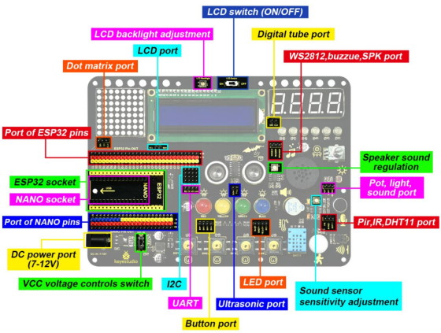

# 1. Product Introduction

## 1.1 Description

This learning kit is a programmable tool specialized for kids above 6, which boasts 15 modules and sensors such as LEDs, buttons, a LCD, a photosensor, a sound sensor, an IR receiver, a temperature and humidity sensor as well as 30+ interesting projects.

Arduino C language is provided, which empower to cultivate programming thinking.

## 1.2 Features

1. Easy wiring: The wiring of VCC and GND are hidden

2. Multiple functions: Nano or ESP32 development board are available as the control board and 15 sensors are integrated. When the external power supply is connected, the DIP switch can be used to control the VCC voltage to 3.3V or 5V.

3. Simple structure: Use 6mm dual-pass copper pillars to connect the acrylic board.

4. High expansibility: VCC and GNG pins are provided

5. Programming learning: Arduino C language is available.

## 1.3 Parameters

- **Working voltage:** 5V or 3.3V
- **DC power:** 7-12V

- **USB power:**  5V
- **Working current:** ≥35mA

- **Working temperature:** –10°C ~ +65°C

## 1.4 Kit List

| No.  | Components                                  | QTY  | Picture                                |
| ---- | ------------------------------------------- | ---- | -------------------------------------- |
| 1    | Keyestudio Circuit Integrated board         | 1    |  |
| 2    | Keyestudio ESP32 Board                      | 1    |  |
| 3    | 3XAA Battery Holder(batteries not included) | 1    |  |
| 4    | Servo                                       | 1    |  |
| 5    | Slotted Screwdriver                         | 1    |  |
| 6    | Phillips Screwdriver                        | 1    |  |
| 7    | IR Remote Control                           | 1    |  |
| 8    | USB Cable                                   | 1    |  |
| 9    | M2.5*6MM Round Head Screw                   | 22   |  |
| 10   | M2.5*9MM Dual-pass Copper Pillar            | 10   |  |
| 11   | 20CM F-F DuPont Wires                       | 20   |  |
| 12   | 10CM F-F DuPont Wires                       | 20   |  |
| 13   | Acrylic Board                               | 1    |  |
| 14   | Rubber Pad                                  | 4    |  |
| 15   | Potentiometer Cap                           | 1    |  |
| 16   | Red Button Cap                              | 1    |  |
| 17   | Green Button Cap                            | 1    |  |
| 18   | Yellow Button Cap                           | 1    |  |
| 19   | Blue Button Cap                             | 1    |  |

## 1.5 ESP32 Control Board

**Introduction**

Keyestudio ESP32 Core board is a Mini development board based on the ESP-WROOM-32 module. The board has brought out most I/O ports to pin headers of 2.54mm pitch. These provide an easy way of connecting peripherals according to your own needs.

 When it comes to developing and debugging with the development board, the both side standard pin headers can make your operation more simple and handy.

 The ESP-WROOM-32 module is the industry's leading integrated WiFi + Bluetooth solution with less than 10 external components. It integrates antenna switches, RF balun, power amplifiers, low noise amplifiers, filters as well as power management modules. At the same time, it also integrates TSMC's low-power 40nm technology, power performance and RF performance, making it safe, reliable and easy to expand to a variety of applications. 

**Specifications**

- Microcontroller: ESP-WROOM-32 Module

- USB-serial port chip: CP2102-GMR

- Working voltage: DC 5V

- Working current：80mA

- Current supply：500mA

- Working temperature range : -40°C ~ +85°C 

- WiFi mode：Station/SoftAP/SoftAP+Station/P2P

- WiFi protocol ：802.11 b/g/n/e/i（802.11n，speed up to 150 Mbps）

- WiFi frequency range：2.4 GHz ~ 2.5 GHz

- Bluetooth protocol ：conform to Bluetooth v4.2 BR/EDR and BLE Standard

- Dimensions：55*26*13mm

- Weight：9.3g

**Pin out**

ESP32 has fewer pins than commonly used processors, but it doesn't have any problems reusing multiple functions on pins. 

**Warning**: The pin voltage level of the ESP32 is 3.3V. If you want to connect the ESP32 to another device with an operating voltage of 5V, you should use a level converter to convert the voltage level. 

- **Power Pins:** The module has two power pins +5V and 3.3V. You can use these two pins to power other devices and modules. 

- **GND Pins**：The module has three grounded pins.
- **Enable pin (EN) :** This pin is used to enable and disable modules. The pin enables module at high level and disables module at low level.  
- **Input/Output pins (GPIO) :** You can use 32 GPIO pins to communicate with LEDs, switches and other input/output devices. You can also pull these pins up or down internally.  
- **Note:** Though GPIO6 to GPIO11 pins (SCK/CLK, SDO/SD0, SDI/SD1, SHD/SD2, SWP/SD3 and SCS/CMD pins) are used for SPI communication for the internal  module, which are not recommended.  

- **ADC:** You can use the 16 ADC pins on this module to convert analog voltages (the output of some sensors) into digital voltages. Some of these converters are connected to internal amplifiers and which are capable of measuring small voltages with high accuracy.
-  **DAC:** ESP32 module has two A/D converters with 8-bit precision.

- **Touch pad:** There are 10 pins on the ESP32 module that are sensitive to capacitance changes. You can attach these pins to certain PCB’s pads and use them as touch switches.  
- **SPI:** There are two SPI interfaces on the module, which can be used to connect the display screen, SD/microSD memory card module as well as external flash memory.  
- **I2C:** SDA and SCL pins are used for I2C communication.  
- **Serial Communication (UART) :** There are two UART serial interfaces on this module, which can be used to transfer up to 5Mbps of information between two devices . The UART0 also has CTS and RTS control functions. 
- **PWM:** Almost all ESP32 input/output pins can be used for PWM (pulse-width modulation). Using these pins can control motors, LED lights and colors.  

## 1.6 Components

## 1.7 ESP32 Integrated Board

This expansion board is compatible with the Keyestudio Nano Plus development board and Keyestudio ESP32 development board. The voltage on VCC can be set to 3.3V (ESP32) or 5V(Nano) via a DIP switch.

It integrates four buttons, four LEDs(red, yellow, green and blue), six WS2812 RGB LEDs, a buzzer, a PIR motion sensor, an IR receiver, a sound sensor, a photoresistor, a 8002 amplifier, a potentiometer, an ultrasonic sensor, a 4-bit digital tube display, a 8x8 dot matrix display and a LCD 1602 display. 

What's more, each pin possesses its own VCC and GND, which brings a higher compatibility to the board and provides more opportunities for extended learning of other modules. 

**Modules  Introduction**

**Pin out**

