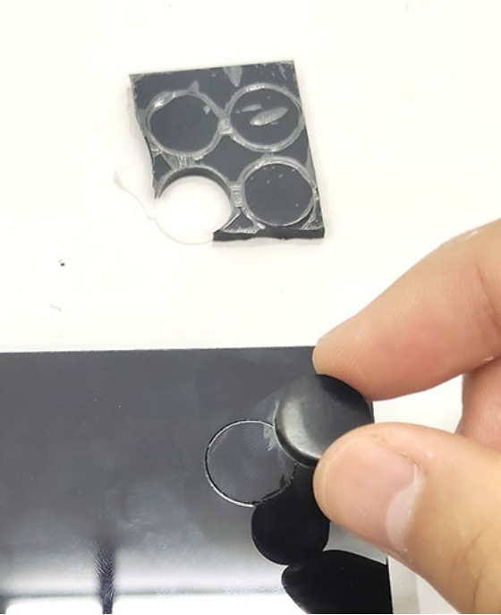
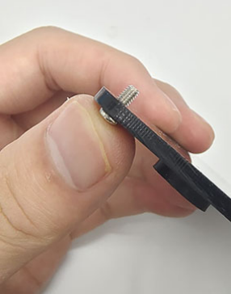
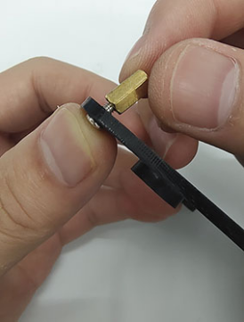
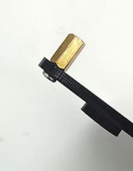
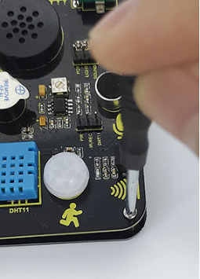
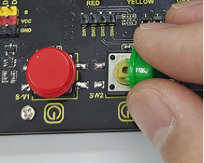
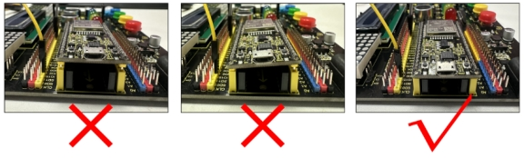
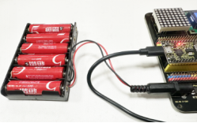

# 2. Product installation

Step 1: Remove the protective film from the acrylic board. 

Step 2: Stick the four rubber pads in the positioning circle under the acrylic board. 

Step 3: Push the screws one by one through the holes from the bottom of the acrylic board (the side with rubber pad), and then screw copper pillars onto them, as shown below.

Step 4: Align the holes on the expansion board with copper pillars. Do note whether the middle two holes are aligned. If not, rotate the board to 180°. After adjustment, tighten the board with screws in place.

Step 5: Install the button caps and potentiometer caps. 

Step 6: Install the ESP32 board. 

Pay attention:

1.The USB port of the board faces outwards. Installing it in the opposite direction may burn the board.

2.The EPS32 board needs to be fully inserted into the EPS32 port of the integrated board to ensure a stable connection between the EPS32 interface board and the integrated board, otherwise the kit may not work properly.

3.This kit consumes more power when driving the servo and connecting to WiFi. Please provide an external power supply for this kit.

