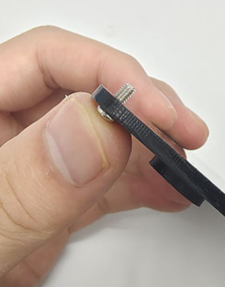
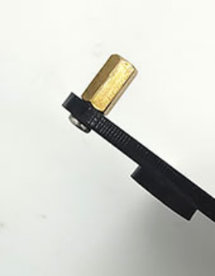

# 2. Produktinstallation

Schritt 1: Entfernen Sie die Schutzfolie von der Acrylplatte.

Schritt 2: Kleben Sie die vier Gummipads im Positionierungskreis unter die Acrylplatte.

Schritt 3: Schieben Sie die Schrauben nacheinander von unten durch die Löcher der Acrylplatte (die Seite mit dem Gummipad) und schrauben Sie dann die Kupfersäulen darauf, wie unten gezeigt.

Schritt 4: Richten Sie die Löcher auf der Erweiterungsplatine an den Kupfersäulen aus. Achten Sie darauf, ob die beiden mittleren Löcher ausgerichtet sind. Falls nicht, drehen Sie die Platine um 180°. Nach der Anpassung ziehen Sie die Platine mit Schrauben fest.

Schritt 5: Installieren Sie die Tastenabdeckungen und Potentiometerkappen.

Schritt 6: Installieren Sie das ESP32-Board.

Beachten Sie:

1. Der USB-Anschluss des Boards zeigt nach außen. Eine Installation in entgegengesetzter Richtung kann das Board beschädigen.

2. Das ESP32-Board muss vollständig in den ESP32-Anschluss der integrierten Platine eingesteckt werden, um eine stabile Verbindung zwischen dem ESP32-Interface-Board und der integrierten Platine zu gewährleisten, andernfalls funktioniert das Kit möglicherweise nicht richtig.

3. Dieses Kit verbraucht mehr Strom beim Ansteuern des Servos und bei der Verbindung mit WiFi. Bitte stellen Sie eine externe Stromversorgung für dieses Kit bereit.

