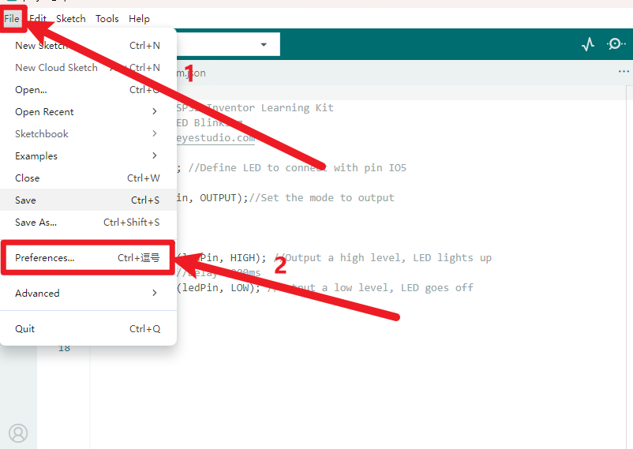
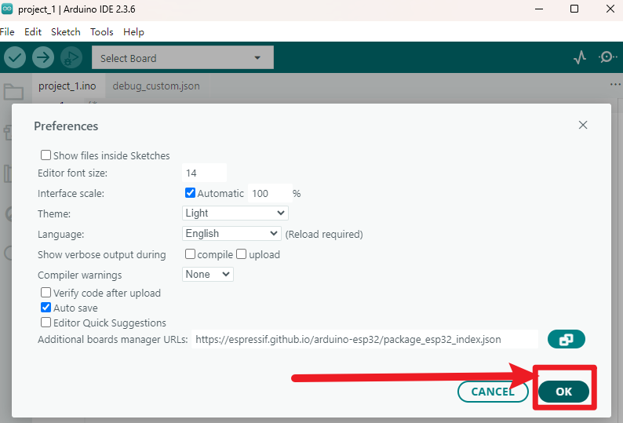
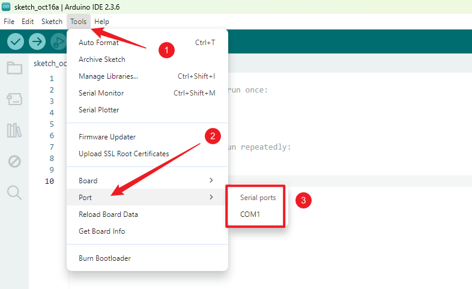
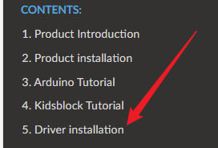

# 3.2 ソフトウェアのダウンロード

コントロールボードを入手したら、まずArduino IDEとドライバーをダウンロードする必要があります。

Arduino IDEは公式サイトからダウンロードできます：<https://www.arduino.cc/en/software>。

Arduinoには様々なバージョンがありますので、ご自身のシステムに適したバージョンをダウンロードしてください。ここではWINDOWSシステムを例に、ダウンロードとインストール方法を説明します。

「JUST DOWNLOAD」をクリックし、ダウンロードしたファイルをクリックしてインストールしてください。

ZIPファイルをダウンロードした場合は、直接解凍して起動できます。

### ESP32環境のインストールと設定

1. 「ファイル」をクリックし、「環境設定」を選択します。  

2. 「」をクリックし、ESP32開発ボードのリンク `https://espressif.github.io/arduino-esp32/package_esp32_index.json` をテキストボックスにコピー＆ペーストし、「**OK**」をクリックします。  

3. 再度「OK」をクリックします。  

4. 左側の小さな開発ボードアイコンをクリックして、開発ボードのオプションを開きます。  

5. 開発ボードの検索ボックスに「ESP32」と入力し、バージョン「2.0.6」を選択してインストールをクリックします。  

**注意：開発ボードのインストール進行状況は右下に表示されます。インストール完了まで数分お待ちください。インストール中はネットワークを安定させてください。インストールに失敗した場合は、上記の手順を繰り返して再インストールしてください。**

### ライブラリの追加

ライブラリは、センサーやディスプレイ、モジュールなどへの接続を簡単にするコードの集合体です。

インターネット上には数百もの追加ライブラリがダウンロード可能です。

ここでは最も簡単なライブラリの追加方法をご紹介します。

最初にダウンロードした素材の中にある「Libraries」フォルダを探し、そのパスを控えておいてください。これは非常に重要です。

この方法では一度に1つのライブラリファイルしかインポートできないため、すべてのライブラリファイルをインポートするにはこの作業を繰り返す必要があります。（ここではAsyncTCP.zipライブラリファイルのインポートのみを例示していますが、後のレッスンで忘れないようにこの段階で全てのライブラリをインポートすることを推奨します。）

### ドライバーの確認

ここでは、ドライバーがパソコンにインストールされているかどうかを確認します。

1. ESP32開発ボードをパソコンに接続せずに、以下のようにポートを開きます。利用可能なポートの選択肢を確認してください。図のようにCOM1のみが表示されています。  

2. 開いていた画面を閉じてプログラミング画面に戻り、ESP32開発ボードをパソコンに接続してから再度ポートを開き、新しいポートが表示されるか確認します。下図のようにCOM6が表示されます。  

3. この時点でCOM6がESP32開発ボードのポートであることが確認でき、ドライバーが自動的にインストールされていることがわかります。

4. マザーボードに接続しても新しいポートが表示されない場合は、データケーブルを交換し、パソコンの別のUSBポートを試してください。問題が解決しない場合は、「**ドライバーのインストール**」セクションを参照してドライバーをインストールしてください。  

### ソフトウェア設定の確認

これでソフトウェアの設定はすべて完了しました。ESP32開発ボードをパソコンに接続し、環境が正しく動作しているか確認しましょう。

注意：デフォルトのコードをそのままアップロードするだけで構いません。アップロードが成功すれば、環境設定が正しく行われていることが確認できます。アニメーションGIFで示した通りです。