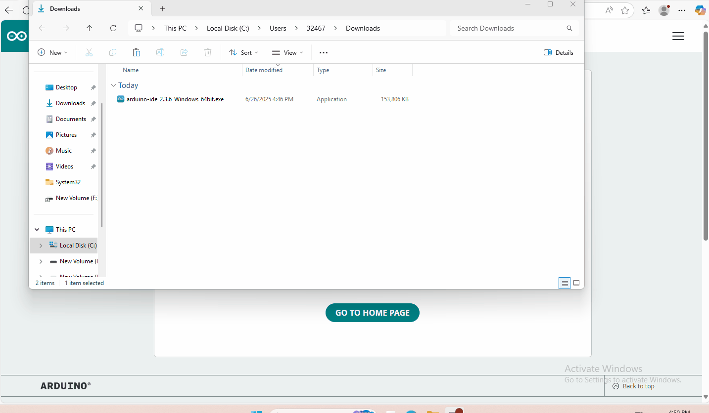
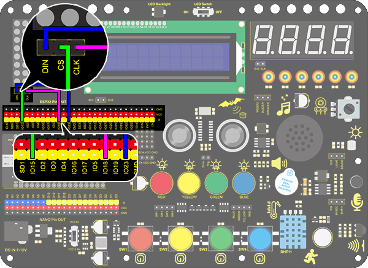

# 3. Arduino Tutorial

## 3.1 Data download

Please note: The library files and code used by Arduino are available for download only at this location. No further download options will be provided thereafter.

Data download:[Arduino Data](./Arduino.7z)

## 3.2 Software Download

When we get control board, we need to download Arduino IDE and driver firstly. 

You could download Arduino IDE from the official website:<https://www.arduino.cc/en/software>.

There are various versions for Arduino,just download a suitable version for your system,we will take WINDOWS system as an example to show you how to download and install.


You just need to click JUSTDOWNLOAD,then click the downloaded file to install it.

And when the ZIP file is downloaded,you can directly unzip and start it.



### Installation and configuration of ESP32 environment

1. Click "File" and select "Preferences".

   

2. Click“ ”，Copy and paste the ESP32 development board link: `https://espressif.github.io/arduino-esp32/package_esp32_index.json` into the text box, then click '**OK**'.

   

3. Click 'OK' again.

   

4. Click the small development board icon on the left to open the development board options.


5. In the development board search box, search for "ESP32", select version "2.0.6", and click install.


**Note: You can see the installation progress of the development board in the lower right corner. Please wait a few minutes for the installation to complete. During the installation, keep your network stable. If the installation fails, repeat the above steps and reinstall the development board.**


### Add Library

Libraries are a collection of code that makes it easy for you to connect to a sensor,display, module, etc.  

There are hundreds of additional libraries available on the Internet for download. 

 We will introduce the most simple way for you to add libraries . 

Locate the “Libraries” folder within the materials downloaded at the outset, and note its path on your computer; this is of paramount importance.


This method can only import one library file at a time, so we need to repeat the process to import all library files. (Here we demonstrate importing only the AsyncTCP.zip library file; it is advisable to import all libraries at this stage to avoid forgetting in subsequent lessons.)


### Driver Check

Here we need to verify whether the drivers are installed on the computer.

1. Without connecting the ESP32 development board to the computer, open the port as shown below. Note the available port options; as illustrated, only COM1 is present.


2. Close the previously opened path and return to the programming interface. Connect the ESP32 development board to the computer, then reopen the port to check for new port options. As shown below, COM6 now appears.


3. At this point, COM6 is the port for the ESP32 development board, confirming that the drivers have been automatically installed.
3. If no new ports appear after connecting to the motherboard, please replace the data cable and try a different USB port on the computer. Should the issue persist, refer to the '**Driver installation**' section to install the driver.


### Software Configuration Check

At this point, we have completed all software configurations. Now connect the ESP32 development board to the computer and verify that the environment is functioning correctly.


Note: We can simply upload the default code directly. Successful upload confirms our environment configuration is working correctly, as demonstrated in the animated gif.

## 3.3 Arduino Project(1-17)

### Project 1 LED Blinking

**1.Description**

LED blinking is a simple project designed for starters. You only need to install an LED on Arduino board and upload the code on Arduino IDE. This project reinforces the lear ning of Arduino conceptual framework and using methods for starters. 

**2. Working Principle**


- **LED:** The above is the circuit diagram of LED. Generally speaking, limited IO ports of output current may cause low brightness of LED, so a NPN triode (Q2) is applied in circuit as a switch. In this case, the LED will light up if the base(pin 1) of triode is at a high level. On the contrary, LED goes off when the base is at low. 

- **Triode switch:** To have a clear idea of its principle, certain knowledge of electronic circuit is required. For details, please consult materials by yourself. Briefly, LED on and off rely on the high and low levels of triode base, which are decided by the pin on the development board. LED lights up when the base(pin 1) is at a high level, and it goes off when the base is at low.

**3.Wiring Diagram：**


**4.Upload Code**

```
/*
  keyestudio ESP32 Inventor Learning Kit
  Project 1: LED Blinking
  http://www.keyestudio.com
*/
int ledPin = 5; //Define LED to connect with pin IO5
void setup() 
{
  pinMode(ledPin, OUTPUT);//Set the mode to output
}

void loop() 
{
  digitalWrite(ledPin, HIGH); //Output a high level, LED lights up
  delay(1000);//Delay 1000ms 
  digitalWrite(ledPin, LOW); //Output a low level, LED goes off
  delay(1000);
}
```

**5.Test Result**

After uploading the code and powering on, LED will light up for 1s and off for 1 s.

### Project 2 Breathing LED

**1.Description**

Arduino breathing led utilizes on-board programmable PWM to output analog waveform. After powering on, LED brightness can be adjusted through duty cycle of the waveform to eventually realize the effect of breathing led. 

In this way, ambient light can be simulated by changing LED brightness over time. Also, breathing led can form a colorful mini light to construct a tranquil and warm environment.

**2. What is PWM?**

PWM controls analog output via digital means, which is able to adjust duty cycle of the wave (a signal circularly shifting between high level and low level).

For Arduino, digital ports of voltage output are LOW and HIGH, which respectively correspond to 0V and 5V. Generally, we define LOW as 0 and HIGH as 1. Arduino will output 500 signals of 0 or 1 within 1s. If they are "1", 5V will be output. Oppositely, if they are all 0, the output will be 0V. Or if they are 010101010101..., the average output will be 2.5V. 

In other words, output ratio of 0 and 1 affects the voltage value, the more 0 and 1 signals are output per unit time, the more accurate the control will be. 

The GPIO34, 35, 36, and 39 of ESP32 cannot use PWM.


**3. Wiring Diagram**


**4.Test Code**

```
/*
  keyestudio ESP32 Inventor Learning Kit 
  Project 2: Breathing LED
  http://www.keyestudio.com
*/
#define PIN_LED   5   //define the led pin
#define CHN       0   //define the pwm channel
#define FRQ       1000  //define the pwm frequency
#define PWM_BIT   8     //define the pwm precision

void setup() 
{
  ledcSetup(CHN, FRQ, PWM_BIT); //setup pwm channel
  ledcAttachPin(PIN_LED, CHN);  //attach the led pin to pwm channel
}

void loop() 
{
  for (int i = 0; i < 255; i++) //make light fade in
  { 
    ledcWrite(CHN, i);
    delay(10);
  }
  for (int i = 255; i > -1; i--) //make light fade out
  {  
    ledcWrite(CHN, i);
    delay(10);
  }
}
```

**5.Test Result**

After uploading the code, we will see the LED slowly brighten and dim, just like the rhythm of breathing.

### Project 3 SOS Distress Device

**1. Description**

Arduino SOS device is able to emit distress signals, which coincides with the principle of Morse code. It is convenient for emergencies.

**2. Wiring Diagram**


**3. Test Code**

```
/*
  keyestudio ESP32 Inventor Learning Kit 
  Project 3：SOS Distress Device
  http://www.keyestudio.com
*/
int ledPin = 5;  //Define pin as IO5
 
void setup() 
{
	pinMode(ledPin, OUTPUT);
}
 
void loop() 
{
    //Three quickly blinks mean “S”
    for(int x=0;x<3;x++)
    {
        digitalWrite(ledPin,HIGH);            //Set LED to light up 
        delay(150);                           //Delay 150ms 
        digitalWrite(ledPin,LOW);             //Set LED to turn off 
        delay(100);                           //Delay 100ms 
	}
    delay(200);//delay 200ms to generate the space between letters
 
    //Three slowly blinks mean “O”
    for(int x=0;x<3;x++)
    {
        digitalWrite(ledPin,HIGH);            //Set LED to light up
        delay(400);                           //Delay 400ms
        digitalWrite(ledPin,LOW);             //Set LED to turn off
        delay(200);                           //Delay 200ms
    }
	delay(100);//Delay 100ms to generate the space between letters
 
    // Three quickly blinks mean “S”
    for(int x=0;x<3;x++)
    {
        digitalWrite(ledPin,HIGH);            //Set LED to light up
        delay(150);                           //Delay 150ms
        digitalWrite(ledPin,LOW);             //Set LED to turn off 
        delay(100);                           //Delay 100ms
    } 
	delay(5000);// Wait 5s before repeating S.0.S
}
```

**4. Test Result**

After the code is successfully uploaded, we can see that the LED flashes 3 times quickly, then flashes 3 times slowly and then flashes 3 times quickly, alternating between fast and slow.

### Project 4 Traffic Light

**1. Description**

The traffic light module is a device used to control the route of pedestrians and vehicles. It includes a red, a yellow and a green light, which implies different instructions.

**Red for Stop:** Pedestrians and vehicles stop proceeding.

**Yellow for Caution:** Pedestrians and vehicles are ready for stopping. If the drive is already in process, the speed should be slow. 

**Green for Proceed:** Pedestrians and vehicles keep going with the abidance of traffic regulations. 

In this project, you can use Arduino to write code to control traffic lights. For instance, set the duration of each lights and the interval time among them. Besides, you may also add a timer to alter light colors to schedule. 

**2. Wiring Diagram**


**3. Test Code**

```
/*
  keyestudio ESP32 Inventor Learning Kit 
  Project 4 Traffic Light
  http://www.keyestudio.com
*/
int greenPin = 27;   //Green LED connects to IO27
int yellowPin = 26; //Yellow LED connects to IO26
int redPin = 25;   //Red LED connects to IO25

void setup() 
{
  //Set all LED interfaces to output mode
  pinMode(greenPin, OUTPUT);
  pinMode(yellowPin, OUTPUT);
  pinMode(redPin, OUTPUT);
}

void loop() 
{
  digitalWrite(greenPin, HIGH); //Light green LED up 
  delay(5000);  //Delay 5s
  digitalWrite(greenPin, LOW); //Turn green LED off 
  for (int i = 1; i <= 3; i++) //Execute for 3 times
  {  
    digitalWrite(yellowPin, HIGH); //Light yellow LED up
    delay(500); //Delay 0.5s
    digitalWrite(yellowPin, LOW); // Turn yellow LED off
    delay(500); //Delay 0.5s
  }
  digitalWrite(redPin, HIGH); //Light red LED up 
  delay(5000);  //Delay 5s 
  digitalWrite(redPin, LOW); //Turn red LED off 

}
```

**4. Test Result**

After uploading the code, green LED will light up for 5s, yellow LED will blink for 3 times, and red LED will light up for 5s, in circulation. 

### Project 5 Rainbow Ambient Light

**1. Description**

Arduino 2812RGB LED is a programable colorful dreamy light, whose color, brightness and rhythm are adjustable. This rainbow ambient light can be used as a dynamic decoration at will. Or you may control it to "dance with music". Importantly, it can be improved as an alarm. Its built-in sensor detects the ambient surroundings to warn users by changing its color, brightness and rhythm.

**2. Working Principle**


The data protocol adopts communication mode of single-line return-to-zero code. After the pixel is reset on power, DIN terminal receives data from the controller. The firstly arriving 24bit data will be extracted by the first pixel and be sent to the inner data register. 

Remaining data will be amplified by an amplification circuit and be transmitted through DOUT port to the next cascaded pixel. Being transmitted through pixels, the signal decreases 24bit each time. 

Besides, The pixel adopts automatic shaping and forwarding technology, insomuch that the cascade number of the pixel is only limited by the signal transmission speed.

**3. Wiring Diagram**


**4. Test Code**

```
/*
  keyestudio ESP32 Inventor Learning Kit 
  Project 5.1  Rainbow Ambient Light
  http://www.keyestudio.com
*/
//Add 2812RGB library file
#include <NeoPixel_ESP32.h>
#define PIN 15

Adafruit_NeoPixel strip = Adafruit_NeoPixel(6, PIN);  //Defines the instance strip and assigns the RGB LED number pins to the library code

void setup() 
{
  strip.begin();        //Activate RGB LED
  strip.show(); // Refresh the display
}

void loop() 
{
  strip.setPixelColor(0, strip.Color(255, 0, 0));       //The frist RGB LED is red 
  strip.setPixelColor(1, strip.Color(0, 255, 0));       //The second RGB LED is green  
  strip.setPixelColor(2, strip.Color(0, 0, 255));       //The third RGB LED is blue 
  strip.setPixelColor(3, strip.Color(255, 255, 0));     //The fourth RGB LED is yellow 
  strip.setPixelColor(4, strip.Color(255, 0, 255));     //The fifth RGB LED is purple 
  strip.setPixelColor(5, strip.Color(255, 255, 255));   //The sixth RGB LED is white 
  strip.show();       //Refresh the display
  delay(100);         //Give a delay to save the stability of the display
}
```

**5. Test Result**

After uploading the code and powering on, the LED will light up in different colors.

From left to right：

- The first RGB LED is red 
- The second RGB LED is green  
- The third RGB LED is blue 
- The fourth RGB LED is yellow 
- The fifth RGB LED is purple 
- The sixth RGB LED is white 


**6. Extended Code**

```
/*
  keyestudio ESP32 Inventor Learning Kit  
  Project 5.2  Rainbow Ambient Light
  http://www.keyestudio.com
*/
//Add 2812RGB library file
#include <NeoPixel_ESP32.h>
#define PIN 15
Adafruit_NeoPixel strip = Adafruit_NeoPixel(6, PIN, NEO_GRB + NEO_KHZ800);

void setup() 
{
  strip.begin();
  strip.show(); // Initialize all pixels to 'off'
}

void loop() 
{
  // Some example procedures showing how to display to the pixels:
  colorWipe(strip.Color(255, 0, 0), 50); // Red
  colorWipe(strip.Color(0, 255, 0), 50); // Green
  colorWipe(strip.Color(0, 0, 255), 50); // Blue
  // Send a theater pixel chase in...
  theaterChase(strip.Color(127, 127, 127), 50); // White
  theaterChase(strip.Color(127,   0,   0), 50); // Red
  theaterChase(strip.Color(  0,   0, 127), 50); // Blue

  rainbow(20);
  rainbowCycle(20);
  theaterChaseRainbow(50);
}

// Fill the dots one after the other with a color
void colorWipe(uint32_t c, uint8_t wait) 
{
  for(uint16_t i=0; i<strip.numPixels(); i++) 
  {
      strip.setPixelColor(i, c);
      strip.show();
      delay(wait);
  }
}

void rainbow(uint8_t wait) 
{
  uint16_t i, j;

  for(j=0; j<256; j++) 
  {
    for(i=0; i<strip.numPixels(); i++) 
    {
      strip.setPixelColor(i, Wheel((i+j) & 255));
    }
    strip.show();
    delay(wait);
  }
}

// Slightly different, this makes the rainbow equally distributed throughout
void rainbowCycle(uint8_t wait) 
{
  uint16_t i, j;
  for(j=0; j<256*5; j++) // 5 cycles of all colors on wheel
  { 
    for(i=0; i< strip.numPixels(); i++) 
    {
      strip.setPixelColor(i, Wheel(((i * 256 / strip.numPixels()) + j) & 255));
    }
    strip.show();
    delay(wait);
  }
}

//Theatre-style crawling lights.
void theaterChase(uint32_t c, uint8_t wait) 
{
  for (int j=0; j<10; j++) //do 10 cycles of chasing
  {  
    for (int q=0; q < 3; q++) 
    {
      for (int i=0; i < strip.numPixels(); i=i+3) 
      {
        strip.setPixelColor(i+q, c);    //turn every third pixel on
      }
      strip.show();
      delay(wait);
      for (int i=0; i < strip.numPixels(); i=i+3) 
      {
        strip.setPixelColor(i+q, 0);        //turn every third pixel off
      }
    }
  }
}

//Theatre-style crawling lights with rainbow effect
void theaterChaseRainbow(uint8_t wait) 
{
  for (int j=0; j < 256; j++) // cycle all 256 colors in the wheel
  {     
    for (int q=0; q < 3; q++) 
    {
        for (int i=0; i < strip.numPixels(); i=i+3) 
        {
          strip.setPixelColor(i+q, Wheel( (i+j) % 255));    //turn every third pixel on
        }
        strip.show();
        delay(wait);
        for (int i=0; i < strip.numPixels(); i=i+3) 
        {
          strip.setPixelColor(i+q, 0);        //turn every third pixel off
        }
    }
  }
}

// Input a value 0 to 255 to get a color value.
// The colours are a transition r - g - b - back to r.
uint32_t Wheel(byte WheelPos) 
{
  if(WheelPos < 85) 
  {
  	return strip.Color(WheelPos * 3, 255 - WheelPos * 3, 0);
  } 
  else if(WheelPos < 170) 
  {
      WheelPos -= 85;
      return strip.Color(255 - WheelPos * 3, 0, WheelPos * 3);
  } 
  else 
  {
      WheelPos -= 170;
      return strip.Color(0, WheelPos * 3, 255 - WheelPos * 3);
  }
}
```

**7. Test Result**

After uploading the code and powering on, the LED will light up in different colors and make a light show.

### Project 6 Water Flow Light

**1. Description**

This simple water flow light project enables to help you learn electronic packaging. In this project, we will control LEDs to change the color in a specified speed via a Arduino board.

**2. Wiring Diagram**


**3. Test Code**

A water flow light means that LED lights go from left to right and then from right to left.
In this experiment, we use continuous pins, so that "for" statement can be utilized not only to set output mode (replace pins with circular variable in code) but to output. 

```
/*
  keyestudio ESP32 Inventor Learning Kit  
  Project 6 Water Flow Light
  http://www.keyestudio.com
*/
void setup() 
{
  for(int i = 12;i <= 15 ;i++) //Use "for" loop statement to set IO12-IO15 pin to output mode
  {  
    pinMode(i,OUTPUT);
  }
}

void loop() 
{
  for(int i = 12; i <= 15; i++)//Use "for" loop statement to light up LED on IO12-IO15 pin in sequence 
  {		
    digitalWrite(i,HIGH);
    delay(200);
    digitalWrite(i,LOW);
  }
  for(int i = 15; i >= 12; i--)//Use "for" loop statement to light up LED on IO15-IO12 pin in sequence 
  {		  
    digitalWrite(i,HIGH);
    delay(200);
    digitalWrite(i,LOW);
  }
}
```

**4.  Test Result**

After uploading code and powering on, the LEDs go from left to right and then from right to left

### Project 7 Active Buzzer

**1.Description**

An active buzzer is a component used as an alarm, a reminder or an entertaining device, which boasts a reliable sound.What's more, it empowers to stimulate highly controllable sounds, making our projects more interesting.

**2. Working Principle**


An active buzzer integrates a multi-vibrator, so it makes sound only via DC voltage. Pin 1 of the buzzer connects to VCC and pin 2 is controlled by a triode. When a high level is provided for the base (pin 1) of the triode, its collector (pin 3) and emitter (pin 2) link to GND, and then the buzzer emits sound. 

Oppositely, if we offer a low level to the base, the rest of pins will be disconnected, so the buzzer will remain quiet.

**3. Wiring Diagram**


**4. Test Code**

```
 /*
  keyestudio ESP32 Inventor Learning Kit
  Project 7 Active Buzzer
  http://www.keyestudio.com
*/
int buzzer = 5; //Define buzzer connected to IO5 pin 

void setup() 
{
  pinMode(buzzer, OUTPUT);//Set the output mode 
}

void loop() 
{
  digitalWrite(buzzer, HIGH); //IO5 pin outputs a high level to cause the buzzer to emit sound 
  delay(1000);					//Delay 1000ms
  digitalWrite(buzzer, LOW); //IO5 outputs a low level to prevent the buzzer to emit sound 
  delay(1000);
}
```

**5. Test Result**

After uploading code and powering on, the buzzer emits sound for 1s and stays quiet for 1s. 

### Project 8 Music Performer

**1. Description**

In this project, we will use a power amplifier speaker to play music. This speaker can not only play simple songs, but also perform what you desire. Thus, you can program other interesting codes in the project to accomplish splendid learning outcomes.

**2.  Working Principle**


The electrical signal is input from pin 1 of RP1 (adjusts signal intensity, which is also the sound volume).

After coupling in C4 and passing R5, the signal reaches IN- pin of 8002B, in which it is operationally amplified and output to BEE1 speaker. 

**Frequency Comparison Table in C**

|    Note     | Frequency(Hz) |      Note      | Frequency(Hz) |     Note     | Frequency(Hz) |
| :---------: | :-----------: | :------------: | :-----------: | :----------: | :-----------: |
| Flat  1  Do |      262      | Natural  1  Do |      523      | Sharp  1  Do |     1047      |
| Flat  2  Re |      294      | Natural  2  Re |      587      | Sharp  2  Re |     1175      |
| Flat  3  Mi |      330      | Natural  3  Mi |      659      | Sharp  3  Mi |     1319      |
| Flat  4  Fa |      349      | Natural  4  Fa |      698      | Sharp  4  Fa |     1397      |
| Flat  5  So |      392      | Natural  5  So |      784      | Sharp  5  So |     1568      |
| Flat  6  La |      440      | Natural  6  La |      880      | Sharp  6  La |     1760      |
| Flat  7  Si |      494      | Natural  7  Si |      988      | Sharp  7  Si |     1967      |

**3.  Wiring Diagram**


**4. Test Code**

```
/*
  keyestudio ESP32 Inventor Learning Kit 
  Project 8.1 Music Performer 
  http://www.keyestudio.com
*/
int beeppin = 5; //Define the speaker pin to IO5

void setup() 
{
  pinMode(beeppin, OUTPUT);//Define the IO5 port to output mode 
}

void loop() 
{
  tone(beeppin, 262);//Flat DO plays 500ms
  delay(500);
  tone(beeppin, 294);//Flat Re plays 500ms
  delay(500);
  tone(beeppin, 330);//Flat Mi plays 500ms
  delay(500);
  tone(beeppin, 349);//Flat Fa plays 500ms
  delay(500);
  tone(beeppin, 392);//Flat So plays 500ms
  delay(500);
  tone(beeppin, 440);//Flat La plays 500ms 
  delay(500);
  tone(beeppin, 494);//Flat Si plays 500ms 
  delay(500);
  noTone(beeppin);//Stop for 1s 
  delay(1000);
}
```

**5. Test Result**

After uploading code and powering on, the amplifier circularly plays music tones with corresponding frequency: DO, Re, Mi, Fa, So, La, Si.

**Power amplifier sound adjustment：**

 **There is a potentiometer next to the speaker. We can adjust the sound of the speaker by twisting it. ** (Note: Please use appropriate strength to adjust it, so as not to break the potentiometer) 


**6. Knowledge Expansion**

 Let's play a birthday song. The wirings remain unchanged.

**Numbered musical notation:**


**Comparison Diagram of Flat, Natural and Sharp**


```
/*
  keyestudio ESP32 Inventor Learning Kit  
  Project 8.2 Music Performer
  http://www.keyestudio.com
*/
int beeppin = 5; //Define the speaker pin to IO5
// do、re、mi、fa、so、la、si

int doremi[] = {262, 294, 330, 370, 392, 440, 494,      //Falt 0-6
                523, 587, 659, 698, 784, 880, 988,      //Natural 7-13
                1047,1175,1319,1397,1568,1760,1967};    //Sharp 14-20
int happybirthday[] = {5,5,6,5,8,7,5,5,6,5,9,8,5,5,12,10,8,7,6,11,11,10,8,9,8};   //Find the number in arrey doremi[] according to the numbered musical notation 
int meter[] = {1,1,2,2,2,4, 1,1,2,2,2,4, 1,1,2,2,2,2,2, 1,1,2,2,2,4};    // Beats

void setup() 
{
  pinMode(beeppin, OUTPUT); //Set IO5 pin to output mode 
}

void loop() 
{
  for( int i = 0 ; i <= 24 ;i++)
  {       //i<=24, because there are only 24 tones in this song
    //Use tone()function to generate a waveform in "frequency"
   tone(beeppin, doremi[happybirthday[i] - 1]);
   delay(meter[i] * 200); //Wait for 1000ms
   noTone(beeppin);//Stop singing
  }
}
```

### Project 9 Digital Tube Display

**1. Description**

This 4-Digit tube display is a device used to display counting or time, which is able to  display numbers from 0 ~ 9 and simple letters. It consists of four digital tubes, each of which has seven light-emitting diodes (LED). 


Moreover, multiple functions can be realized by connecting their pins to the Arduino development board, such as timekeeping and some game storing. 

**2. Working Principle**


TM1650 utilizes IIC protocol and adopts two bus lines (SDA and SCL).

**Data Command:** 0x48. 
This command tells TM1650 to light up the digital tubes rather than key scanning.

**Display Command:**


Actually, it is one byte of data with different bits representing different functions.
**bit[6:4]:** Set the brightness of LED. Note that 000 indicates the brightest. 
**bit[3]:** Determine whether there is a decimal dot. 
**bit[0]:** Determine whether to turn on the display.

**Digital Tube Turns on**
Take an example: Level 8 brightness without a dot signifies 0x05. 
Steps: Starting signal — Send 0x48 — Slave-device receives — Send 0x05 — Slave-device receives — Ending signal
After turning on, there is no need to repeatedly send 0x48, as the function of digital tube has confirmed. 
Besides, the brightness and display methods can be enumerated with multiple data in one place, so that it is clear and space-saving.

**Digital Tube Turns off**
Steps: Starting signal — Send 0x48 — Slave-device receives — Send 0x00 — Slave-device receives — Ending signal

**Digital Tube Displays Numbers**
We firstly tell TM1650 to display numbers on the predetermined tube. And then the number will be displayed. Its eight bit corresponds to eight segment, with 1 for lighting up and 0 for lighting off. If there is a doubt of the corresponding relation, you may light up bit by bit in loop.

For example, when bit 1 is turned on and displays 8, the data is 0x68. If there is a dot, 8 will also be displayed when sending 0x7f.
Steps: Starting signal — Send 0x68 — Slave-device receives — Send 0x7f — Slave-device receives — Ending signal
Result: 8 is displayed on Bit 1. 

For convenience, an array of corresponding value to 0~9 can be made. After further improvement, it is able to display numbers, adjust brightness, shift the decimal dot and tubes.

**3. Wiring Diagram**


**4. Test Code**

```
/*
  keyestudio ESP32 Inventor Learning Kit 
  Project 9.1 Digital Tube Display 
  http://www.keyestudio.com
*/
#include "TM1650.h"
#define CLK 22    //pins definitions for TM1650 and can be changed to other ports       
#define DIO 21
TM1650 DigitalTube(CLK,DIO);

void setup()
{
  for(char b=0;b<4;b++)
  {
    DigitalTube.clearBit(b);      //DigitalTube.clearBit(0 to 3); Clear bit display.
  }
}

void loop()
{
    DigitalTube.displayFloatNum(9999);   //Values or variables added to the parentheses can be displayed through the digital tube 
}
```

**5.  Test Result**

After connecting the wiring and uploading code, the digital tube display shows "9999", as shown below. 


**6. Extended Code **

```
/*
  keyestudio ESP32 Inventor Learning Kit 
  Project 9.2 Digital Tube Display 
  http://www.keyestudio.com
*/
#include "TM1650.h"
#define CLK 22    //pins definitions for TM1650 and can be changed to other ports       
#define DIO 21
TM1650 DigitalTube(CLK,DIO);

void setup()
{
  for(char b=0;b<4;b++)
  {
    DigitalTube.clearBit(b);      //DigitalTube.clearBit(0 to 3); Clear bit display.
  }
}

void loop()
{
  for(int num=0; num<10000; num++)
  {   //If num is less than 10000, num will increase by 1 for each cycle
    DigitalTube.displayFloatNum(num);   //Values or variables in the parentheses can be displayed through the digital tube 
    delay(100);
  }
}
```

**7. Test** Result

After uploading code, the digital tube displays 1~9999 by "for" loop

### Project 10 Dot Matrix Display

**1. Description**

This module consists of a 8x8 LED dot matrix with one control pin for each row as well as each column to adjust the brightness of LED. Connecting with Arduino board, the brightness of LED is controlled to display characters and figures via Arduino programming. In this way, simple characters, numbers and figures are able to be displayed. It also can be applied in game machines or screens.

**2. Working Principle**


MAX7219 is an IC with SPI communication and can be used to control the 8x8 dot matrix. The MAX7219 SPI communication has integrated in our libraries and you can recall directly.

**Dot Matrix Modulo Operation**

Click the link for Modulo ：[http://dotmatrixtool.com/#](http://dotmatrixtool.com/#)

**Steps:**

1.Click the link and set the height and width of the dot matrix. Here we set both to 8. 


2.Set "Byte Order" to "Column Major".


3.Set "Endian" to "Big Endian".


4.Click the white tiles to form a pattern you want(click again for deselecting), and then click "Generate" to generate an array for this icon. Copy this array and paste it in code, and then the pattern will be displayed on the dot matrix.


**3. Wiring Diagram**



**4. Test Code**

```
/*
  keyestudio ESP32 Inventor Learning Kit 
  Project 10 Dot Matrix Display
  http://www.keyestudio.com
*/

#include "LedControl.h"
int DIN = 23;
int CLK = 18;
int CS = 15;
LedControl lc=LedControl(DIN,CLK,CS,1);
const byte IMAGES[8] = {0x30, 0x78, 0x7c, 0x3e, 0x3e, 0x7c, 0x78, 0x30};

void setup() 
{
  lc.shutdown(0,false);
  // Set brightness to a medium value
  lc.setIntensity(0,8);
  // Clear the display
  lc.clearDisplay(0);  
}

void loop()
{
  for(int i=0; i < 8; i++)
  {
      lc.setRow(0,i,IMAGES[i]);
  }
}
```

**5. Test Result**

After connecting the wiring and uploading code, a heart will be displayed on the dot matrix, as shown below.


### Project 11 LCD

**1. Description**

Arduino I2C 1602 LCD is a commonly-used auxiliary device for MCU development board to connect with external sensors and modules. It features a 16-bit wide character, 2-line LCD screen and adjustable brightness. This programable module is convenient for data editing, display and management . Besides, it can display not only characters and figures but sensors value, like temperature, humidity or pressure value. 

As a result of its usability, the display is wildly applied in many fields, including smart home products, industrial monitoring systems, robot control systems and automotive electronics systems.

**2.  Working Principle**


It is the same as IIC communication principle. Underlying functions have been packaged in libraries so that you can recall them directly. If you are interested in these, you may have a further look of underlying driving principles. 

**3. Wiring Diagram**


**4.Test Code**

```
/*
  keyestudio ESP32 Inventor Learning Kit 
  Project 11 LCD
  http://www.keyestudio.com
*/
#include <Wire.h>
#include <LiquidCrystal_I2C.h>
LiquidCrystal_I2C lcd(0x27,16,2); // set the LCD address to 0x27 for a 16 chars and 2 line display

void setup()
{
    lcd.init(); // initialize the lcd
    // Print a message to the LCD.
    lcd.backlight();		//Turn on the LCD backlight 
    lcd.setCursor(2,0);		//Set the display position 
    lcd.print("Hello,world!");		//LCD displays "Hello, world!"
    lcd.setCursor(2,1);	
    lcd.print("keyestudio!");		//LCD displays "keyestudio!"
}

void loop()
{
}
```

**5. Test Result**

After connecting the wiring and uploading code, turn on the LCD,  "Hello, world!" and "keyestudio!" will be displayed on the LCD. 


If the characters are unclear, please fix the backlight potentiometer by the small slotted screwdriver(Please use appropriate force to adjust. Connect an external power supply if necessary.


### Project 12 Servo

**1. Description**

This servo features high performance and high precision with a maximum rotation angle of 180°. Weighting only 9g, it is perfectly suitable for any mini device in multiple occasions. What's more, it enjoys short startup time, low noise and strong stability.

**2. Working Principle**

**Angle range:** 180° (360°, 180° and 90°)

**Drive voltage:** 3.3V or 5V

**Pin:** Three wires


**GND:** Grounded(brown)

**VCC:** A red pin that connects to a +5v (3.3V) power

**S:** A orange signal pin that controlled via PWM signal


**Control Principle**: The rotation angle is controlled via duty cycle of PWM. Theoretically, standard PWM cycle is 20ms(50Hz), so pulse width should distribute within 1ms~2ms. However, the actual pulse width reaches 0.5ms~2.5ms, which corresponds to 0°～180°. Pay attention that, for the same signal, the rotation angle may vary from servo brands. 

**3. Wiring Diagram**


Add an external power source instead of just using USB for power.


**4. Test Code**

```
int servoPin = 4;//servo PIN

void setup() 
{
  pinMode(servoPin, OUTPUT);//servo pin is set to output
}

void loop() 
{
  for(int i = 0 ; i <= 180 ; i++) 
  {
   servopulse(servoPin, i);//Set the servo to rotate from 0° to 180°
  delay(10);//delay 10ms
  }
  for(int i = 180 ; i >= 0 ; i--) 
  {
   servopulse(servoPin, i);//Set the servo to rotate from 180° to 0°
  delay(10);//delay 10ms
  }
}

void servopulse(int pin, int myangle) 
{ //Impulse function
  int pulsewidth = map(myangle, 0, 180, 500, 2500); //Map Angle to pulse width
  for (int i = 0; i < 10; i++) 
  { //Output a few more pulses
    digitalWrite(pin, HIGH);//Set the servo interface level to high
    delayMicroseconds(pulsewidth);//The number of microseconds of delayed pulse width value
    digitalWrite(pin, LOW);//Lower the level of servo interface
  }
}
```

**5. Test Result**

After connecting the wiring and uploading code, the servo starts to rotate from 0° to 180° and then reverse. 

### **Project 13 Mini Lamp**

**1. Description**

In this project, we are going to control a lamp via Arduino UNO and a button. When we press the button, the state of the lamp will shift(ON or OFF).

**2. Working Principle**


When the button is released, a voltage VCC passing through R29 provides a high level for S terminal. When pressed, pin 1 and 3, pin 2 and 4 are connected and voltage on S1 arrives GND as a low level. At this moment, R29 avoids a short circuit between VCC and GND.

**3. Wiring Diagram**


**4.  Test Code**

```
/*
  keyestudio ESP32 Inventor Learning Kit 
  Project 13.1 Mini Lamp
  http://www.keyestudio.com
*/
int button = 15;
int value = 0;

void setup() 
{
  Serial.begin(9600); //Set the serial baud rate to 9600 
  pinMode(button, INPUT);  //Connect the button pin to digital port 8 and set it to input mode.
}

void loop() 
{
  value = digitalRead(button);//Read the button value 
  Serial.print("Key status:"); //Print "Key status:" on serial port 
  Serial.println(value); //Print the button variable on the serial port and wrapping lines
}
```

**5. Test Result**

After connecting the wiring and uploading code, open the serial monitor and set the baud rate to 9600. 
When we press the button, serial port prints "Key status: 0"; When we release it, serial port prints "Key status: 1".


**6. Knowledge Expansion**

Next, we will control the LED through the state of buttons. 

- **Flow Chart：**


- **Wiring Diagram:**


- **Code**

```
/*
  keyestudio ESP32 Inventor Learning Kit 
  Project 13.2 Mini Lamp
  http://www.keyestudio.com
*/
#define led	   4
#define button 15
bool ledState = false;

void setup() 
{
  // initialize digital pin PIN_LED as an output.
  pinMode(led, OUTPUT);
  pinMode(button, INPUT);
}

// the loop function runs over and over again forever
void loop() 
{
  if (digitalRead(button) == LOW) {    //When the button value is 0 for the first time, button jitter is triggered, so 20ms is delayed to judge whether the button is equal to 0. 
    delay(20);                              //Delay 20ms
    if (digitalRead(button) == LOW) {   //judge whether the button value is 0
      ledState = !ledState;                 //ledStart is equal to the inverse of its original value, which can be used to light the LED on and off 
      digitalWrite(led, ledState);
    }
    while (digitalRead(button) == LOW);     //hold the button for the while loop, exit it when release it
  }
}
```

- **Test Result**

You can control the red LED light on and off by the red button.

### Project 14 Counter

**1. Description**

Arduino 4-bit digital tube counter can record numbers within 0~9999. It features display speed, count mode adjustment as well as reset function. This module is wildly applied in real-time counter (such as button-press and DC motor rotation count), gaming and experiment equipment.

**2.  Flow Chart**


**3. Wiring Diagram**


**4.Test Code**

```
/*
  keyestudio ESP32 Inventor Learning Kit 
  Project 14 Counter
  http://www.keyestudio.com
*/
#include "TM1650.h" //Upload TM1650 library file
int item = 0; //Displayed value
#define CLK 22    //pins definitions for TM1650 and can be changed to other ports       
#define DIO 21
TM1650 DigitalTube(CLK,DIO);

int res = 17;     //Reset button
int subtract = 18;   //minus button
int  add = 19;       //plus button

void setup(){
    //set the pin connecting with button to input  
  pinMode(res,INPUT);
  pinMode(add,INPUT);
  pinMode(subtract,INPUT);
  for(char b=0;b<4;b++){
    DigitalTube.clearBit(b);      //DigitalTube.clearBit(0 to 3); Clear bit display.
  }
}

void loop()
{
  DigitalTube.displayFloatNum(item);//Digital tube displays item value 
  int red_key = digitalRead(res);            //Red button is the reset button
  int yellow_key = digitalRead(subtract);    //Yellow button is minus 1
  int green_key = digitalRead(add);           //Green button is plus 1
  if(green_key == 0)
  {
    item++;  //operate to add 1, item = item + 1
    delay(200);
  }
  if(yellow_key == 0)
  {
    item--;		//operate to reduce 1, item = item - 1
    delay(200);
  }
  if(red_key == 0)
  {
    item = 0;
    delay(200);
  }
  if (item > 9999)//return to zero when greater than 9999(excessing the display range)
  {  
    item = 0; 
  }
}
```

**4. Test Result**

After connecting the wiring and uploading code, press green button to add 1, yellow to minus 1, and red to reset. Press the button and hold it, and the displayed value will keep adding or reducing.

### Project 15 Responder

**1. Description**

This programmable responder inputs and receives signals through Arduino development board and a group of buttons, and it judges the correctness of answers via a LED. It is a good object to exercise students' reaction ability and draw their attention to questions. If the answer is correct, the respondent obtains a lot scores. 

Moreover, it simplifies teachers' manipulation of question-grabbers and cuts answer clutters. It may even stimulate students' interests in learning. 

**2. Flow Chart**


**3. Wiring Diagram**


**4. Test Code**

```
/*
  keyestudio ESP32 Inventor Learning Kit  
   Project 15 Responder
  http://www.keyestudio.com
*/
int blue_key = 16;	//Set blue button to connect pin D3 
int  green_key= 17;	//Set green button to connect pin D4 
int yellow_key = 18;	//Set yellow button to connect pin D5 
int red_key = 19;	//Set red button to connect pin D6 

int blue_led = 12;	//Set blue LED to connect pin D7 
int green_led = 13;	//Set green LED to connect pin D8 
int yellow_led = 14;	//Set yellow LED to connect pin D9 
int red_led = 27;	//Set red LED to connect pin D10 

void setup()
{
    //Set the pin connecting with button to input 
  pinMode(blue_key,INPUT);	
  pinMode(green_key,INPUT);
  pinMode(yellow_key,INPUT);
  pinMode(red_key,INPUT);
 	//Set the pin connecting with LED to output 
  pinMode(blue_led,OUTPUT);
  pinMode(green_led,OUTPUT);
  pinMode(yellow_led,OUTPUT);
  pinMode(red_led,OUTPUT);

}

void loop()
{
  int red_key_val = digitalRead(red_key);	//Read the red button value  
  digitalWrite(red_led,HIGH);				//Red LED lights up 
  if(red_key_val == 0)
  {				//Determine whether the red button is pressed 
    digitalWrite(red_led,LOW);		//All LED go off 
    digitalWrite(blue_led,LOW);
    digitalWrite(green_led,LOW);
    digitalWrite(yellow_led,LOW);
    delay(200);
    while(1)
    {						//while()loop 
      int blue_key_val = digitalRead(blue_key);		//Read the button value  
      int green_key_val = digitalRead(green_key);
      int yellow_key_val = digitalRead(yellow_key);
      if(blue_key_val == 0)
      {						//Determine whether the blue button is pressed 
        digitalWrite(blue_led,HIGH);				//Blue LED lights up 
        break;										//Exit loop
      }
      if(green_key_val == 0)
      {
        digitalWrite(green_led,HIGH);
        break;
      }
      if(yellow_key_val == 0)
      {
        digitalWrite(yellow_led,HIGH);
        break;
      }
    }
  }
}
```

**5. Test Result**

Let's simulate a quick-answer game.

Press the red button to turn off all LED lights. Then we can select the yellow, green and blue buttons to turn on the corresponding LED lights. The person whose LED light turns on first can answer first.

### Project 16 Timebomb

**1. Description**

This project will give you an opportunity experience an interesting timebomb game.  

In this project, the dot matrix represents your timebomb, while the digital tube displays remaining time. Buttons can not only control the bomb but also set its time. You may set a countdown to control this bomb, and it explodes when the countdown is over. Beyond that, a buzzer is adopted to alarm. 

Anyhow, by programming on multiple sensors, your comprehensive capability of logic thinking can be enhanced. 

**2. Flow Chart**


**3. Wiring Diagram**


**4. Test Code**

```
/*
  keyestudio ESP32 Inventor Learning Kit  
  Project 16 Timebomb
  http://www.keyestudio.com
*/
#include "TM1650.h" //Upload TM1650 libraries 
#include "LedControl.h"
//Dot matrix
int DIN = 23;
int CLK = 18;
int CS = 15;
LedControl lc=LedControl(DIN,CLK,CS,1); 

byte smile[8]=   {0x20,0x44,0x22,0x02,0x02,0x22,0x44,0x20};//Smile face  
byte weep[8]= {0x20,0x42,0x24,0x04,0x04,0x24,0x42,0x20};//Crying face

// Button, buzzer and digital tube 
int item = 0; //displayed value 
TM1650 DigitalTube(22,21);   //Set the SCL pin of the digital tube to 22 and the DIO pin to 21 

int addition = 32;		//Set the plus button to IO32
int subtraction = 33;	//Set the minus button to IO33
int start = 34;			//Set the start button to IO34
int reset = 35;			//Set the reset button to IO35
int buzz = 26;			//Set the buzzer to IO26

int buzz_val = 1;		//The variable of buzzer

void printByte(byte character [])  //The dot matrix display function
{  
  int i = 0;  
  for(i=0;i<8;i++)  
  {  
    lc.setRow(0,i,character[i]);  
  }  
} 

void setup()
{
  lc.shutdown(0,false);       //MAX72XX is in power saving mode when starting    
  lc.setIntensity(0,8);       //Set the brightness to the maximum   
  lc.clearDisplay(0);         //Clear the display  
 //Set the pin mode
  pinMode(addition,INPUT);		
  pinMode(subtraction,INPUT);
  pinMode(start,INPUT);
  pinMode(reset,INPUT);
  pinMode(buzz,OUTPUT);

  for(char b=0;b<4;b++)
  {
    DigitalTube.clearBit(b);      //DigitalTube.clearBit(0 to 3); Clear bit display.
  }
}

void loop()
{
  printByte(smile);		//Dot matrix displays a smile face  
  DigitalTube.displayFloatNum(item); //Digital tube displays the item value  
  int blue_key = digitalRead(addition);		//Read the button value 
  int green_key = digitalRead(subtraction);
  int yellow_key = digitalRead(start);
  if(blue_key == 0)
  {	//Determine whether the button is pressed 
    item = item + 1;  	//+1
    delay(200);
  }
  if(green_key == 0 )
  {
    item = item - 1;  //-1
    delay(200);
  }
  if (item > 9999) 
  {  //When the value is greater than 9999(exceeding the display range), reset 
    item = 0; 
  }
  if(yellow_key == 0)
  {
    while(1)
    {					//whlie()loop
      DigitalTube.displayFloatNum(item); //Digital tube displays the item value 
      item--;					//item--equals to item = item - 1
      delay(1000);
      buzz_val = !buzz_val;		//“！”takes the inverse runner. invert buzz_val
      digitalWrite(buzz,buzz_val);
      if(item == 0)
      {
        digitalWrite(buzz,LOW);
        break;					//break to exit the loop
      }
    }
    while(item==0)
    {				//when itme=0, enter loop 
      DigitalTube.displayFloatNum(item); //Digital tube displays the item value 
      printByte(weep);					//Display a crying face 
      int red_key = digitalRead(reset);
      if(red_key == 0)
      {
        break;
      }
    }
  }
}
```

**5. Test Result**

After connecting the wires and uploading the code, the blue button (increase) and green button (decrease) can be used to set the time, and the yellow button can be used to count down. When the countdown ends, the smiley face on the Dot Matrix Display turns into a crying face, simulating the explosion of the bomb. Pressing the red button can reset the program.

### Project 17 Invasion Alarm

**1. Description**

This invasion alarm system is able to detect invaders in houses or small offices and warn the host to take measures in time. 

In this project, the sensor monitors a certain area. Some device on Arduino board will trigger LED to light up and buzzer to beep for caution if a movement is detected in that zone. 

Virtually, this module features practicability, easy installation and low costs. With the exception of home and office, it also applies to factories, warehouses and markets, which, to a large extent, protects property security.

**2. Working Principle**


Human body(37°C) always emits infrared ray with a wavelength of 10μm, which approximates to that of the sensor detected. 

On this account, this module is able to detects human beings movement. If there is, PIR sensor outputs a high level about 3s. If not, it outputs a low level . 

**3. Wiring Diagram**


**4. Test Code**

```
/*
  keyestudio ESP32 Inventor Learning Kit  
  Project 17.1 Invasion Alarm
  http://www.keyestudio.com
*/
int pir = 5;    //Define IO5 as PIR sensor pin 

void setup() 
{
  pinMode(pir,INPUT);   //Set IO5 pin to input 
  Serial.begin(9600);
}

void loop() 
{
  int pir_val = digitalRead(pir); 	//Read the PIR result and assign it to pir_val 
    Serial.print("pir_val:"); //Print “pir_val”
	Serial.println(pir_val);
    delay(500);
}
```

**5. Test Result**

After connecting the wiring and uploading the code, open serial monitor to set baud rate to 9600, and the serial port prints the PIR value. If the PIR sensor detects a person, it will display 1.


**6. Knowledge** Expansion

Let's make an invasion alarm. When the PIR sensor detects human, LED lights up and the buzzer emits sound. In contrast, LED goes off and the buzzer stays quiet. 

- **Flow Chart：**


- **Wiring Diagram：**


- **Code：**

```
/*
  keyestudio ESP32 Inventor Learning Kit  
  Project 17.2 Invasion Alarm
  http://www.keyestudio.com
*/
int pir = 5;		//Set PIR sensor pin to IO5
int red_led = 18;	//Set red LED to pin IO18
int buzz = 19;		//Set buzzer to pin IO19

void setup() 
{
  // put your setup code here, to run once:
  pinMode(pir,INPUT);		//Set PIR pin to input mode 
  pinMode(red_led,OUTPUT);	//Set LED pin to output mode  
  pinMode(buzz,OUTPUT);		//Set buzzer pin to output mode 
}

void loop() 
{
  // put your main code here, to run repeatedly:
  int pir_val = digitalRead(pir);
  if(pir_val == 1)
  {
    digitalWrite(red_led,HIGH);
    digitalWrite(buzz,HIGH);
  }
  else
  {
    digitalWrite(red_led,LOW);
    digitalWrite(buzz,LOW);
  }
}
```

**Test Result**

If the PIR sensor detects a person nearby, the red LED will light up and the buzzer will sound.

