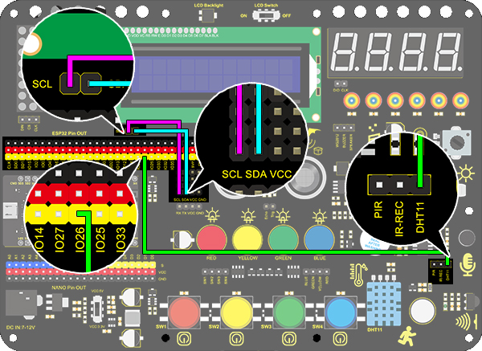
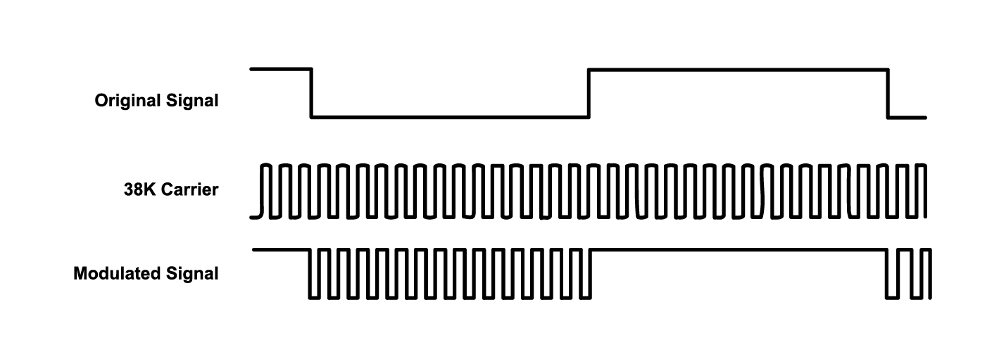

## 3.3 Arduino Project(18-34)

### Project 18 Beating Heart

**1. Description**

In this project, a beating heart will be presented via an Arduino board, a 8X8 dot matrix display, a circuit board and some electronic components. By programming, you can control the beating frequency, heart dimension and its brightness. 

**2. Wiring Diagram**


**3. Test Code**

```
/*
  keyestudio ESP32 Inventor Learning Kit  
  Project 18 Beating Heart
  http://www.keyestudio.com
*/

#include "LedControl.h"
int DIN = 23;
int CLK = 18;
int CS = 15;
LedControl lc=LedControl(DIN,CLK,CS,1);
const byte IMAGES1[] = {0x30, 0x78, 0x7c, 0x3e, 0x3e, 0x7c, 0x78, 0x30};  // a big heart
const byte IMAGES2[] = {0x00, 0x10, 0x38, 0x1c, 0x1c, 0x38, 0x10, 0x00};  //a small heart

void setup() 
{
  lc.shutdown(0,false);
  // Set brightness to a medium value
  lc.setIntensity(0,8);
  // Clear the display
  lc.clearDisplay(0);  
}

void loop()
{
  for(int i=0; i < 8; i++)
  {
      lc.setRow(0,i,IMAGES1[i]);
  }
  delay(1000);
  for(int i=0; i < 8; i++)
  {
    lc.setRow(0,i,IMAGES2[i]);
  }
  delay(1000);
}
```

**4.  Test Result**

After connecting the wiring and uploading code, the two sizes of hearts are displayed alternately. 


### Project 19 Dimming Lamp

**1. Description**

The dimming lamp adjusts the brightness of LED via a potentiometer and an Arduino controller. The brightness is subject to resistance value, which can be read and adjusted by connecting the ends of the potentiometer to digital or analog pins on board. What's more, this system is applied to control voltage or current of other devices such as fans, bulbs and heaters. 

**2. Working Principle**


Essentially, potentiometer is an element that can change the value of resistance. According to Ohm's law(U=I*R), the resistance affects the voltage. Our potentiometer is 10K.

In this project, the maximum resistance is 10K. The ESP32 board will equally divide the voltage of 3V into 4095 parts (3/4095=0.0007326007326). The analog voltage is obtained by multiplying the read value and 0.0007326007326. 

**3. Wiring Diagram**


**4. Test Code**

```
/*
  keyestudio ESP32 Inventor Learning Kit  
   Project 19.1 Dimming Lamp
  http://www.keyestudio.com
*/
int pot = 34;      //Define variable pot to IO34

void setup() 
{
  // put your setup code here, to run once:
  Serial.begin(9600);		//Set baud rate to 9600
}

void loop() 
{
  // put your main code here, to run repeatedly:
  int value = analogRead(pot);	//Read io34 and assign it to the variable value
  Serial.println(value);		//Print the variable value and wrap it around 
  delay(200);
}
```

**5. Test Result**

After connecting the wiring and uploading code, open serial monitor to set baud rate to 9600, and the analog value will be displayed, within the range of 0-4095.Rotating the potentiometer can change the size of the analog value.


**6. Knowledge Expansion**

We will control the brightness of LED via a potentiometer. As we know, it is influenced by PWM. However, the range of analog value is 0-4095 while that of PWM is 0-255. Thus, a "map(value, fromLow, fromHigh, toLow, toHigh)" function is needed.

**Wiring Diagram：**


**Code：**

```
/*
  keyestudio ESP32 Inventor Learning Kit  
   Project 19.2 Dimming Lamp
  http://www.keyestudio.com
*/
int led = 25;		//Define LED to IO25
int pot = 34;		//Define pot to IO34

void setup() 
{
  // put your setup code here, to run once:
  pinMode(led,OUTPUT);		//Set LED pin to output 
}

void loop() 
{
  // put your main code here, to run repeatedly:
  int value = analogRead(pot);
  int led_val = map(value,0,4095,0,255);  //Convert the range of potentiometer analog value to the range we need  
  analogWrite(led,led_val);
}
```

**7. Test Result**

After the code is uploaded successfully, rotating the potentiometer will change the brightness of the red LED.

### Project 20 Light Pillar

**1. Description**

The resistance(less than 1KΩ) of the photoresistor varies from the light, thus it can control the brightness of the dot matrix. When controlling, we connect this resistor to an analog pin on the board to monitor the change of resistance. In this way, the light automatically controls the brightness of the display. 

Besides,  the photoresistor is widely applied to our daily life. For instance, a curtain automatically opens or closes according to the outer light intensity. 

**2. Working Principle**


When it is totally in dark, the resistance equals 0.2MΩ, and the voltage at signal terminal (point 2) approaches to 0V. The stronger the light is , the smaller the resistance and voltage will be.

**3. Wiring Diagram**


**4. Test Code**

```
/*
  keyestudio ESP32 Inventor Learning Kit 
  Project 20.1 Light Pillar
  http://www.keyestudio.com
*/
int light = 34;      //Define light to IO34

void setup() 
{
  // put your setup code here, to run once:
  Serial.begin(9600);		//Set baud rate to 9600
}

void loop() 
{
  // put your main code here, to run repeatedly:
  int value = analogRead(light);	//Read IO34 and assign it to the variable value
  Serial.println(value);		//Print the variable value and wrap it around 
  delay(200);
}
```

**5. Test Result**

After connecting the wiring and uploading code, open serial monitor to set baud rate to 9600, the analog value will be displayed, withing the range of 0-4095. Changing the light intensity around it can change its value.


**6. Knowledge Expansion**

We will use this photoresistor to sense the ambient light intensity. The two columns of middle are included in this experiment to represent light intensity. The stronger it is, the more lighted LEDs will be. This forms a "light pillar".

- **Wiring Diagram：**


- **Code：**

```
/*
  keyestudio ESP32 Inventor Learning Kit 
  Project 20.2 Light Pillar
  http://www.keyestudio.com
*/

#include "LedControl.h"
int DIN = 23;
int CLK = 18;
int CS = 15;
LedControl lc=LedControl(DIN,CLK,CS,1);
const byte IMAGES[8] = {0x01,0x03,0x07,0x0F,0x1F,0x3F,0x7F,0xFF}; //Data of light pillar

int light = 34;

void setup() 
{
  lc.shutdown(0,false);
  // Set brightness to a medium value
  lc.setIntensity(0,8);
  // Clear the display
  lc.clearDisplay(0);
  pinMode(light,INPUT);  
}

void loop()
{
  int value = analogRead(light);
  int temp = map(value,0,4095,0,7);  //Convert the range of analog values to 0-7
  lc.setRow(0,3,IMAGES[temp]);      //Display the value of the array IMAGES[temp] in column 3
  lc.setRow(0,4,IMAGES[temp]);      //Display the value of the array IMAGES[temp] in column 4
}
```

- **Test Result**

The stronger the light near the photoresistor, the higher the light column of the LED matrix.


### Project 21 Sound Controlled LED

**1. Description**

Sound controlled LED is a device used to detect sound in a way that controls the brightness of LED, which is composed of a Arduino board and some components. It can connect to multiple sensors such as microphones. It converts sound to changing voltage signal to be received by Arduino to control the LED on and off.

**2. Working Principle**


When detecting a sound, the electret film in microphone vibrates, which changes the capacitance and generates a subtle change of voltage. 

Next, we make use of LM3 chip to build a proper circuit to amplify the detected sound up, which can be adjusted by a potentiometer. Rotate it clockwise to enlarge the times.

**3. Wiring Diagram**


**4. Test Code**

```
/*
  keyestudio ESP32 Inventor Learning Kit 
  Project 21.1：Sound Controlled LED
  http://www.keyestudio.com
*/
int sound = 33; //Define sound as IO33

void setup()
{
  Serial.begin(9600);
  pinMode(sound,INPUT);
}

void loop()
{
  int value = analogRead(sound);
  Serial.println(value);
}
```

**5.  Test Result**

After connecting the wiring and uploading code, open serial monitor to set baud rate to 9600, the analog value will be displayed.


**Sensitivity adjustment：**

If you feel that the sensitivity of the sound sensor is suitable, we can adjust the potentiometer of the sound sensor(right for the highest sensitivity, left for the lowest sensitivity).


**6. Knowledge Expansion**

The commonly seen corridor light is a kind of sound controlled light. Meanwhile, it also includes a photoresistor. Differed from that, here we establish a model that an LED only is affected by sound. When the analog volume exceeds 100, LED lights up for 2S and then goes off. 

- **Flow Chart：**


- **Wiring Diagram：**


- **Code：**

```
/*
  keyestudio ESP32 Inventor Learning Kit 
  Project 21.2：Sound Controlled LED
  http://www.keyestudio.com
*/
int sound = 33;   //Define sound to IO33
int led = 25;      //Define led to IO25

void setup()
{
  pinMode(led,OUTPUT);   //Set IO25 to output 
}

void loop()
{
  int value = analogRead(sound);    //Read analog value of IO33 and assign it to value
  if(value > 100)
  {                  //Judge whether value is greater than 100
    digitalWrite(led,HIGH);         //If IO25 pin outputs high level, LED lights up
    delay(2000);
  }
  else
  {
    digitalWrite(led,LOW);          //If IO25 pin outputs low level, LED lights off
  }
}
```

- **Test Result**

When the value detected by the sound sensor is greater than 100, the red LED will light up.

### Project 22 Noise Meter

**1. Description**

The noise meter will be able to use the number of dots on the LED matrix to reflect the size of the noise.

**2. Wiring Diagram**


**3. Test Code**

```
/*
  keyestudio ESP32 Inventor Learning Kit 
  Project 22 Noisemeter
  http://www.keyestudio.com
*/
#include <LedControl.h>  
  
int DIN = 23;
int CLK = 18;
int CS = 15;
int sensor = 34;

LedControl lc=LedControl(DIN,CLK,CS,1);  
byte data_val[8][8]= {
  {0x00, 0x00, 0x00, 0x00, 0x00, 0x00, 0x00, 0x01},
  {0x00, 0x00, 0x00, 0x00, 0x00, 0x00, 0x03, 0x01},
  {0x00, 0x00, 0x00, 0x00, 0x00, 0x07, 0x03, 0x01},
  {0x00, 0x00, 0x00, 0x00, 0x0f, 0x07, 0x03, 0x01},
  {0x00, 0x00, 0x00, 0x1f, 0x0f, 0x07, 0x03, 0x01},
  {0x00, 0x00, 0x3f, 0x1f, 0x0f, 0x07, 0x03, 0x01},
  {0x00, 0x7f, 0x3f, 0x1f, 0x0f, 0x07, 0x03, 0x01},
  {0xff, 0x7f, 0x3f, 0x1f, 0x0f, 0x07, 0x03, 0x01}
  };


void setup()
{  
 lc.shutdown(0,false);       //When powering on, MAX72XX is in the power saving mode. 
 lc.setIntensity(0,8);       //Set the brightness to the maximum
 lc.clearDisplay(0);         //Clear the display 
}  
  
void loop()
{   
  int val = analogRead(sensor);
  Serial.println(val);
  int temp = map(val,0,800,0,7);  //The range of analog values in the 0-800 is the most appropriate
  for(int i=0;i<8;i++)  
  {  
    lc.setRow(0,7-i,data_val[temp][i]);  
  } 
}  
```

**4. Test Code**

The greater the sound value detected by the sound sensor, the more dots light up on the LED matrix.


### Project 23 Smart Cup

**1. Description**

In this project, we mainly adopt the Arduino development board to create a programmable smart cup, which reveals the temperature of inner liquid through a RGB indicator. It can control the brightness of the light by setting a temperature threshold. If the threshold is exceeded, it will get brighter. Otherwise, it gets darker. 

The smart cup enables to help users better control the temperature of their drinking water and effectively prevent overheating or freezing.

**2. Working Principle**


**3. Wiring Diagram**


**4. Test Code**

```
/*
  keyestudio ESP32 Inventor Learning Kit 
  Project 23.1 Smart Cup
  http://www.keyestudio.com
*/
#include <xht11.h>
xht11 xht(26);   //The DHT11 sensor connects to IO26
unsigned char dat[] = {0,0,0,0}; //Define an array to store temperature and humidity data

void setup() 
{
  // put your setup code here, to run once:
  Serial.begin(9600);
}

void loop() 
{
  // put your main code here, to run repeatedly:
  if (xht.receive(dat)) { //Check correct return to true
    Serial.print("RH:");
    Serial.print(dat[0]); //The integral part of humidity,dht[1] is the decimal part
    Serial.print("%  ");
    Serial.print("Temp:");
    Serial.print(dat[2]); //The integer part of the temperature,dht[3] is the decimal part
    Serial.println("C");
  } 
  else 
  {    //Read error
    Serial.println("sensor error");
  }
  delay(1500);  //Delay 1500ms 
}
```

**5. Test Result**

After connecting the wiring and uploading code, open serial monitor to set baud rate to 9600, and the temperature and humidity value will be displayed. 


**6. Knowledge Expansion**

Now, we will make a smart cup which can show liquid temperature. We divide 100 into four parts with an LED, as shown below: 

- **Red LED: ** 100-75°C
- **Yellow LED: ** 75-50°C
- **Green LED: ** 50-25°C
- **Blue LED:**  25-0°C

**Wiring Diagram：**


**Code：**

```
/*
  keyestudio ESP32 ESP32 Inventor Learning Kit 
  Project 23.2 Smart Cup
  http://www.keyestudio.com
*/
#include <xht11.h>
xht11 xht(26);                         //Define DHT11 to pin IO26
unsigned char dat[4] = { 0, 0, 0, 0 };  //Define an array to store temperature and humidity data

int red_led = 12;
int yellow_led = 13;   //Define yellow_led to io13
int green_led = 14;    //Define green_led to io14
int blue_led = 27;     //Define blue_led to io27
int temperature = 0;  //Set an variable to save the temperature value

void setup() 
{
  // put your setup code here, to run once:
  pinMode(red_led, OUTPUT);     //Set io12 to ouput 
  pinMode(green_led, OUTPUT);   //Set io13 to ouput 
  pinMode(blue_led, OUTPUT);    //Set io14 to ouput 
  pinMode(yellow_led, OUTPUT);  //Set io27 to ouput 
  Serial.begin(9600);
}

void loop() 
{
  // put your main code here, to run repeatedly:
  if (xht.receive(dat))  //Check correct return to true
  { 
    temperature = dat[2];
    if (temperature > 75) // Determine whether value is greater than 75
    {  
      digitalWrite(green_led, LOW);
      digitalWrite(red_led, HIGH);
      digitalWrite(blue_led, LOW);
      digitalWrite(yellow_led,LOW);
    }
    if (temperature < 75 && temperature > 50) //Determine whether value is between 50 and 75 
    {  
      digitalWrite(green_led, LOW);
      digitalWrite(red_led, LOW);
      digitalWrite(blue_led, LOW);
      digitalWrite(yellow_led,HIGH);
    }
    if (temperature < 50 && temperature > 25) //Determine whether value is between 25 and 50 
    {  
      digitalWrite(green_led, HIGH);
      digitalWrite(red_led, LOW);
      digitalWrite(blue_led, LOW);
      digitalWrite(yellow_led,LOW);
    }
    if (temperature < 25)  //Determine whether value is smaller than 25 
    { 
      digitalWrite(green_led, LOW);
      digitalWrite(red_led, LOW);
      digitalWrite(blue_led, HIGH);
      digitalWrite(yellow_led,LOW);
    }
  }
  delay(1500);  //Delay 1500ms
}
```

**Test Result**

- **Red LED:**  100-75°C
- **Yellow LED:**  75-50°C
- **Green LED:**  50-25°C
- **Blue LED:** 25-0°C

If the blue LED is on, it means the temperature detected by the DHT11 sensor is in the range of 0-25°.

### Project 24 Weather Station

**1. Description**

This weather station records the ambient temperature and humidity value via Arduino board and a temperature and humidity sensor. 

**2. Wiring Diagram**



**3. Test Code**

```
/*
  keyestudio ESP32 Inventor Learning Kit  
  Project 24：Weather Station
  http://www.keyestudio.com
*/

#include <LiquidCrystal_I2C.h>
#include <xht11.h>
LiquidCrystal_I2C lcd(0x27, 16,2);  // set the LCD address to 0x27 for a 16 chars and 2 line display
xht11 xht(26);                         //The DHT11 sensor connects to IO26
unsigned char dat[] = { 0, 0, 0, 0 };  //Define an array to store temperature and humidity data

void setup() 
{
  lcd.init();  // initialize the lcd
  lcd.backlight();
}

void loop() 
{
  if (xht.receive(dat))  //Check correct return to true
  { 
    lcd.setCursor(0, 0);
    lcd.print("humidity:");
    lcd.setCursor(9, 0);
    lcd.print(dat[0]);
    lcd.setCursor(0, 1);
    lcd.print("temperature:");
    lcd.setCursor(12, 1);
    lcd.print(dat[2]);
  }
  delay(1500);  //Delay 1500ms
}
```

**4. Test Result**

After connecting the wiring and uploading code, the LCD display will directly discover the ambient humidity and temperature value. 


### Project 25 Ultrasonic Rangefinder

**1. Description**

This ultrasonic rangefinder measures distance of obstacles by emitting sound waves and then receiving the echo. That is to say, the distance is not an immediate value, but an observed one by a theoretical calculation of time difference between emitter and receiver. 

Ultrasonic is able to detect the shape of objects, set up automatic doors and estimate flow velocity and pressure. 

What's more, it supports cooperative works with computers. As a result, the measured value can be transmitted to computers via Arduino board. 

In daily life, it is widely used for motors, servos and LEDs as well as systems(automatic navigation, control and security monitoring systems).

**2. Working Principle**


As we all know, ultrasonic is a kind of inaudible sound wave signal with high frequency. Similar to a bat, this module measures distance of obstacles by calculating the time difference between wave-emitting and echo-receiving.

**Maximum distance:** 3M

**Minimum distance:** 5cm

**Detection angle:** ≤15°

**3. Wiring Diagram**


**4. Test Code**

```
/*
  keyestudio ESP32 Inventor Learning Kit  
  Project 25.1：Ultrasonic Rangefinder
  http://www.keyestudio.com
*/
int distance = 0; //Define a variable to receive the diatance value 
int EchoPin = 14; //Connect Echo pin to io14
int TrigPin = 13; //Connect Trig pin to io13

float checkdistance() { //Acquire the distance 
  // preserve a short low level to ensure a clear high pulse:
  digitalWrite(TrigPin, LOW);
  delayMicroseconds(2);    //Delay 2um
  //Trigger the sensor by a high pulse of 10um or longer 
  digitalWrite(TrigPin, HIGH);
  delayMicroseconds(10);		//Delay 10um
  digitalWrite(TrigPin, LOW);
  //Read the signal from the sensor: a high level pulse
  //Duration is detected from the point sending "ping" command to the time receiving echo signal (unit: um).
  float distance = pulseIn(EchoPin, HIGH) / 58.00;  //Convert into distance
  delay(10);
  return distance; //Return the diatance value
}

void setup() 
{
  Serial.begin(9600);//Set the baud rate to 9600
  pinMode(TrigPin, OUTPUT);//Set Trig pin to output
  pinMode(EchoPin, INPUT);  //Set Echo pin to input 
}

void loop() 
{
  distance = checkdistance();   //Assign the read value to "distance" 
  if (distance < 4 || distance >= 400) //Display "-1" if exceeding the detection range 
  {  
    distance = -1;
  }
  Serial.print("ditance: ");
  Serial.print(distance);
  Serial.println(" CM");
  delay(200);
}
```

**5. Test Result**

After connecting the wiring and uploading code, open serial monitor to set baud rate to 9600, the serial port prints the distance value. 


**6. Knowledge Expansion**

Let's make a rangefinder. 

We display characters on LCD 1602. Program to show "Keyestudio" at (3,0) and “distance:” at (0,1) followed by the distance value at (9,1). 

When the value is smaller than 100(or 10), a residue of the third(or the second) bit still exists. Therefore, an "if" judgement is necessary to determine a certain condition.

**Wiring Diagram：**


**Code：**

```
/*
  keyestudio ESP32 Inventor Learning Kit  
  Project 25.2：Ultrasonic Rangefinder
  http://www.keyestudio.com
*/
#include <Wire.h>
#include <LiquidCrystal_I2C.h>
LiquidCrystal_I2C lcd(0x27,16,2); //set the LCD address to 0x27 for a 16 chars and 2 line display

int distance = 0; //Define a variable to receive the diatance value 
int EchoPin = 14; //Connect Echo pin to io14
int TrigPin = 13; //Connect Trig pin to io13
float checkdistance() { //Acquire the distance 
  // preserve a short low level to ensure a clear high pulse:
  digitalWrite(TrigPin, LOW);
  delayMicroseconds(2);
  //Trigger the sensor by a high pulse of 10um or longer 
  digitalWrite(TrigPin, HIGH);
  delayMicroseconds(10);
  digitalWrite(TrigPin, LOW);
  // Read the signal from the sensor: a high level pulse
  //Duration is detected from the point sending "ping" command to the time receiving echo signal (unit: um).
  float distance = pulseIn(EchoPin, HIGH) / 58.00;  //Convert into distance
  delay(10);
  return distance;
}

void setup() 
{
  	Serial.begin(9600);//Set the baud rate to 9600
  	pinMode(TrigPin, OUTPUT);//Set Trig pin to output
  	pinMode(EchoPin, INPUT);  //Set Echo pin to input 
    lcd.init(); // initialize the lcd
    // Print a message to the LCD.
    lcd.backlight();
    lcd.setCursor(3,0);
    lcd.print("Keyestudio");
}

void loop() 
{
  distance = checkdistance();
 
  if (distance < 2 || distance >= 400) //Display "-1" if exceeding the detection range 
  {  
    distance = -1;
  }
  if(distance < 100 && distance > 10){             //Eliminate the shadow of the third digit when the value drops to two digits
    lcd.setCursor(11,1);
    lcd.print(" ");
  }
  if(distance < 10)//Eliminate two-digit shadows when the value drops to one digit
  {              
    lcd.setCursor(10,1);
    lcd.print(" ");
  }
  lcd.setCursor(0,1);
  lcd.print("distance:");
  lcd.setCursor(9,1);
  lcd.print(distance);
  delay(200);
}
```

### Project 26 Human Body Piano

**1. Description**

The analog piano includes a development board and an ultrasonic sensor. It enables to play different tones by detecting the position of your fingers. Thus, this module is able to stimulate a piano to perform music and songs. 

**2. Flow Chart**


**3. Wiring Diagram**


**4. Test Code**

```
/*
  keyestudio ESP32 Inventor Learning Kit  
  Project 26 Human Body Piano
  http://www.keyestudio.com
*/
int distance = 0; //Define a variable to receive the distance 
int EchoPin = 14; //Connect Echo pin to io14
int TrigPin = 13; //Connect Trig pin to io13

int beeppin = 5;

float checkdistance() { //Acquire distance
  // preserve a short low level to ensure a clear high pulse:
  digitalWrite(TrigPin, LOW);
  delayMicroseconds(2);
  // Trigger the sensor by a high pulse of 10um or longer 
  digitalWrite(TrigPin, HIGH);
  delayMicroseconds(10);
  digitalWrite(TrigPin, LOW);
  // Read the signal from the sensor: a high level pulse
  //Duration is detected from the point sending "ping" command to the time receiving echo signal (unit: um).
  float distance = pulseIn(EchoPin, HIGH) / 58.00;  //Convert into distance
  delay(10);
  return distance;
}

void setup() 
{
  Serial.begin(9600);//Set the baud rate to 9600
  pinMode(TrigPin, OUTPUT);//Set Trig pin to output
  pinMode(EchoPin, INPUT);  //Set Echo pin to input 
}

void loop() 
{
  distance = checkdistance();
  if(distance < 10)
  {            
    tone(beeppin, 262);//Play DO
    delay(1000);
  }
  if(distance < 20 && distance > 10)
  {            
    tone(beeppin, 294);//Play Re
    delay(1000);
  }
  if(distance < 30 && distance > 20)
  {            
    tone(beeppin, 330);//Play Mi
    delay(1000);
  }
  if(distance < 40 && distance > 30)
  {             
    tone(beeppin, 349);//Play fa
    delay(1000);
  }
  if(distance < 50 && distance > 40)
  {             
    tone(beeppin, 392);//Play So
    delay(1000);
  }
  if(distance < 60 && distance > 50){             
    tone(beeppin, 440);//Play La
    delay(1000);
  }
  if(distance < 70 && distance > 60)
  {             
    tone(beeppin, 494);//Play Si
    delay(1000);
  }
  Serial.println(distance);
  noTone(beeppin);//Stop
}
```

**5. Test Result**

Connect the wirings and upload the code. 

- Play Do when the distance is less than 10. 
- Play Re when the distance is within 10~20. 
- Play Mi when the distance is within 20~30. 
- Play Fa when the distance is within 30~40. 
- Play So when the distance is within 40~50. 
- Play La when the distance is within 50~60. 
- Play Si when the distance is within 60~70. 

### Project 27 Intelligent Parking

**1. Description**

This intelligent parking system detects and optimizes parking position via an ultrasonic sensor. With this system, wrong parking is avoided to a large extent. 

Firstly, you need to install the sensor around the carpark. And then it will detect the distance between the car and its edges and send the information to the development board so as to control the car to automatically adjust to the optimal parking position.

**2. Flow Chart**


**3. Wiring Diagram**


**4. Test Code**

```
/*
  keyestudio ESP32 Inventor Learning Kit  
  Project 27 Intelligent Parking
  http://www.keyestudio.com
*/
#include <LedControl.h>

int DIN = 23;  //Define DIN pin to IO23
int CS = 15;   //Define CS pin to IO15
int CLK = 18;  //Define CLK pin to IO18

int temp = 0;

int distance = 0;  //Define a variable to receive the distance
int EchoPin = 14;  //Connect Echo pin to IO14
int TrigPin = 13;  //Connect Trig pin to IO13

float checkdistance() {  //Acquire distance
  // preserve a short low level to ensure a clear high pulse:
  digitalWrite(TrigPin, LOW);
  delayMicroseconds(2);
  // Trigger the sensor by a high pulse of 10um or longer
  digitalWrite(TrigPin, HIGH);
  delayMicroseconds(10);
  digitalWrite(TrigPin, LOW);
  // Read the signal from the sensor: a high level pulse
  //Duration is detected from the point sending "ping" command to the time receiving echo signal (unit: um).
  float distance = pulseIn(EchoPin, HIGH) / 58.00;  //Convert into distance
  delay(10);
  return distance;
}

LedControl lc = LedControl(DIN, CLK, CS, 4);
byte data_val[4][8] = 
{
  { 0x00, 0x00, 0x00, 0x01, 0x01, 0x00, 0x00, 0x00 },
  { 0x00, 0x00, 0x04, 0x05, 0x05, 0x04, 0x00, 0x00 },
  { 0x00, 0x10, 0x14, 0x15, 0x15, 0x14, 0x10, 0x00 },
  { 0x40, 0x50, 0x54, 0x55, 0x55, 0x54, 0x50, 0x40 },
};


void setup() 
{
  lc.shutdown(0, false);  //MAX72XX is in power-saving mode at startup
  lc.setIntensity(0, 8);  //Set the brightness to its maximum value
  lc.clearDisplay(0);     //Clear display

  pinMode(TrigPin, OUTPUT);  //Set Trig pin to output 
  pinMode(EchoPin, INPUT);   //Set Echo pin to input 
  Serial.begin(9600);
}

void loop() 
{
  distance = checkdistance();
  Serial.println(distance);
  if (distance < 15) 
  {
    temp = 0;
  } 
  else if (distance < 30 && distance > 15) 
  {
    temp = 1;
  } 
  else if (distance < 40 && distance > 30) 
  {
    temp = 2;
  } 
  else if (distance > 50) 
  {
    temp = 3;
  }
  for (int i = 0; i < 8; i++) 
  {
    lc.setRow(0, i, data_val[temp][i]);
  }
}
```

**5. Test Result**

After connecting the wiring and uploading code, lines will be displayed on the dot matrix. If the detected distance is less than 50cm, there will be fewer lines.


### Project 28 Intelligent Gate

**1. Description**

The intelligent gate is an intelligent parking lot system that  integrates MCU and ultrasonic sensor, which automatically controls the gate according to the distance of cars, so as to better control the car access. 

When a certain distance is reached, MCU receives the signal from the sensor and estimates the distance via the signal intensity. If the car is approaching or leaving, MCU will open or close the gate via a servo. 

**2. Flow Chart**


**3. Wiring Diagram**


**4. Test Code**

```
/*
  keyestudio ESP32 Inventor Learning Kit  
  Project 28 Intelligent Gate
  http://www.keyestudio.com
*/
#define servo_pin  25
int distance = 0; //Define a variable to receive the distance
int EchoPin = 14; //Connect Echo pin to IO14
int TrigPin = 13; //Connect Trig pin to IO13

//Ultrasonic ranging program
float checkdistance() { //Acquire distance
  //preserve a short low level to ensure a clear high pulse:
  digitalWrite(TrigPin, LOW);
  delayMicroseconds(2);
  //Trigger the sensor by a high pulse of 10um or longer
  digitalWrite(TrigPin, HIGH);
  delayMicroseconds(10);
  digitalWrite(TrigPin, LOW);
  //Read the signal from the sensor: a high level pulse
  //Duration is detected from the point sending "ping" command to the time receiving echo signal (unit: um).
  float distance = pulseIn(EchoPin, HIGH) / 58.00;  //Convert into distance
  delay(10);
  return distance;
}

//Servo rotation program
void Set_Angle(int angle_val) //Impulse function
{ 
  int pulsewidth = map(angle_val, 0, 180, 500, 2500); //Map Angle to pulse width
  for (int i = 0; i < 10; i++) { //Output a few more pulses
    digitalWrite(servo_pin, HIGH);//Set the servo interface level to high
    delayMicroseconds(pulsewidth);//The number of microseconds of delayed pulse width value
    digitalWrite(servo_pin, LOW);//Lower the level of servo interface
    delay(20 - pulsewidth / 1000);  //Add the bracket
  }
} 

void setup() 
{
  // put your setup code here, to run once:
  pinMode(servo_pin,OUTPUT);
  pinMode(TrigPin, OUTPUT);//Set Trig pin to output 
  pinMode(EchoPin, INPUT);  //Set Echo pin to input 
}

void loop() 
{
  // put your main code here, to run repeatedly:
 distance = checkdistance();
 Serial.println();
  if(distance < 30)
  {
    Set_Angle(180);
    delay(5000);//Wait for 5s   
  }
  if(distance > 30)
  {
    Set_Angle(0);
  }
}
```

**5. Test Result**

After connecting the wiring and uploading code, the servo will rotate to 180° for 5s if the detected distance is less than 30cm. On the contrary, the servo will rotate to 0°.

### Project 29 IR Remote Control

**1. Description**

The IR remote control uses IR signal to control LED, which greatly simplifies the process of controlling LED. 

**2. Working Principle**


 In this project, we often use a carrier of about 38K for modulation. 

IR remote control system includes modulation, emitting and receiving. It sends data through modulating, which improves the transmission efficiency and reduces the power consumption.

Generally, the frequency of carrier modulation is within 30khz~60khz(usually 38kHz). The duty cycle of the square wave is 1/3, as shown below, which is decided by the 455kHz crystal oscillator on the emitting end. 

An Integer frequency division is essential for crystal oscillator at this end, and the frequency coefficient usually evaluates 12. Therefore, 455kHz÷12≈37.9kHz≈38kHz. 

**38KH carrier (complete) emitting diagram:**



**Carrier frequency:** 38KHz

**Wave length:** 940nm

**Receiving angle:** 90°

**Control distance:** 6M

**Schematic diagram of remote control buttons:**


**3. Wiring Diagram**


**4. Test Code**

```
/*
  keyestudio ESP32 Inventor Learning Kit  
  Project 29.1 IR Remote Control
  http://www.keyestudio.com
*/
#include <Arduino.h>
#include <IRremoteESP8266.h>
#include <IRrecv.h>
#include <IRutils.h>

const uint16_t recvPin = 19;  // Infrared receiving pin
IRrecv irrecv(recvPin);  // Create a class object used to receive class
decode_results results;   // Create a decoding results class object
long ir_rec;

void setup()
{
  Serial.begin(9600); // Initialize the serial port and set the baud rate to 9600
  irrecv.enableIRIn(); // start receiving signals
}

void loop() 
{
  if (irrecv.decode(&results)) 
  {
    ir_rec = results.value; //assign the signal to the variable ir_rec
    if(ir_rec != 0)
    {		//Prevente the code from repeating execute when the button is pressed 
        Serial.print(ir_rec, HEX); //Print the variable ir_rec in hexadecimal
        Serial.println();//Wrapping lines
    }
    irrecv.resume(); //Release the IR remote and receive the next value.
  }
} 
```

**5. Test Result**

After connecting the wiring and uploading code, open the serial monitor and set the baud rate to 9600. 

Press the button on the remote control, and you will see the value in hexadecimal.


**6. Knowledge Expansion**

Next, we will use an IR remote control to control the LED. Press OK to light up the LED and press again to turn it off. 

**Wiring Diagram：**


**Code：**

```
/*
  keyestudio ESP32 Inventor Learning Kit 
  Project 29.2 IR Remote Control
  http://www.keyestudio.com
*/
#include <Arduino.h>
#include <IRremoteESP8266.h>
#include <IRrecv.h>
#include <IRutils.h>

int led = 25;
int led_val = 0;
const uint16_t recvPin = 19;  // Infrared receiving pin
IRrecv irrecv(recvPin);       // Create a class object used to receive class
decode_results results;       // Create a decoding results class object
long ir_rec;

void setup() 
{
  Serial.begin(9600);   // Initialize the serial port and set the baud rate to 9600
  irrecv.enableIRIn();  // start receiving signals
  pinMode(led, OUTPUT);
}

void loop() 
{
  if (irrecv.decode(&results)) 
  {
    ir_rec = results.value;      //assign the signal to the variable ir_rec
    if (ir_rec != 0) 
    {           //Prevente the code from repeating execute when the button is pressed
      if (ir_rec == 0xFF02FD) //Determine whether the received IR signal is from button OK
      {  
        led_val = !led_val;      //Reverse a variable. If the initial value is 0, it turns to 1 after reversing  
        digitalWrite(led, led_val);
      }
    }
    irrecv.resume();  //Release the IR remote and receive the next value.
  }
}
```

**Test Result:** 

Press OK to light up the LED and press again to turn it off.

### Project 30 Smart Home

**1. Description**

In this technology era, we are all familiar with smart home. It is a system that can control electric appliance via buttons. 

In this project, we seek to stimulate a smart home via an IR remote control. With Arduino MCU as its core, it can be used to  control light, air conditioners, TV and security monitors. 

**2. Flow Chart**


**3. Wiring Diagram**


**4. Test Code**

```
/*
  keyestudio ESP32 Inventor Learning Kit 
  Project 30 Smart Home
  http://www.keyestudio.com
*/
#include <LiquidCrystal_I2C.h>
#include <IRremoteESP8266.h>
#include <IRrecv.h>
#include <IRutils.h>
#include <xht11.h>

LiquidCrystal_I2C lcd(0x27, 16, 2);  // set the LCD address to 0x27 for a 16 chars and 2 line display

const uint16_t recvPin = 19;  // Infrared receiving pin
IRrecv irrecv(recvPin);       // Create a class object used to receive class
decode_results results;       // Create a decoding results class object
long ir_rec;

xht11 xht(26);                         //The DHT11 connects to IO26
unsigned char dat[] = { 0, 0, 0, 0 };  //Define an array to store temperature and humidity data

int distance = 0;  //Define a variable to receive the distance 
int EchoPin = 14;  //Connect Echo pin to IO14
int TrigPin = 13;  //Connect Trig pin to IO13

int ligth_sensor = 33;      //Define the photoresistor pin 
int sound_sensor = 32;      //efine the sound sensor pin
int pot_sensor = 25;        //Define the potentiometer pin
 
void setup() {
  //LCD 1602
  lcd.init();  // initialize the lcd
  lcd.backlight();  //Turn on the LCD backlight 
  lcd.setCursor(3, 0);
  lcd.print("keyestudio");  //LCD displays "keyestudio"
  //IR receiver
  irrecv.enableIRIn();  // start receiving signals
  //Ultrasonic
  pinMode(TrigPin, OUTPUT);  //Set Trig pin to output 
  pinMode(EchoPin, INPUT);   //Set Echo pin to input 
}
void loop() {
  if (irrecv.decode(&results)) {

    if (results.value != 0) {  //Prevent the button from being pressed repeatedly
      ir_rec = results.value;  //The signal is assigned to the variable ir_rec
      show_clear();
    }
    irrecv.resume();  //Release the IRremote and receive the next value.
  }
  switch (ir_rec) {
    case 0xFF02FD: show_clear(); break;
    case 0xFF6897: show_temperature(); break;
    case 0xFF9867: show_humidity(); break;
    case 0xFFB04F: show_distance(); break;
    case 0xFF30CF: show_luminance(); break;
    case 0xFF18E7: show_sound(); break;
    case 0xFF7A85: show_pot(); break;
  }
  delay(300);
}

void show_clear() {  //Clear display 
  lcd.setCursor(0, 1);
  lcd.print("                ");    
}

void show_temperature() {  //Display temperature
  if (xht.receive(dat)) {  //Check correct return to true
    lcd.setCursor(0, 1);
    lcd.print("Temperature:");
    lcd.setCursor(13, 1);
    lcd.print(dat[2]);
    if (dat[2] < 100) {
      lcd.setCursor(15, 1);
      lcd.print(" ");
    }
  }
}

void show_humidity() {     //Display humidity
  if (xht.receive(dat)) {  //Check correct return to true 
    lcd.setCursor(0, 1);
    lcd.print("Humidity:");
    lcd.setCursor(10, 1);
    lcd.print(dat[0]);
    Serial.println("2");
    if (dat[0] < 100) {
      lcd.setCursor(12, 1);
      lcd.print(" ");
    }
  }
}

float checkdistance() {  //Acquire distance
  // preserve a short low level to ensure a clear high pulse:
  digitalWrite(TrigPin, LOW);
  delayMicroseconds(2);
  // Trigger the sensor by a high pulse of 10um or longer
  digitalWrite(TrigPin, HIGH);
  delayMicroseconds(10);
  digitalWrite(TrigPin, LOW);
  // Read the signal from the sensor: a high level pulse
  //Duration is detected from the point sending "ping" command to the time receiving echo signal (unit: um).
  float distance = pulseIn(EchoPin, HIGH) / 58.00;  //Convert into distance
  delay(10);
  return distance;
}

void show_distance() {  //Display the distance 
  distance = checkdistance();
  // if (distance < 2 || distance >= 400) {  //Disolay "-1" if exceeding the detection range 
  //   distance = -1;
  // }
  lcd.setCursor(0, 1);
  lcd.print("distance:");
  lcd.setCursor(9, 1);
  lcd.print(distance);
  if (distance < 100 && distance > 10) {  //Eliminate the third residual digit when the value drops to two digits
    lcd.setCursor(11, 1);
    lcd.print(" ");
  }
  if (distance < 10) {  //Eliminate the second residual digit when the value drops to one digit
    lcd.setCursor(10, 1);
    lcd.print(" ");
  }
}

void show_luminance()  //Read the analog value of photoresistor
{ 
  int value = analogRead(ligth_sensor);
  lcd.setCursor(0, 1);
  lcd.print("Luminance:");
  lcd.setCursor(11, 1);
  lcd.print(value);
  if (value < 1000) 
  {
    lcd.setCursor(14, 1);
    lcd.print(" ");
  }
  if (value < 100) 
  {
    lcd.setCursor(13, 1);
    lcd.print(" ");
  }
  if (value < 10) 
  {
    lcd.setCursor(12, 1);
    lcd.print(" ");
  }
}

void show_sound() //Read the analog sound value
{   
  int value = analogRead(sound_sensor);
  lcd.setCursor(0, 1);
  lcd.print("Sound:");
  lcd.setCursor(7, 1);
  lcd.print(value);
  if (value < 1000) 
  {
    lcd.setCursor(10, 1);
    lcd.print(" ");
  }
  if (value < 100) 
  {
    lcd.setCursor(9, 1);
    lcd.print(" ");
  }
  if (value < 10) 
  {
    lcd.setCursor(8, 1);
    lcd.print(" ");
  }
}

void show_pot()  //Read the analog value of potentiometer 
{ 
  int value = analogRead(pot_sensor);
  lcd.setCursor(0, 1);
  lcd.print("PotAnalog:");
  lcd.setCursor(11, 1);
  lcd.print(value);
  if (value < 1000) 
  {
    lcd.setCursor(14, 1);
    lcd.print(" ");
  }
  if (value < 100) 
  {
    lcd.setCursor(13, 1);
    lcd.print(" ");
  }
  if (value < 10) 
  {
    lcd.setCursor(12, 1);
    lcd.print(" ");
  }
}
```

**5. Test Result**

After connecting the wiring and uploading code, we can see the corresponding contents on LCD by pressing buttons. OK button clears the sensor display.


### Project 31 Connect the ESP32 board to WiFi

**1. Description**

ESP32 boasts a built-in Wi-Fi and Bluetooth nodule that is widely used in Internet of Things (IoT). With this function, it can remotely control the data transmission through the wireless network. 

In applications, ESP32 can be used as a client to connect to a Wi-Fi network, or as a hotspot to create its own network. Through these connections, ESP32 receives commands to control external devices, such as turning on/off lights and adjusting temperature. In the code, protocols like HTTP and MQTT are used to communicate with the server to achieve data sending and receiving, so as to remotely control and monitoring.

**2. ESP32 wifi**

ESP32 development board comes with built-in Wi-Fi (2.4G) and Bluetooth (4.2), which enable it to easily connect to Wi-Fi network and communicate with other devices in the network. You can display web pages in your browser via ESP32.

· Base station mode (STA / Wi-Fi Client mode): ESP32 is connected to Wi-Fi hotspot (AP).

· AP mode (Soft-AP / Wi-Fi hotspot mode): Wi-Fi device(s) is(are) connected to ESP32.

· AP-STA mode: ESP32 is both Wi-Fi hotspot and a Wi-Fi device connected to another Wi-Fi.

· These modes supports multiple security modes, including WPA, WPA2 and WEP.

· It is able to scan Wi-Fi hotspot (active or passive)

· It support promiscuous mode monitoring IEEE802.11 Wi-Fi packets.

**3. Wiring Diagram**


**Notes:**

1. You need to prepare a 2.4GHz frequency WIFI(not 5GHz). It can be a mobile hotspot or a router.

2. The ESP32 board consumes more power when connected to the network, so you need to connect an external power supply to this kit. We provide you with a 6XAA Battery Holder (battery not included), which you can connect to the DC port of the ESP32 integrated board.

   

3. Remember your wifi network name and password and fill it into the code before uploading it.

```
const char* ssid = "your_SSID"; // Fill in WiFi name, for example,= "KEYES"
const char* password = "your_password"; // Fill in WiFi password, for example,= "123456"
```

**4. Upload Code**

```
/*
  keyestudio ESP32 Inventor Learning Kit
  Project 31 ESP32 WiFi
  http://www.keyestudio.com
*/
#include <WiFi.h>
#include <LiquidCrystal_I2C.h>

LiquidCrystal_I2C lcd(0x27, 16, 2);
const char* ssid = "your_SSID"; // set to your WiFi name
const char* password = "your_password"; // set your WiFi password
WiFiServer server(80);
int i = 0;

void setup() 
{
  lcd.init();  // initialize the lcd
  // We start by connecting to a WiFi network
  lcd.backlight();

  lcd.setCursor(0, 0);
  lcd.print("IP:");

  WiFi.begin(ssid, password);

  while (WiFi.status() != WL_CONNECTED) 
  {
    lcd.setCursor(i, 1);
    lcd.print(".");
    delay(500);
    i++;
    if (i > 15) 
    {
      i = 0;
      lcd.setCursor(0, 1);
      lcd.print("                ");
    }
  }
  lcd.setCursor(0, 1);
  lcd.print("                ");
  lcd.setCursor(0, 1);
  lcd.print(WiFi.localIP());
}

void loop() 
{
}
```

**5. Test Result**

After uploading the code, LCD1602 shows the IP address of the wifi that you connected to ESP32.


**6. Knowledge Expansion**

IP address displays “Holly World!”.

```
#include <WiFi.h>
#include <ESPAsyncWebServer.h>
#include <LiquidCrystal_I2C.h>
LiquidCrystal_I2C lcd(0x27, 16, 2);

// WiFi configuration

const char* ssid = "your-SSID";     // your WiFi name
const char* password = "your-PASSWORD";  // your WiFi password
int i = 0;
// Create a Web Server
AsyncWebServer server(80);

void setup() 
{
  lcd.init();  // initialize the lcd
  lcd.backlight();
  lcd.setCursor(0, 0);
  lcd.print("IP:");

  // WiFi connection
  WiFi.begin(ssid, password);
  while (WiFi.status() != WL_CONNECTED) 
  {
    lcd.setCursor(i, 1);
    lcd.print(".");
    delay(500);
    i++;
    if (i > 15) 
    {
      i = 0;
      lcd.setCursor(0, 1);
      lcd.print("                ");
    }
  }
  lcd.setCursor(0, 1);
  lcd.print("                ");
  lcd.setCursor(0, 1);
  lcd.print(WiFi.localIP());

  // Process the client request and return to the page
  server.on("/", HTTP_GET, [](AsyncWebServerRequest* request) {
    String html = generateHTML();
    request->send(200, "text/html", html);
  });
  // Start the Web server
  server.begin();
}

String generateHTML()
{
  // Generate HTML page
  String html = "<html><head>";
  html += "<h1>Hello, World!</h1>";
  html += "</head></html>";
  return html;
}

void loop() 
{
}
```

**7. Test result**

Use a computer or mobile phone that is connected to the same network as the ESP32 board, and access the IP address shown on the LCD1602 and you will see “Hello world”.


### Project 32 ESP32 WiFi Control LED

**1. Description**

Next we will learn to control the LED through wifi on a mobile phone or a computer.

**Notes:**

1. You need to prepare your a 2.4GHz frequency WIFI, not 5GHz frequency. It can be a mobile hotspot or a router.

2. The ESP32 board consumes more power when connected to the network, so you need to connect an external power supply to this kit. We provide you with a 6XAA Battery Holder (battery not included), which you can connect to the DC port of the ESP32 integrated board.


3. When using other devices to control this kit, the ESP32 board needs to be connected to the same network as your control device.

4. Remember your wifi network name and password and fill it into the code before uploading it.

```
const char* ssid = "your_SSID"; // Fill in WiFi name, for example,= "KEYES"
const char* password = "your_password"; // Fill in WiFi password, for example,= "123456"
```

**2. Wiring Diagram**


**3. Upload Code**

```
#include <WiFi.h>
#include <ESPAsyncWebServer.h>
#include <LiquidCrystal_I2C.h>

LiquidCrystal_I2C lcd(0x27, 16, 2);

// WiFi configuration
const char* ssid = "your-SSID";    // your WiFi name
const char* password = "your-PASSWORD";  // your WiFi password

// Create a Web Server
AsyncWebServer server(80);

// LED pin configuration
#define redLED 12
#define yellowLED 13
#define greenLED 14
#define blueLED 15

// LED state
bool redLEDState = false;
bool yellowLEDState = false;
bool greenLEDState = false;
bool blueLEDState = false;
int i = 0;

// Create HTML page
String generateHTML() 
{
  String html = "<html><head><style>";
  html += "button { font-size: 30px; padding: 15px; margin: 10px; border: none; cursor: pointer; width: 200px; height: 100px; }";
  html += "button.on { background-color: #4CAF50; color: white; }";   // color of LED on
  html += "button.off { background-color: #f44336; color: white; }";  // color of LED off
  html += "</style></head><body>";

  // Concatenation after converting a constant String to a String object using String()
  html += "<button id='btn0' class='" + String(redLEDState ? "on" : "off") + "' onclick='toggleLed(0)'>red LED</button>";
  html += "<button id='btn1' class='" + String(yellowLEDState ? "on" : "off") + "' onclick='toggleLed(1)'>yellow LED</button>";
  html += "<button id='btn2' class='" + String(greenLEDState ? "on" : "off") + "' onclick='toggleLed(2)'>green LED</button>";
  html += "<button id='btn3' class='" + String(blueLEDState ? "on" : "off") + "' onclick='toggleLed(3)'>blue LED</button>";
    
  html += "<script>";
  html += "function toggleLed(led) {";
  html += "  var xhr = new XMLHttpRequest();";
  html += "  xhr.open('GET', '/toggle?led=' + led, true);";
  html += "  xhr.send();";
  html += "  var button = document.getElementById('btn' + led);";
  html += "  if (button.classList.contains('off')) {";
  html += "    button.classList.remove('off');";
  html += "    button.classList.add('on');";
  html += "  } else {";
  html += "    button.classList.remove('on');";
  html += "    button.classList.add('off');";
  html += "  }";
  html += "}";
  html += "</script></body></html>";
  return html;
}

void setup() 
{
  // Initialize serial port
  Serial.begin(115200);

  // Set LED pins to output
  pinMode(redLED, OUTPUT);
  pinMode(yellowLED, OUTPUT);
  pinMode(greenLED, OUTPUT);
  pinMode(blueLED, OUTPUT);
  digitalWrite(redLED, LOW);  // Initially, all leds are off
  digitalWrite(yellowLED, LOW);
  digitalWrite(greenLED, LOW);
  digitalWrite(blueLED, LOW);

  lcd.init();  // initialize the lcd
  // We start by connecting to a WiFi network
  lcd.backlight();
  lcd.setCursor(0, 0);
  lcd.print("IP:");

  // WiFi connection
  WiFi.begin(ssid, password);
  while (WiFi.status() != WL_CONNECTED) {
    lcd.setCursor(i, 1);
    lcd.print(".");
    delay(500);
    i++;
    if (i > 15) {
      i = 0;
      lcd.setCursor(0, 1);
      lcd.print("                ");
    }
  }
  lcd.setCursor(0, 1);
  lcd.print("                ");
  lcd.setCursor(0, 1);
  lcd.print(WiFi.localIP());

  // Process client requests
  server.on("/", HTTP_GET, [](AsyncWebServerRequest* request) {
    request->send(200, "text/html", generateHTML());  // Back to HTML page
  });

  // Control LED state
  server.on("/toggle", HTTP_GET, [](AsyncWebServerRequest* request) {
    if (request->hasParam("led")) {
      int led = request->getParam("led")->value().toInt();
      if (led == 0) {
        redLEDState = !redLEDState;
        digitalWrite(redLED, redLEDState ? HIGH : LOW);
      } else if (led == 1) {
        yellowLEDState = !yellowLEDState;
        digitalWrite(yellowLED, yellowLEDState ? HIGH : LOW);
      } else if (led == 2) {
        greenLEDState = !greenLEDState;
        digitalWrite(greenLED, greenLEDState ? HIGH : LOW);
      } else if (led == 3) {
        blueLEDState = !blueLEDState;
        digitalWrite(blueLED, blueLEDState ? HIGH : LOW);
      }
    }
    request->send(200, "text/plain", "OK");  // Back response
  });

  // Start the Web server
  server.begin();
}

void loop() 
{
  // Nothing needs to be done in loop(), all processing is done by the asynchronous Web server
}
```

**4. Test Result**

After uploading the code, LCD1602 shows the IP address of the wifi. Use a computer or mobile phone that is connected to the same network as the ESP32 board, open the browser and enter the IP address, you will see the control page.


### Project 33 ESP32 Read Data

**1. Description**

We learned how to control the led light throught ESP32 wifi and display the IP address on the LCD1602. Next, we will use the esp32 board read the sensor data and transmit it to the web page.

**Notes**

1. You need to prepare your a 2.4GHz frequency WIFI, not 5GHz frequency. It can be a mobile hotspot or a router.
2. The ESP32 board consumes more power when connected to the network, so you need to connect an external power supply to this kit. We provide you with a 6XAA Battery Holder (battery not included), which you can connect to the DC port of the ESP32 integrated board.


3. When using other devices to control this kit, the ESP32 board needs to be connected to the same network as your control device.

4. Remember your wifi network name and password and fill it into the code before uploading it.

```
const char* ssid = "your_SSID"; // Fill in WiFi name, for example,= "KEYES"
const char* password = "your_password"; // Fill in WiFi password, for example,= "123456"
```

**2. Wiring Diagram**


**3. Upload Code**

```
#include <WiFi.h>
#include <ESPAsyncWebServer.h>
#include <xht11.h>
#include <LiquidCrystal_I2C.h>
LiquidCrystal_I2C lcd(0x27, 16, 2);

// WiFi configuration
const char* ssid = "your-SSID";    // your WiFi name
const char* password = "your-PASSWORD";  // your WiFi password

// Create a Web Server
AsyncWebServer server(80);

// DHT11 configuration
xht11 xht(26);                         //set DHT11 sensor pin to IO26
unsigned char dat[] = { 0, 0, 0, 0 };  //Define an array to store temperature and humidity values
int i = 0;

// photoresistor configuration
#define LDRPIN 34  // connect photoresistor to GPIO34(analog input)

void setup() 
{
  lcd.init();  // initialize the lcd
  lcd.backlight();
  lcd.setCursor(0, 0);
  lcd.print("IP:");

  // WiFi connection
  WiFi.begin(ssid, password);
  while (WiFi.status() != WL_CONNECTED) {
    lcd.setCursor(i, 1);
    lcd.print(".");
    delay(500);
    i++;
    if (i > 15) {
      i = 0;
      lcd.setCursor(0, 1);
      lcd.print("                ");
    }
  }
  lcd.setCursor(0, 1);
  lcd.print("                ");
  lcd.setCursor(0, 1);
  lcd.print(WiFi.localIP());

  // Process the client request and return to the page
  server.on("/", HTTP_GET, [](AsyncWebServerRequest* request) {
    String html = generateHTML();
    request->send(200, "text/html", html);
  });

  // Start the Web server
  server.begin();
}

String generateHTML() 
{
  // acquire photoresistor value
  int lightValue = analogRead(LDRPIN);  // read photoresistor analog value

  // Generate HTML page
  String html = "<html><head><style>";
  html += "body { font-family: Arial, sans-serif; background-color: #f4f4f4; }";
  html += "h2 { color: #333; }";
  html += "div.sensor { background-color: #fff; padding: 20px; margin: 15px; border-radius: 10px; box-shadow: 0px 4px 6px rgba(0, 0, 0, 0.1); }";
  html += "div.sensor h3 { margin: 0; }";
  html += "div.sensor p { font-size: 20px; color: #555; }";
  html += "</style>";
  // add automatic refresh, refresh the page every 5 seconds
  html += "<meta http-equiv='refresh' content='5'>";
  html += "</head><body>";

  // diaplay temperature and humidity
  html += "<div class='sensor'>";
  html += "<h3>Temperature</h3>";
  html += "<p>" + String(dat[2]) + " &deg;C</p>";
  html += "</div>";

  html += "<div class='sensor'>";
  html += "<h3>Humidity</h3>";
  html += "<p>" + String(dat[0]) + " %</p>";
  html += "</div>";

  // diaplay photoresistor resistance value
  html += "<div class='sensor'>";
  html += "<h3>Luminance</h3>";
  html += "<p>" + String(lightValue) + "</p>";
  html += "</div>";
  html += "</body></html>";

  return html;
}

void loop() 
{
  // Update temperature, humidity and light intensity every 2 seconds
  if (!xht.receive(dat)) {
    Serial.println("sensor error");
  }
  delay(2000);
}
```

**4. Test Result**

After uploading the code, LCD1602 shows the IP address. Use a computer or mobile phone that is connected to the same network as the ESP32 board, open the browser and enter the IP address, you can see the sensor values on the control page which refresh every 5 seconds.


### Project 34 Smart Home

**1. Description**

In this project, we simulate the smart home with the inventor kit.

**Notes**

1. You need to prepare your a 2.4GHz frequency WIFI, not 5GHz frequency. It can be a mobile hotspot or a router.
2. The ESP32 board consumes more power when connected to the network, so you need to connect an external power supply to this kit. We provide you with a 6XAA Battery Holder (battery not included), which you can connect to the DC port of the ESP32 integrated board.


3. When using other devices to control this kit, the ESP32 board needs to be connected to the same network as your control device.

4. Remember your wifi network name and password and fill it into the code before uploading it.

```
const char* ssid = "your_SSID"; // Fill in WiFi name, for example,= "KEYES"
const char* password = "your_password"; // Fill in WiFi password, for example,= "123456"
```

**2. Wiring Diagram**


**3. Upload Code**

```
#include <WiFi.h>
#include <ESPAsyncWebServer.h>
#include <xht11.h>
#include <LiquidCrystal_I2C.h>

LiquidCrystal_I2C lcd(0x27, 16, 2);

// WiFi configuration
const char* ssid = "your-SSID";     // your WiFi name
const char* password = "your-PASSWORD";  // your WiFi password

// DHT11 configuration
xht11 xht(26);                         //set DHT11 sensor pin to IO26
unsigned char dat[] = { 0, 0, 0, 0 };  //Define an array to store temperature and humidity values
int i = 0;

// photoresistor analog pin
#define LDR_PIN 34  // connect the photoresistor to GPIO 34

// LED pins
#define redLED_PIN 12
#define yellowLED_PIN 13
#define greenLED_PIN 14
#define blueLED_PIN 15
// LED state
bool redLEDState = false;
bool yellowLEDState = false;
bool greenLEDState = false;
bool blueLEDState = false;

// Web server
AsyncWebServer server(80);

String generateHTML() {
  String html = "<html><head><style>";

  // basic format
  html += "body { font-family: Arial, sans-serif; background-color: #f4f4f4; }";
  html += "h2 { color: #333; }";
  html += "div.sensor { background-color: #fff; padding: 20px; margin: 15px; border-radius: 10px; box-shadow: 0px 4px 6px rgba(0, 0, 0, 0.1); }";
  html += "div.sensor h3 { margin: 0; }";
  html += "div.sensor p { font-size: 20px; color: #555; }";

  // button format
  html += "button { font-size: 30px; padding: 15px; margin: 10px; border: none; cursor: pointer; width: 200px; height: 100px; }";
  html += "button.on { background-color: #4CAF50; color: white; }";   // color of LED on
  html += "button.off { background-color: #f44336; color: white; }";  // color of LED off

  html += "</style>";
  html += "<meta http-equiv='refresh' content='5'>";  // Automatically refresh every 5 seconds
  html += "</head><body>";

  // temperature
  html += "<h2>Sensor Data</h2>";

  html += "<div class='sensor'>";
  html += "<h3>Temperature</h3>";
  html += "<p>" + String(dat[2]) + " &deg;C</p>";
  html += "</div>";
  // humidity
  html += "<div class='sensor'>";
  html += "<h3>Humidity</h3>";
  html += "<p>" + String(dat[0]) + " %</p>";
  html += "</div>";

  // diaplay photoresistor resistance value
  int lightValue = analogRead(LDR_PIN);  // photoresistor value
  html += "<div class='sensor'>";
  html += "<h3>Luminance</h3>";
  html += "<p>" + String(lightValue) + "</p>";
  html += "</div>";

  // LED control button
  html += "<h2>Control LEDs</h2>";
  html += "<button id='btn0' class='" + String(redLEDState ? "on" : "off") + "' onclick='toggleLed(0)'>Red LED</button>";
  html += "<button id='btn1' class='" + String(yellowLEDState ? "on" : "off") + "' onclick='toggleLed(1)'>Yellow LED</button>";
  html += "<button id='btn2' class='" + String(greenLEDState ? "on" : "off") + "' onclick='toggleLed(2)'>Green LED</button>";
  html += "<button id='btn3' class='" + String(blueLEDState ? "on" : "off") + "' onclick='toggleLed(3)'>Blue LED</button>";

  // JavaScript control LED On/Off
  html += "<script>";
  html += "function toggleLed(led) {";
  html += "  var xhr = new XMLHttpRequest();";
  html += "  xhr.open('GET', '/toggle?led=' + led, true);";
  html += "  xhr.send();";

  html += "  var button = document.getElementById('btn' + led);";
  html += "  if (button.classList.contains('off')) {";
  html += "    button.classList.remove('off');";
  html += "    button.classList.add('on');";
  html += "  } else {";
  html += "    button.classList.remove('on');";
  html += "    button.classList.add('off');";
  html += "  }";
  html += "}";
  html += "</script>";

  html += "</body></html>";

  return html;
}

void setup() 
{
  // Initialize serial port
  Serial.begin(115200);

  lcd.init();  // initialize the lcd
  lcd.backlight();
  lcd.setCursor(0, 0);
  lcd.print("IP:");

  // WiFi connection
  WiFi.begin(ssid, password);
  while (WiFi.status() != WL_CONNECTED) {
    lcd.setCursor(i, 1);
    lcd.print(".");
    delay(500);
    i++;
    if (i > 15) {
      i = 0;
      lcd.setCursor(0, 1);
      lcd.print("                ");
    }
  }
  lcd.setCursor(0, 1);
  lcd.print("                ");
  lcd.setCursor(0, 1);
  lcd.print(WiFi.localIP());

  // Set LED pins to output
  pinMode(redLED_PIN, OUTPUT);
  pinMode(yellowLED_PIN, OUTPUT);
  pinMode(greenLED_PIN, OUTPUT);
  pinMode(blueLED_PIN, OUTPUT);

  // Process Web requests
  server.on("/", HTTP_GET, [](AsyncWebServerRequest* request) {
    if (!xht.receive(dat)) {
      Serial.println("sensor error");
    }
    String html = generateHTML();
    request->send(200, "text/html", html);
  });

  // Control the end of the LED
  server.on("/toggle", HTTP_GET, [](AsyncWebServerRequest* request) {
    String led = request->getParam("led")->value();
    int ledNum = led.toInt();
    if (ledNum == 0) {
      redLEDState = !redLEDState;
      digitalWrite(redLED_PIN, redLEDState ? HIGH : LOW);  //  LED 1
    } else if (ledNum == 1) {
      yellowLEDState = !yellowLEDState;
      digitalWrite(yellowLED_PIN, yellowLEDState ? HIGH : LOW);  //  LED 2
    } else if (ledNum == 2) {
      greenLEDState = !greenLEDState;
      digitalWrite(greenLED_PIN, greenLEDState ? HIGH : LOW);  //  LED 3
    } else if (ledNum == 3) {
      blueLEDState = !blueLEDState;
      digitalWrite(blueLED_PIN, blueLEDState ? HIGH : LOW);  //  LED 4
    }
    request->redirect("/");  // Go back to home page
  });

  // Start the Web server
  server.begin();
}

void loop() 
{
  // Read the temperature and humidity values and update the web page
  if (!xht.receive(dat)) 
  {
    Serial.println("sensor error");
  }
    delay(2000);  // Refresh the page every 2 seconds
}
```

**4. Test Result**

After uploading the code, LCD1602 shows the IP address. Open the browser, enter the IP address and you will see the control page. 

At this time, you can use the control device to read the value read by the sensor, and you can also control the on and off of the LED.


