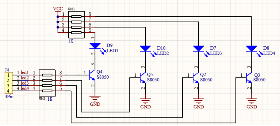

### Progetto 1 Lampeggio LED

**1. Descrizione**

Il lampeggio del LED è un progetto semplice pensato per principianti. È sufficiente collegare un LED alla scheda Arduino e caricare il codice sull’IDE Arduino. Questo progetto rafforza l’apprendimento del quadro concettuale di Arduino e dei metodi d’uso per i principianti.

**2. Principio di funzionamento**



- **LED:** Sopra è mostrato lo schema elettrico del LED. In generale, le porte IO con corrente di uscita limitata possono causare una bassa luminosità del LED, quindi nel circuito viene utilizzato un transistor NPN (Q2) come interruttore. In questo caso, il LED si accende se la base (pin 1) del transistor è a livello alto. Al contrario, il LED si spegne quando la base è a livello basso.

- **Interruttore a transistor:** Per comprendere chiaramente il principio, è necessaria una certa conoscenza dei circuiti elettronici. Per dettagli, si consiglia di consultare materiale specifico. In breve, l’accensione e lo spegnimento del LED dipendono dai livelli alto e basso della base del transistor, che sono determinati dal pin sulla scheda di sviluppo. Il LED si accende quando la base (pin 1) è a livello alto e si spegne quando la base è a livello basso.

**3. Schema di collegamento：**


**4. Caricamento del codice**

```
/*
  keyestudio ESP32 Inventor Learning Kit
  Project 1: LED Blinking
  http://www.keyestudio.com
*/
int ledPin = 5; //Define LED to connect with pin IO5
void setup() 
{
  pinMode(ledPin, OUTPUT);//Set the mode to output
}

void loop() 
{
  digitalWrite(ledPin, HIGH); //Output a high level, LED lights up
  delay(1000);//Delay 1000ms 
  digitalWrite(ledPin, LOW); //Output a low level, LED goes off
  delay(1000);
}
```

**5. Risultato del test**

Dopo aver caricato il codice e acceso l’alimentazione, il LED si accenderà per 1 secondo e si spegnerà per 1 secondo.