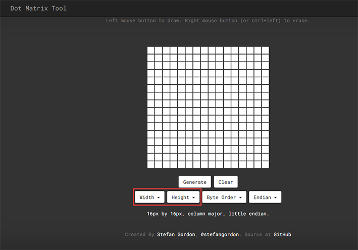
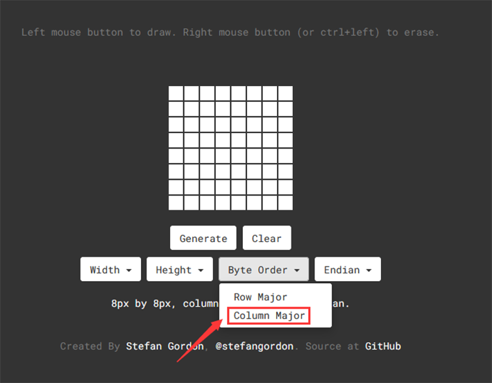
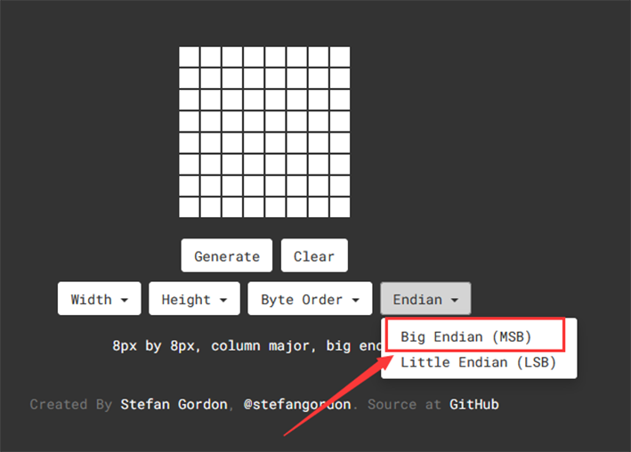

### Project 10 Dot Matrix Display

**1. Beschrijving**

Deze module bestaat uit een 8x8 LED dot matrix met één besturingspin voor elke rij en elke kolom om de helderheid van de LED aan te passen. Door verbinding te maken met een Arduino board, wordt de helderheid van de LED geregeld om karakters en figuren weer te geven via Arduino programmering. Op deze manier kunnen eenvoudige karakters, cijfers en figuren worden weergegeven. Het kan ook worden toegepast in spelmachines of schermen.

**2. Werking**


MAX7219 is een IC met SPI-communicatie en kan worden gebruikt om de 8x8 dot matrix te besturen. De MAX7219 SPI-communicatie is geïntegreerd in onze libraries en kan direct worden aangeroepen.

**Dot Matrix Modulo Operatie**

Klik op de link voor Modulo ：[http://dotmatrixtool.com/#](http://dotmatrixtool.com/#)

**Stappen:**

1. Klik op de link en stel de hoogte en breedte van de dot matrix in. Hier stellen we beide in op 8.



2. Stel "Byte Order" in op "Column Major".



3. Stel "Endian" in op "Big Endian".



4. Klik op de witte tegels om een patroon te vormen dat je wilt (klik nogmaals om te deselecteren), en klik vervolgens op "Generate" om een array voor dit icoon te genereren. Kopieer deze array en plak deze in de code, waarna het patroon op de dot matrix wordt weergegeven.


**3. Aansluitschema**


**4. Testcode**

```
/*
  keyestudio ESP32 Inventor Learning Kit 
  Project 10 Dot Matrix Display
  http://www.keyestudio.com
*/

#include "LedControl.h"
int DIN = 23;
int CLK = 18;
int CS = 15;
LedControl lc=LedControl(DIN,CLK,CS,1);
const byte IMAGES[8] = {0x30, 0x78, 0x7c, 0x3e, 0x3e, 0x7c, 0x78, 0x30};

void setup() 
{
  lc.shutdown(0,false);
  // Stel helderheid in op een gemiddelde waarde
  lc.setIntensity(0,8);
  // Maak het display leeg
  lc.clearDisplay(0);  
}

void loop()
{
  for(int i=0; i < 8; i++)
  {
      lc.setRow(0,i,IMAGES[i]);
  }
}
```

**5. Testresultaat**

Na het aansluiten van de bedrading en het uploaden van de code, wordt er een hart weergegeven op de dot matrix, zoals hieronder getoond.

