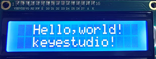
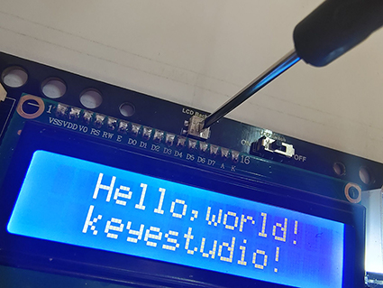

### Projekt 11 LCD

**1. Beschreibung**

Das Arduino I2C 1602 LCD ist ein häufig verwendetes Zusatzgerät für MCU-Entwicklungsboards, um externe Sensoren und Module anzuschließen. Es verfügt über ein 16 Zeichen breites, 2-zeiliges LCD-Display und eine einstellbare Helligkeit. Dieses programmierbare Modul ist praktisch für die Datenbearbeitung, Anzeige und Verwaltung. Darüber hinaus kann es nicht nur Zeichen und Zahlen, sondern auch Sensordaten wie Temperatur-, Feuchtigkeits- oder Druckwerte anzeigen.

Aufgrund seiner Vielseitigkeit wird das Display in vielen Bereichen eingesetzt, darunter Smart-Home-Produkte, industrielle Überwachungssysteme, Robotersteuerungssysteme und Automobilelektroniksysteme.

**2. Funktionsprinzip**


Es basiert auf dem gleichen Prinzip wie die IIC-Kommunikation. Die zugrundeliegenden Funktionen sind in Bibliotheken verpackt, sodass Sie diese direkt aufrufen können. Wenn Sie daran interessiert sind, können Sie sich die zugrundeliegenden Treiberprinzipien näher ansehen.

**3. Schaltplan**


**4. Testcode**

```
/*
  keyestudio ESP32 Inventor Learning Kit 
  Project 11 LCD
  http://www.keyestudio.com
*/
#include <Wire.h>
#include <LiquidCrystal_I2C.h>
LiquidCrystal_I2C lcd(0x27,16,2); // set the LCD address to 0x27 for a 16 chars and 2 line display

void setup()
{
    lcd.init(); // initialize the lcd
    // Print a message to the LCD.
    lcd.backlight();		//Turn on the LCD backlight 
    lcd.setCursor(2,0);		//Set the display position 
    lcd.print("Hello,world!");		//LCD displays "Hello, world!"
    lcd.setCursor(2,1);	
    lcd.print("keyestudio!");		//LCD displays "keyestudio!"
}

void loop()
{
}
```

**5. Testergebnis**

Nach dem Anschließen der Verkabelung und Hochladen des Codes schalten Sie das LCD ein. „Hello, world!“ und „keyestudio!“ werden auf dem LCD angezeigt.



Wenn die Zeichen unscharf sind, justieren Sie bitte das Hintergrundbeleuchtungspotentiometer mit einem kleinen Schlitzschraubendreher (Bitte verwenden Sie angemessene Kraft zum Einstellen). Schließen Sie bei Bedarf eine externe Stromversorgung an.



