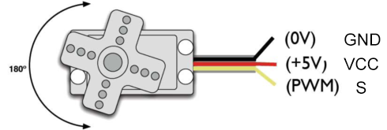
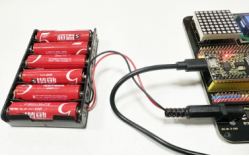

### Projekt 12 Servo

**1. Beschreibung**

Dieser Servo zeichnet sich durch hohe Leistung und hohe Präzision mit einem maximalen Drehwinkel von 180° aus. Mit einem Gewicht von nur 9g ist er perfekt geeignet für jede Mini-Anwendung in verschiedenen Einsatzbereichen. Darüber hinaus verfügt er über eine kurze Anlaufzeit, geringe Geräuschentwicklung und hohe Stabilität.

**2. Funktionsprinzip**

**Winkelbereich:** 180° (360°, 180° und 90°)

**Betriebsspannung:** 3,3V oder 5V

**Pin:** Drei Drähte



**GND:** Masse (braun)

**VCC:** Ein roter Pin, der mit +5V (3,3V) verbunden wird

**S:** Ein oranger Signalleiter, der über PWM-Signal gesteuert wird


**Steuerprinzip:** Der Drehwinkel wird über das Tastverhältnis des PWM-Signals gesteuert. Theoretisch beträgt der Standard-PWM-Zyklus 20ms (50Hz), daher sollte die Pulsbreite im Bereich von 1ms bis 2ms liegen. Tatsächlich reicht die Pulsbreite jedoch von 0,5ms bis 2,5ms, was einem Winkel von 0° bis 180° entspricht. Beachten Sie, dass bei gleichem Signal der Drehwinkel je nach Servo-Hersteller variieren kann.

**3. Schaltplan**


Verwenden Sie eine externe Stromquelle anstelle der reinen USB-Stromversorgung.



**4. Testcode**

```
int servoPin = 4;//servo PIN

void setup() 
{
  pinMode(servoPin, OUTPUT);//servo pin is set to output
}

void loop() 
{
  for(int i = 0 ; i <= 180 ; i++) 
  {
   servopulse(servoPin, i);//Set the servo to rotate from 0° to 180°
  delay(10);//delay 10ms
  }
  for(int i = 180 ; i >= 0 ; i--) 
  {
   servopulse(servoPin, i);//Set the servo to rotate from 180° to 0°
  delay(10);//delay 10ms
  }
}

void servopulse(int pin, int myangle) 
{ //Impulse function
  int pulsewidth = map(myangle, 0, 180, 500, 2500); //Map Angle to pulse width
  for (int i = 0; i < 10; i++) 
  { //Output a few more pulses
    digitalWrite(pin, HIGH);//Set the servo interface level to high
    delayMicroseconds(pulsewidth);//The number of microseconds of delayed pulse width value
    digitalWrite(pin, LOW);//Lower the level of servo interface
  }
}
```

**5. Testergebnis**

Nach dem Anschließen der Verkabelung und Hochladen des Codes beginnt der Servo, sich von 0° bis 180° zu drehen und anschließend in die entgegengesetzte Richtung.