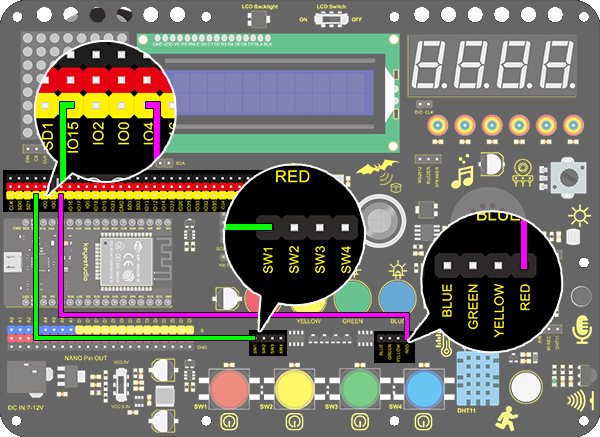

### **プロジェクト13 ミニランプ**

**1. 説明**

このプロジェクトでは、Arduino UNOとボタンを使ってランプを制御します。ボタンを押すと、ランプの状態が切り替わります（ONまたはOFF）。

**2. 動作原理**


ボタンが離されているとき、R29を通った電圧VCCがS端子に高レベルを供給します。押されると、ピン1と3、ピン2と4が接続され、S1の電圧がGNDに接続されて低レベルになります。このとき、R29はVCCとGND間の短絡を防ぎます。

**3. 配線図**


**4. テストコード**

```
/*
  keyestudio ESP32 Inventor Learning Kit 
  Project 13.1 Mini Lamp
  http://www.keyestudio.com
*/
int button = 15;
int value = 0;

void setup() 
{
  Serial.begin(9600); //シリアル通信のボーレートを9600に設定
  pinMode(button, INPUT);  //ボタンピンをデジタルポート8に接続し、入力モードに設定
}

void loop() 
{
  value = digitalRead(button);//ボタンの値を読み取る
  Serial.print("Key status:"); //シリアルポートに「Key status:」を表示
  Serial.println(value); //ボタンの値をシリアルポートに表示し改行
}
```

**5. テスト結果**

配線を接続しコードをアップロードした後、シリアルモニターを開きボーレートを9600に設定します。  
ボタンを押すとシリアルポートに「Key status: 0」と表示され、離すと「Key status: 1」と表示されます。


**6. 知識の拡張**

次に、ボタンの状態を使ってLEDを制御します。

- **フローチャート：**


- **配線図：**



- **コード**

```
/*
  keyestudio ESP32 Inventor Learning Kit 
  Project 13.2 Mini Lamp
  http://www.keyestudio.com
*/
#define led	   4
#define button 15
bool ledState = false;

void setup() 
{
  // デジタルピンPIN_LEDを出力として初期化
  pinMode(led, OUTPUT);
  pinMode(button, INPUT);
}

// loop関数は永遠に繰り返し実行される
void loop() 
{
  if (digitalRead(button) == LOW) {    //ボタンの値が初めて0になったとき、チャタリングが発生するため20ms遅延して再度判定
    delay(20);                              //20ms遅延
    if (digitalRead(button) == LOW) {   //ボタンの値が0か判定
      ledState = !ledState;                 //ledStateを反転させ、LEDのON/OFFを切り替える
      digitalWrite(led, ledState);
    }
    while (digitalRead(button) == LOW);     //ボタンが押されている間はループを保持し、離すと抜ける
  }
}
```

- **テスト結果**

赤いボタンで赤色LEDの点灯・消灯を制御できます。