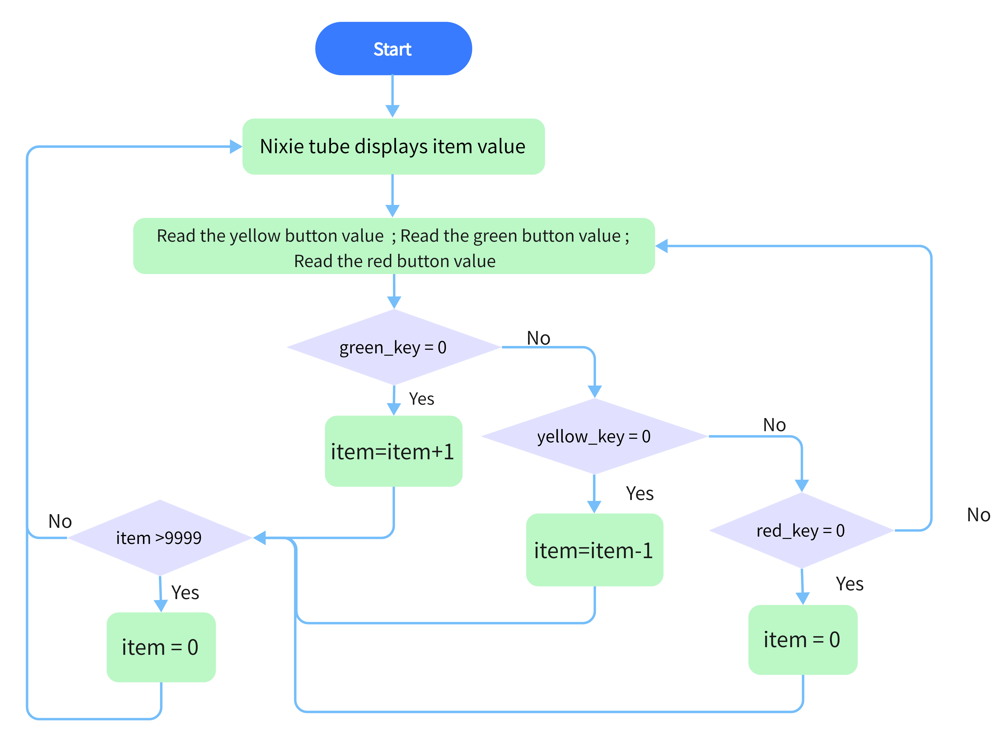
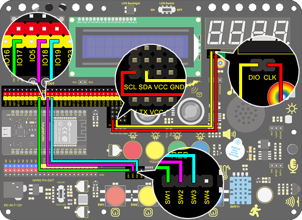

### プロジェクト14 カウンター

**1. 説明**

Arduino 4ビットデジタル管カウンターは、0～9999の範囲内の数字を記録できます。表示速度、カウントモードの調整、およびリセット機能を備えています。このモジュールは、リアルタイムカウンター（ボタン押下やDCモーターの回転数カウントなど）、ゲーム、実験機器に広く応用されています。

**2. フローチャート**



**3. 配線図**



**4. テストコード**

```
/*
  keyestudio ESP32 Inventor Learning Kit 
  Project 14 Counter
  http://www.keyestudio.com
*/
#include "TM1650.h" //Upload TM1650 library file
int item = 0; //Displayed value
#define CLK 22    //pins definitions for TM1650 and can be changed to other ports       
#define DIO 21
TM1650 DigitalTube(CLK,DIO);

int res = 17;     //Reset button
int subtract = 18;   //minus button
int  add = 19;       //plus button

void setup(){
    //set the pin connecting with button to input  
  pinMode(res,INPUT);
  pinMode(add,INPUT);
  pinMode(subtract,INPUT);
  for(char b=0;b<4;b++){
    DigitalTube.clearBit(b);      //DigitalTube.clearBit(0 to 3); Clear bit display.
  }
}

void loop()
{
  DigitalTube.displayFloatNum(item);//Digital tube displays item value 
  int red_key = digitalRead(res);            //Red button is the reset button
  int yellow_key = digitalRead(subtract);    //Yellow button is minus 1
  int green_key = digitalRead(add);           //Green button is plus 1
  if(green_key == 0)
  {
    item++;  //operate to add 1, item = item + 1
    delay(200);
  }
  if(yellow_key == 0)
  {
    item--;		//operate to reduce 1, item = item - 1
    delay(200);
  }
  if(red_key == 0)
  {
    item = 0;
    delay(200);
  }
  if (item > 9999)//return to zero when greater than 9999(excessing the display range)
  {  
    item = 0; 
  }
}
```

**4. テスト結果**

配線を接続しコードをアップロードした後、緑ボタンを押すと1ずつ加算、黄ボタンで1ずつ減算、赤ボタンでリセットします。ボタンを押し続けると、表示値が連続して加算または減算されます。