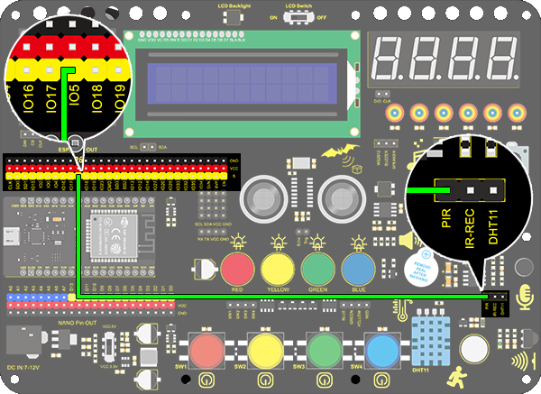
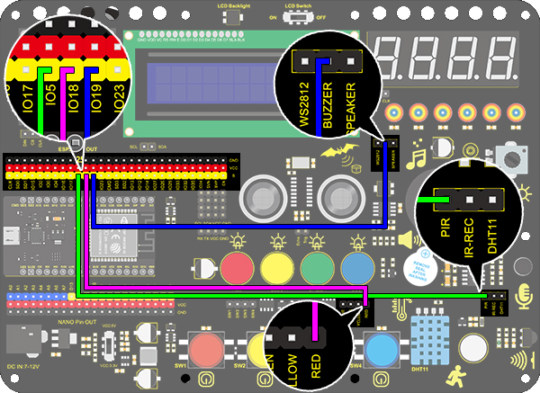

### Projet 17 Alarme d'Invasion

**1. Description**

Ce système d'alarme d'invasion est capable de détecter des intrus dans des maisons ou de petits bureaux et d'avertir l'hôte afin qu'il prenne des mesures à temps.

Dans ce projet, le capteur surveille une certaine zone. Un dispositif sur la carte Arduino déclenchera l'allumage d'une LED et le buzzer émettra un bip pour avertir si un mouvement est détecté dans cette zone.

En pratique, ce module se caractérise par sa praticité, sa facilité d'installation et son faible coût. En plus des maisons et bureaux, il s'applique également aux usines, entrepôts et marchés, ce qui protège dans une large mesure la sécurité des biens.

**2. Principe de Fonctionnement**


Le corps humain (37°C) émet toujours un rayonnement infrarouge avec une longueur d'onde de 10μm, ce qui correspond à celle détectée par le capteur.

De ce fait, ce module est capable de détecter les mouvements humains. S'il y en a, le capteur PIR délivre un niveau haut pendant environ 3 secondes. Sinon, il délivre un niveau bas.

**3. Schéma de Câblage**



**4. Code de Test**

```
/*
  keyestudio ESP32 Inventor Learning Kit  
  Project 17.1 Invasion Alarm
  http://www.keyestudio.com
*/
int pir = 5;    //Define IO5 as PIR sensor pin 

void setup() 
{
  pinMode(pir,INPUT);   //Set IO5 pin to input 
  Serial.begin(9600);
}

void loop() 
{
  int pir_val = digitalRead(pir); 	//Read the PIR result and assign it to pir_val 
    Serial.print("pir_val:"); //Print “pir_val”
	Serial.println(pir_val);
    delay(500);
}
```

**5. Résultat du Test**

Après avoir connecté le câblage et téléchargé le code, ouvrez le moniteur série, réglez le débit en bauds à 9600, et le port série affiche la valeur du PIR. Si le capteur PIR détecte une personne, il affichera 1.


**6. Extension des Connaissances**

Créons une alarme d'invasion. Lorsque le capteur PIR détecte un humain, la LED s'allume et le buzzer émet un son. Dans le cas contraire, la LED s'éteint et le buzzer reste silencieux.

- **Organigramme :**


- **Schéma de Câblage :**



- **Code :**

```
/*
  keyestudio ESP32 Inventor Learning Kit  
  Project 17.2 Invasion Alarm
  http://www.keyestudio.com
*/
int pir = 5;		//Set PIR sensor pin to IO5
int red_led = 18;	//Set red LED to pin IO18
int buzz = 19;		//Set buzzer to pin IO19

void setup() 
{
  // put your setup code here, to run once:
  pinMode(pir,INPUT);		//Set PIR pin to input mode 
  pinMode(red_led,OUTPUT);	//Set LED pin to output mode  
  pinMode(buzz,OUTPUT);		//Set buzzer pin to output mode 
}

void loop() 
{
  // put your main code here, to run repeatedly:
  int pir_val = digitalRead(pir);
  if(pir_val == 1)
  {
    digitalWrite(red_led,HIGH);
    digitalWrite(buzz,HIGH);
  }
  else
  {
    digitalWrite(red_led,LOW);
    digitalWrite(buzz,LOW);
  }
}
```

**Résultat du Test**

Si le capteur PIR détecte une personne à proximité, la LED rouge s'allumera et le buzzer émettra un son.