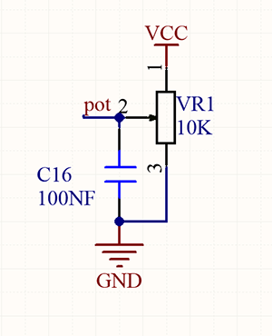
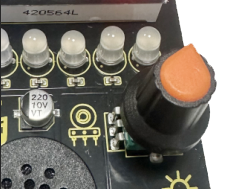
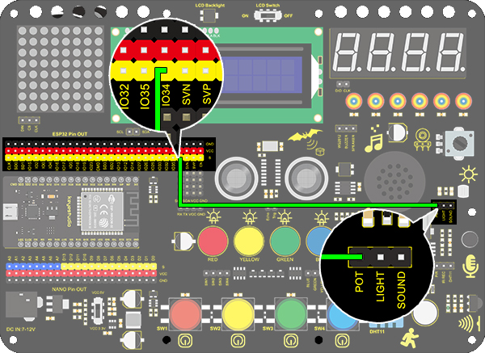

### Projet 19 Lampe à intensité variable

**1. Description**

La lampe à intensité variable ajuste la luminosité de la LED via un potentiomètre et un contrôleur Arduino. La luminosité dépend de la valeur de résistance, qui peut être lue et ajustée en connectant les extrémités du potentiomètre aux broches digitales ou analogiques de la carte. De plus, ce système est appliqué pour contrôler la tension ou le courant d'autres appareils tels que ventilateurs, ampoules et chauffages.

**2. Principe de fonctionnement**





Essentiellement, le potentiomètre est un élément qui peut modifier la valeur de la résistance. Selon la loi d'Ohm (U=I*R), la résistance influence la tension. Notre potentiomètre est de 10K.

Dans ce projet, la résistance maximale est de 10K. La carte ESP32 divisera également la tension de 3V en 4095 parties (3/4095=0.0007326007326). La tension analogique est obtenue en multipliant la valeur lue par 0.0007326007326.

**3. Schéma de câblage**



**4. Code de test**

```
/*
  keyestudio ESP32 Inventor Learning Kit  
   Project 19.1 Dimming Lamp
  http://www.keyestudio.com
*/
int pot = 34;      //Define variable pot to IO34

void setup() 
{
  // put your setup code here, to run once:
  Serial.begin(9600);		//Set baud rate to 9600
}

void loop() 
{
  // put your main code here, to run repeatedly:
  int value = analogRead(pot);	//Read io34 and assign it to the variable value
  Serial.println(value);		//Print the variable value and wrap it around 
  delay(200);
}
```

**5. Résultat du test**

Après avoir connecté le câblage et téléchargé le code, ouvrez le moniteur série en réglant le débit en bauds à 9600, et la valeur analogique s'affichera, dans la plage de 0 à 4095. La rotation du potentiomètre peut modifier la valeur analogique.


**6. Extension des connaissances**

Nous allons contrôler la luminosité de la LED via un potentiomètre. Comme nous le savons, cela est influencé par le PWM. Cependant, la plage de la valeur analogique est de 0 à 4095 tandis que celle du PWM est de 0 à 255. Ainsi, une fonction "map(value, fromLow, fromHigh, toLow, toHigh)" est nécessaire.

**Schéma de câblage :**


**Code :**

```
/*
  keyestudio ESP32 Inventor Learning Kit  
   Project 19.2 Dimming Lamp
  http://www.keyestudio.com
*/
int led = 25;		//Define LED to IO25
int pot = 34;		//Define pot to IO34

void setup() 
{
  // put your setup code here, to run once:
  pinMode(led,OUTPUT);		//Set LED pin to output 
}

void loop() 
{
  // put your main code here, to run repeatedly:
  int value = analogRead(pot);
  int led_val = map(value,0,4095,0,255);  //Convert the range of potentiometer analog value to the range we need  
  analogWrite(led,led_val);
}
```

**7. Résultat du test**

Après le téléchargement réussi du code, la rotation du potentiomètre modifiera la luminosité de la LED rouge.