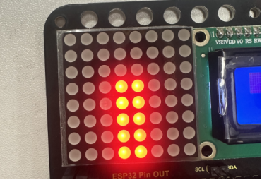

### プロジェクト20 ライトピラー

**1. 説明**

フォトレジスタの抵抗値（1KΩ未満）は光の強さによって変化し、それによりドットマトリクスの明るさを制御できます。制御時には、この抵抗をボードのアナログピンに接続して抵抗の変化を監視します。こうすることで、光がディスプレイの明るさを自動的に制御します。

また、フォトレジスタは日常生活でも広く応用されています。例えば、カーテンが外の光の強さに応じて自動的に開閉するなどです。

**2. 動作原理**


完全に暗い状態では、抵抗は0.2MΩとなり、信号端子（ポイント2）の電圧は0Vに近づきます。光が強くなるほど、抵抗と電圧は小さくなります。

**3. 配線図**


**4. テストコード**

```
/*
  keyestudio ESP32 Inventor Learning Kit 
  Project 20.1 Light Pillar
  http://www.keyestudio.com
*/
int light = 34;      //Define light to IO34

void setup() 
{
  // put your setup code here, to run once:
  Serial.begin(9600);		//Set baud rate to 9600
}

void loop() 
{
  // put your main code here, to run repeatedly:
  int value = analogRead(light);	//Read IO34 and assign it to the variable value
  Serial.println(value);		//Print the variable value and wrap it around 
  delay(200);
}
```

**5. テスト結果**

配線を接続しコードをアップロードした後、シリアルモニターを開きボーレートを9600に設定すると、アナログ値が0～4095の範囲で表示されます。周囲の光の強さを変えることで値も変化します。


**6. 知識の拡張**

このフォトレジスタを使って周囲の光の強さを感知します。中央の2列はこの実験に含まれており、光の強さを表しています。光が強いほど点灯するLEDの数が増え、「ライトピラー（光の柱）」を形成します。

- **配線図：**


- **コード：**

```
/*
  keyestudio ESP32 Inventor Learning Kit 
  Project 20.2 Light Pillar
  http://www.keyestudio.com
*/

#include "LedControl.h"
int DIN = 23;
int CLK = 18;
int CS = 15;
LedControl lc=LedControl(DIN,CLK,CS,1);
const byte IMAGES[8] = {0x01,0x03,0x07,0x0F,0x1F,0x3F,0x7F,0xFF}; //Data of light pillar

int light = 34;

void setup() 
{
  lc.shutdown(0,false);
  // Set brightness to a medium value
  lc.setIntensity(0,8);
  // Clear the display
  lc.clearDisplay(0);
  pinMode(light,INPUT);  
}

void loop()
{
  int value = analogRead(light);
  int temp = map(value,0,4095,0,7);  //Convert the range of analog values to 0-7
  lc.setRow(0,3,IMAGES[temp]);      //Display the value of the array IMAGES[temp] in column 3
  lc.setRow(0,4,IMAGES[temp]);      //Display the value of the array IMAGES[temp] in column 4
}
```

- **テスト結果**

フォトレジスタの近くの光が強いほど、LEDマトリクスの光の柱が高くなります。

