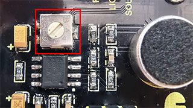
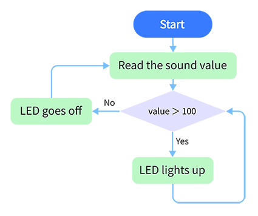
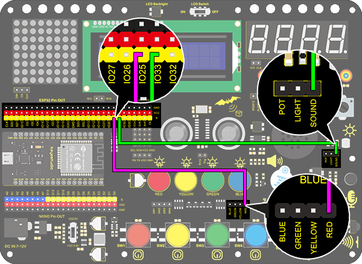

### プロジェクト21 音声制御LED

**1. 説明**

音声制御LEDは、音を検出してLEDの明るさを制御するための装置で、Arduinoボードといくつかの部品で構成されています。マイクロフォンなど複数のセンサーに接続可能です。音を電圧信号の変化に変換し、Arduinoが受信してLEDの点灯・消灯を制御します。

**2. 動作原理**


音を検出すると、マイクロフォン内のエレクトレットフィルムが振動し、静電容量が変化して微小な電圧変化が発生します。

次に、LM3チップを使って検出した音を増幅する適切な回路を構築します。増幅度は可変抵抗で調整可能で、時計回りに回すと増幅率が大きくなります。

**3. 配線図**


**4. テストコード**

```
/*
  keyestudio ESP32 Inventor Learning Kit 
  Project 21.1：Sound Controlled LED
  http://www.keyestudio.com
*/
int sound = 33; //Define sound as IO33

void setup()
{
  Serial.begin(9600);
  pinMode(sound,INPUT);
}

void loop()
{
  int value = analogRead(sound);
  Serial.println(value);
}
```

**5. テスト結果**

配線を接続しコードをアップロードした後、シリアルモニターを開きボーレートを9600に設定すると、アナログ値が表示されます。


**感度調整：**

音声センサーの感度が適切だと感じたら、センサーの可変抵抗を調整します（右回しで最高感度、左回しで最低感度）。



**6. 知識の拡張**

よく見かける廊下のライトは音声制御ライトの一種で、同時にフォトレジスターも含まれています。これとは異なり、ここではLEDが音声のみに影響されるモデルを構築します。アナログ音量が100を超えると、LEDが2秒間点灯し、その後消灯します。

- **フローチャート：**



- **配線図：**



- **コード：**

```
/*
  keyestudio ESP32 Inventor Learning Kit 
  Project 21.2：Sound Controlled LED
  http://www.keyestudio.com
*/
int sound = 33;   //Define sound to IO33
int led = 25;      //Define led to IO25

void setup()
{
  pinMode(led,OUTPUT);   //Set IO25 to output 
}

void loop()
{
  int value = analogRead(sound);    //Read analog value of IO33 and assign it to value
  if(value > 100)
  {                  //Judge whether value is greater than 100
    digitalWrite(led,HIGH);         //If IO25 pin outputs high level, LED lights up
    delay(2000);
  }
  else
  {
    digitalWrite(led,LOW);          //If IO25 pin outputs low level, LED lights off
  }
}
```

- **テスト結果**

音声センサーが検出した値が100を超えると、赤色LEDが点灯します。