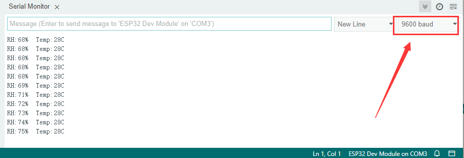
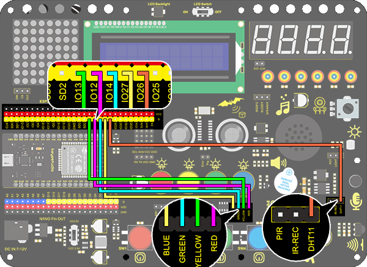

### Proyecto 23 Taza Inteligente

**1. Descripción**

En este proyecto, utilizamos principalmente la placa de desarrollo Arduino para crear una taza inteligente programable, que muestra la temperatura del líquido interior mediante un indicador RGB. Puede controlar el brillo de la luz configurando un umbral de temperatura. Si se supera el umbral, la luz se vuelve más brillante. De lo contrario, se atenúa.

La taza inteligente ayuda a los usuarios a controlar mejor la temperatura de su agua para beber y a prevenir eficazmente el sobrecalentamiento o la congelación.

**2. Principio de Funcionamiento**


**3. Diagrama de Conexiones**


**4. Código de Prueba**

```
/*
  keyestudio ESP32 Inventor Learning Kit 
  Project 23.1 Smart Cup
  http://www.keyestudio.com
*/
#include <xht11.h>
xht11 xht(26);   //The DHT11 sensor connects to IO26
unsigned char dat[] = {0,0,0,0}; //Define an array to store temperature and humidity data

void setup() 
{
  // put your setup code here, to run once:
  Serial.begin(9600);
}

void loop() 
{
  // put your main code here, to run repeatedly:
  if (xht.receive(dat)) { //Check correct return to true
    Serial.print("RH:");
    Serial.print(dat[0]); //The integral part of humidity,dht[1] is the decimal part
    Serial.print("%  ");
    Serial.print("Temp:");
    Serial.print(dat[2]); //The integer part of the temperature,dht[3] is the decimal part
    Serial.println("C");
  } 
  else 
  {    //Read error
    Serial.println("sensor error");
  }
  delay(1500);  //Delay 1500ms 
}
```

**5. Resultado de la Prueba**

Después de conectar el cableado y subir el código, abra el monitor serial y configure la velocidad en 9600 baudios, y se mostrarán los valores de temperatura y humedad.



**6. Ampliación de Conocimientos**

Ahora, haremos una taza inteligente que pueda mostrar la temperatura del líquido. Dividimos 100 en cuatro partes con un LED, como se muestra a continuación:

- **LED Rojo:** 100-75°C
- **LED Amarillo:** 75-50°C
- **LED Verde:** 50-25°C
- **LED Azul:** 25-0°C

**Diagrama de Conexiones：**



**Código：**

```
/*
  keyestudio ESP32 ESP32 Inventor Learning Kit 
  Project 23.2 Smart Cup
  http://www.keyestudio.com
*/
#include <xht11.h>
xht11 xht(26);                         //Define DHT11 to pin IO26
unsigned char dat[4] = { 0, 0, 0, 0 };  //Define an array to store temperature and humidity data

int red_led = 12;
int yellow_led = 13;   //Define yellow_led to io13
int green_led = 14;    //Define green_led to io14
int blue_led = 27;     //Define blue_led to io27
int temperature = 0;  //Set an variable to save the temperature value

void setup() 
{
  // put your setup code here, to run once:
  pinMode(red_led, OUTPUT);     //Set io12 to ouput 
  pinMode(green_led, OUTPUT);   //Set io13 to ouput 
  pinMode(blue_led, OUTPUT);    //Set io14 to ouput 
  pinMode(yellow_led, OUTPUT);  //Set io27 to ouput 
  Serial.begin(9600);
}

void loop() 
{
  // put your main code here, to run repeatedly:
  if (xht.receive(dat))  //Check correct return to true
  { 
    temperature = dat[2];
    if (temperature > 75) // Determine whether value is greater than 75
    {  
      digitalWrite(green_led, LOW);
      digitalWrite(red_led, HIGH);
      digitalWrite(blue_led, LOW);
      digitalWrite(yellow_led,LOW);
    }
    if (temperature < 75 && temperature > 50) //Determine whether value is between 50 and 75 
    {  
      digitalWrite(green_led, LOW);
      digitalWrite(red_led, LOW);
      digitalWrite(blue_led, LOW);
      digitalWrite(yellow_led,HIGH);
    }
    if (temperature < 50 && temperature > 25) //Determine whether value is between 25 and 50 
    {  
      digitalWrite(green_led, HIGH);
      digitalWrite(red_led, LOW);
      digitalWrite(blue_led, LOW);
      digitalWrite(yellow_led,LOW);
    }
    if (temperature < 25)  //Determine whether value is smaller than 25 
    { 
      digitalWrite(green_led, LOW);
      digitalWrite(red_led, LOW);
      digitalWrite(blue_led, HIGH);
      digitalWrite(yellow_led,LOW);
    }
  }
  delay(1500);  //Delay 1500ms
}
```

**Resultado de la Prueba**

- **LED Rojo:** 100-75°C
- **LED Amarillo:** 75-50°C
- **LED Verde:** 50-25°C
- **LED Azul:** 25-0°C

Si el LED azul está encendido, significa que la temperatura detectada por el sensor DHT11 está en el rango de 0-25°.