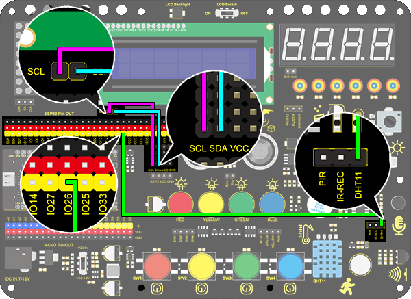

### Projet 24 Station Météo

**1. Description**

Cette station météo enregistre la température ambiante et l'humidité via une carte Arduino et un capteur de température et d'humidité.

**2. Schéma de câblage**



**3. Code de test**

```
/*
  keyestudio ESP32 Inventor Learning Kit  
  Project 24：Weather Station
  http://www.keyestudio.com
*/

#include <LiquidCrystal_I2C.h>
#include <xht11.h>
LiquidCrystal_I2C lcd(0x27, 16,2);  // set the LCD address to 0x27 for a 16 chars and 2 line display
xht11 xht(26);                         //The DHT11 sensor connects to IO26
unsigned char dat[] = { 0, 0, 0, 0 };  //Define an array to store temperature and humidity data

void setup() 
{
  lcd.init();  // initialize the lcd
  lcd.backlight();
}

void loop() 
{
  if (xht.receive(dat))  //Check correct return to true
  { 
    lcd.setCursor(0, 0);
    lcd.print("humidity:");
    lcd.setCursor(9, 0);
    lcd.print(dat[0]);
    lcd.setCursor(0, 1);
    lcd.print("temperature:");
    lcd.setCursor(12, 1);
    lcd.print(dat[2]);
  }
  delay(1500);  //Delay 1500ms
}
```

**4. Résultat du test**

Après avoir connecté le câblage et téléversé le code, l'affichage LCD montrera directement la valeur d'humidité et de température ambiantes.

