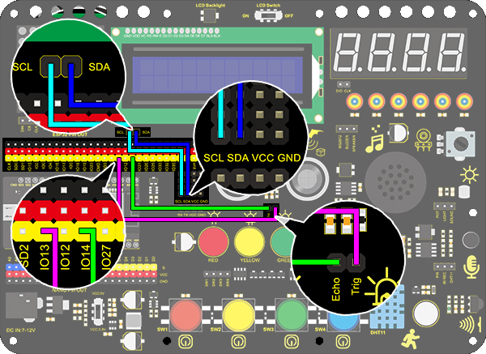

### Project 25 Ultrasone Afstandsmeter

**1. Beschrijving**

Deze ultrasone afstandsmeter meet de afstand van obstakels door geluidsgolven uit te zenden en vervolgens de echo te ontvangen. Met andere woorden, de afstand is geen directe waarde, maar een waargenomen waarde door een theoretische berekening van het tijdsverschil tussen zender en ontvanger.

Ultrasoon kan de vorm van objecten detecteren, automatische deuren aansturen en de stroomsnelheid en druk inschatten.

Bovendien ondersteunt het samenwerking met computers. Hierdoor kan de gemeten waarde via een Arduino-board naar computers worden verzonden.

In het dagelijks leven wordt het veel gebruikt voor motoren, servo’s en LEDs, evenals systemen (automatische navigatie-, controle- en beveiligingsmonitoringsystemen).

**2. Werkingsprincipe**


Zoals we allemaal weten, is ultrasoon een soort onhoorbare geluidsgolf met een hoge frequentie. Net als een vleermuis meet deze module de afstand van obstakels door het tijdsverschil te berekenen tussen het uitzenden van de golf en het ontvangen van de echo.

**Maximale afstand:** 3M

**Minimale afstand:** 5cm

**Detectiehoek:** ≤15°

**3. Aansluitschema**


**4. Testcode**

```
/*
  keyestudio ESP32 Inventor Learning Kit  
  Project 25.1：Ultrasonic Rangefinder
  http://www.keyestudio.com
*/
int distance = 0; //Define a variable to receive the diatance value 
int EchoPin = 14; //Connect Echo pin to io14
int TrigPin = 13; //Connect Trig pin to io13

float checkdistance() { //Acquire the distance 
  // preserve a short low level to ensure a clear high pulse:
  digitalWrite(TrigPin, LOW);
  delayMicroseconds(2);    //Delay 2um
  //Trigger the sensor by a high pulse of 10um or longer 
  digitalWrite(TrigPin, HIGH);
  delayMicroseconds(10);		//Delay 10um
  digitalWrite(TrigPin, LOW);
  //Read the signal from the sensor: a high level pulse
  //Duration is detected from the point sending "ping" command to the time receiving echo signal (unit: um).
  float distance = pulseIn(EchoPin, HIGH) / 58.00;  //Convert into distance
  delay(10);
  return distance; //Return the diatance value
}

void setup() 
{
  Serial.begin(9600);//Set the baud rate to 9600
  pinMode(TrigPin, OUTPUT);//Set Trig pin to output
  pinMode(EchoPin, INPUT);  //Set Echo pin to input 
}

void loop() 
{
  distance = checkdistance();   //Assign the read value to "distance" 
  if (distance < 4 || distance >= 400) //Display "-1" if exceeding the detection range 
  {  
    distance = -1;
  }
  Serial.print("ditance: ");
  Serial.print(distance);
  Serial.println(" CM");
  delay(200);
}
```

**5. Testresultaat**

Na het aansluiten van de bedrading en het uploaden van de code, open je de seriële monitor en stel je de baudrate in op 9600. De seriële poort toont de afstandswaarde.


**6. Kennisuitbreiding**

Laten we een afstandsmeter maken.

We tonen tekens op een LCD 1602. Het programma toont "Keyestudio" op (3,0) en “distance:” op (0,1), gevolgd door de afstandswaarde op (9,1).

Wanneer de waarde kleiner is dan 100 (of 10), blijft er een rest van het derde (of het tweede) cijfer zichtbaar. Daarom is een "if"-controle nodig om een bepaalde conditie te bepalen.

**Aansluitschema:**



**Code:**

```
/*
  keyestudio ESP32 Inventor Learning Kit  
  Project 25.2：Ultrasonic Rangefinder
  http://www.keyestudio.com
*/
#include <Wire.h>
#include <LiquidCrystal_I2C.h>
LiquidCrystal_I2C lcd(0x27,16,2); //set the LCD address to 0x27 for a 16 chars and 2 line display

int distance = 0; //Define a variable to receive the diatance value 
int EchoPin = 14; //Connect Echo pin to io14
int TrigPin = 13; //Connect Trig pin to io13
float checkdistance() { //Acquire the distance 
  // preserve a short low level to ensure a clear high pulse:
  digitalWrite(TrigPin, LOW);
  delayMicroseconds(2);
  //Trigger the sensor by a high pulse of 10um or longer 
  digitalWrite(TrigPin, HIGH);
  delayMicroseconds(10);
  digitalWrite(TrigPin, LOW);
  // Read the signal from the sensor: a high level pulse
  //Duration is detected from the point sending "ping" command to the time receiving echo signal (unit: um).
  float distance = pulseIn(EchoPin, HIGH) / 58.00;  //Convert into distance
  delay(10);
  return distance;
}

void setup() 
{
  	Serial.begin(9600);//Set the baud rate to 9600
  	pinMode(TrigPin, OUTPUT);//Set Trig pin to output
  	pinMode(EchoPin, INPUT);  //Set Echo pin to input 
    lcd.init(); // initialize the lcd
    // Print a message to the LCD.
    lcd.backlight();
    lcd.setCursor(3,0);
    lcd.print("Keyestudio");
}

void loop() 
{
  distance = checkdistance();
 
  if (distance < 2 || distance >= 400) //Display "-1" if exceeding the detection range 
  {  
    distance = -1;
  }
  if(distance < 100 && distance > 10){             //Eliminate the shadow of the third digit when the value drops to two digits
    lcd.setCursor(11,1);
    lcd.print(" ");
  }
  if(distance < 10)//Eliminate two-digit shadows when the value drops to one digit
  {              
    lcd.setCursor(10,1);
    lcd.print(" ");
  }
  lcd.setCursor(0,1);
  lcd.print("distance:");
  lcd.setCursor(9,1);
  lcd.print(distance);
  delay(200);
}