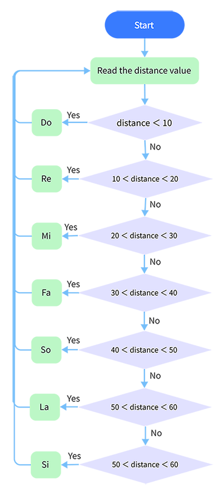

### Project 26 Menselijk Lichaam Piano

**1. Beschrijving**

De analoge piano bestaat uit een ontwikkelbord en een ultrasone sensor. Hiermee kun je verschillende tonen spelen door de positie van je vingers te detecteren. Dit module kan dus een piano stimuleren om muziek en liedjes te spelen.

**2. Stroomschema**



**3. Aansluitschema**


**4. Testcode**

```
/*
  keyestudio ESP32 Inventor Learning Kit  
  Project 26 Human Body Piano
  http://www.keyestudio.com
*/
int distance = 0; //Define a variable to receive the distance 
int EchoPin = 14; //Connect Echo pin to io14
int TrigPin = 13; //Connect Trig pin to io13

int beeppin = 5;

float checkdistance() { //Acquire distance
  // preserve a short low level to ensure a clear high pulse:
  digitalWrite(TrigPin, LOW);
  delayMicroseconds(2);
  // Trigger the sensor by a high pulse of 10um or longer 
  digitalWrite(TrigPin, HIGH);
  delayMicroseconds(10);
  digitalWrite(TrigPin, LOW);
  // Read the signal from the sensor: a high level pulse
  //Duration is detected from the point sending "ping" command to the time receiving echo signal (unit: um).
  float distance = pulseIn(EchoPin, HIGH) / 58.00;  //Convert into distance
  delay(10);
  return distance;
}

void setup() 
{
  Serial.begin(9600);//Set the baud rate to 9600
  pinMode(TrigPin, OUTPUT);//Set Trig pin to output
  pinMode(EchoPin, INPUT);  //Set Echo pin to input 
}

void loop() 
{
  distance = checkdistance();
  if(distance < 10)
  {            
    tone(beeppin, 262);//Play DO
    delay(1000);
  }
  if(distance < 20 && distance > 10)
  {            
    tone(beeppin, 294);//Play Re
    delay(1000);
  }
  if(distance < 30 && distance > 20)
  {            
    tone(beeppin, 330);//Play Mi
    delay(1000);
  }
  if(distance < 40 && distance > 30)
  {             
    tone(beeppin, 349);//Play fa
    delay(1000);
  }
  if(distance < 50 && distance > 40)
  {             
    tone(beeppin, 392);//Play So
    delay(1000);
  }
  if(distance < 60 && distance > 50){             
    tone(beeppin, 440);//Play La
    delay(1000);
  }
  if(distance < 70 && distance > 60)
  {             
    tone(beeppin, 494);//Play Si
    delay(1000);
  }
  Serial.println(distance);
  noTone(beeppin);//Stop
}
```

**5. Testresultaat**

Sluit de bedrading aan en upload de code.

- Speel Do wanneer de afstand minder is dan 10.
- Speel Re wanneer de afstand tussen 10 en 20 ligt.
- Speel Mi wanneer de afstand tussen 20 en 30 ligt.
- Speel Fa wanneer de afstand tussen 30 en 40 ligt.
- Speel So wanneer de afstand tussen 40 en 50 ligt.
- Speel La wanneer de afstand tussen 50 en 60 ligt.
- Speel Si wanneer de afstand tussen 60 en 70 ligt.