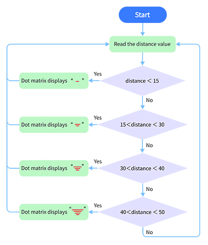
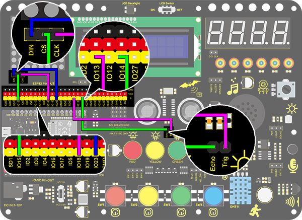
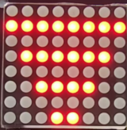

### プロジェクト27 インテリジェントパーキング

**1. 説明**

このインテリジェントパーキングシステムは超音波センサーを使って駐車位置を検出し、最適化します。このシステムにより、誤った駐車を大幅に防止できます。

まず、駐車場の周囲にセンサーを設置します。次に、車とその周囲の距離を検出し、その情報を開発ボードに送信して、車が自動的に最適な駐車位置に調整されるように制御します。

**2. フローチャート**



**3. 配線図**



**4. テストコード**

```
/*
  keyestudio ESP32 Inventor Learning Kit  
  Project 27 Intelligent Parking
  http://www.keyestudio.com
*/
#include <LedControl.h>

int DIN = 23;  //Define DIN pin to IO23
int CS = 15;   //Define CS pin to IO15
int CLK = 18;  //Define CLK pin to IO18

int temp = 0;

int distance = 0;  //Define a variable to receive the distance
int EchoPin = 14;  //Connect Echo pin to IO14
int TrigPin = 13;  //Connect Trig pin to IO13

float checkdistance() {  //Acquire distance
  // preserve a short low level to ensure a clear high pulse:
  digitalWrite(TrigPin, LOW);
  delayMicroseconds(2);
  // Trigger the sensor by a high pulse of 10um or longer
  digitalWrite(TrigPin, HIGH);
  delayMicroseconds(10);
  digitalWrite(TrigPin, LOW);
  // Read the signal from the sensor: a high level pulse
  //Duration is detected from the point sending "ping" command to the time receiving echo signal (unit: um).
  float distance = pulseIn(EchoPin, HIGH) / 58.00;  //Convert into distance
  delay(10);
  return distance;
}

LedControl lc = LedControl(DIN, CLK, CS, 4);
byte data_val[4][8] = 
{
  { 0x00, 0x00, 0x00, 0x01, 0x01, 0x00, 0x00, 0x00 },
  { 0x00, 0x00, 0x04, 0x05, 0x05, 0x04, 0x00, 0x00 },
  { 0x00, 0x10, 0x14, 0x15, 0x15, 0x14, 0x10, 0x00 },
  { 0x40, 0x50, 0x54, 0x55, 0x55, 0x54, 0x50, 0x40 },
};


void setup() 
{
  lc.shutdown(0, false);  //MAX72XX is in power-saving mode at startup
  lc.setIntensity(0, 8);  //Set the brightness to its maximum value
  lc.clearDisplay(0);     //Clear display

  pinMode(TrigPin, OUTPUT);  //Set Trig pin to output 
  pinMode(EchoPin, INPUT);   //Set Echo pin to input 
  Serial.begin(9600);
}

void loop() 
{
  distance = checkdistance();
  Serial.println(distance);
  if (distance < 15) 
  {
    temp = 0;
  } 
  else if (distance < 30 && distance > 15) 
  {
    temp = 1;
  } 
  else if (distance < 40 && distance > 30) 
  {
    temp = 2;
  } 
  else if (distance > 50) 
  {
    temp = 3;
  }
  for (int i = 0; i < 8; i++) 
  {
    lc.setRow(0, i, data_val[temp][i]);
  }
}
```

**5. テスト結果**

配線を接続しコードをアップロードすると、ドットマトリクスに線が表示されます。検出された距離が50cm未満の場合、表示される線の数が少なくなります。

