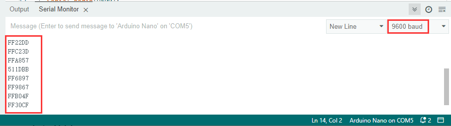

### Projekt 29 IR-Fernbedienung

**1. Beschreibung**

Die IR-Fernbedienung verwendet IR-Signale zur Steuerung einer LED, was den Prozess der LED-Steuerung erheblich vereinfacht.

**2. Funktionsprinzip**


In diesem Projekt verwenden wir häufig einen Träger mit etwa 38K zur Modulation.

Das IR-Fernbediensystem umfasst Modulation, Aussendung und Empfang. Es sendet Daten durch Modulation, was die Übertragungseffizienz verbessert und den Stromverbrauch reduziert.

Im Allgemeinen liegt die Frequenz der Trägermodulation im Bereich von 30kHz bis 60kHz (meist 38kHz). Das Tastverhältnis der Rechteckwelle beträgt 1/3, wie unten gezeigt, und wird durch den 455kHz Quarzoszillator auf der Senderseite bestimmt.

Eine ganzzahlige Frequenzteilung ist für den Quarzoszillator an dieser Stelle unerlässlich, und der Frequenzfaktor beträgt üblicherweise 12. Daher gilt: 455kHz ÷ 12 ≈ 37,9kHz ≈ 38kHz.

**38kHz Träger (vollständig) Aussendediagramm:**


**Trägerfrequenz:** 38kHz

**Wellenlänge:** 940nm

**Empfangswinkel:** 90°

**Steuerabstand:** 6M

**Schaltplan der Fernbedienungstasten:**


**3. Anschlussdiagramm**


**4. Testcode**

```
/*
  keyestudio ESP32 Inventor Learning Kit  
  Project 29.1 IR Remote Control
  http://www.keyestudio.com
*/
#include <Arduino.h>
#include <IRremoteESP8266.h>
#include <IRrecv.h>
#include <IRutils.h>

const uint16_t recvPin = 19;  // Infrarot-Empfangspin
IRrecv irrecv(recvPin);  // Erstellen eines Klassenobjekts zum Empfang
decode_results results;   // Erstellen eines Objekts für Dekodierungsergebnisse
long ir_rec;

void setup()
{
  Serial.begin(9600); // Initialisiert die serielle Schnittstelle und setzt die Baudrate auf 9600
  irrecv.enableIRIn(); // Startet den Empfang von Signalen
}

void loop() 
{
  if (irrecv.decode(&results)) 
  {
    ir_rec = results.value; // Weist das Signal der Variablen ir_rec zu
    if(ir_rec != 0)
    {		// Verhindert, dass der Code bei gedrückter Taste mehrfach ausgeführt wird
        Serial.print(ir_rec, HEX); // Gibt die Variable ir_rec im Hexadezimalformat aus
        Serial.println();// Zeilenumbruch
    }
    irrecv.resume(); // Gibt die IR-Fernbedienung frei und empfängt den nächsten Wert.
  }
} 
```

**5. Testergebnis**

Nach dem Anschluss der Verkabelung und Hochladen des Codes öffnen Sie den seriellen Monitor und stellen die Baudrate auf 9600 ein.

Drücken Sie eine Taste auf der Fernbedienung, und Sie sehen den Wert im Hexadezimalformat.



**6. Wissensvertiefung**

Als Nächstes verwenden wir eine IR-Fernbedienung, um die LED zu steuern. Drücken Sie OK, um die LED einzuschalten, und drücken Sie erneut, um sie auszuschalten.

**Anschlussdiagramm：**


**Code：**

```
/*
  keyestudio ESP32 Inventor Learning Kit 
  Project 29.2 IR Remote Control
  http://www.keyestudio.com
*/
#include <Arduino.h>
#include <IRremoteESP8266.h>
#include <IRrecv.h>
#include <IRutils.h>

int led = 25;
int led_val = 0;
const uint16_t recvPin = 19;  // Infrarot-Empfangspin
IRrecv irrecv(recvPin);       // Erstellen eines Klassenobjekts zum Empfang
decode_results results;       // Erstellen eines Objekts für Dekodierungsergebnisse
long ir_rec;

void setup() 
{
  Serial.begin(9600);   // Initialisiert die serielle Schnittstelle und setzt die Baudrate auf 9600
  irrecv.enableIRIn();  // Startet den Empfang von Signalen
  pinMode(led, OUTPUT);
}

void loop() 
{
  if (irrecv.decode(&results)) 
  {
    ir_rec = results.value;      // Weist das Signal der Variablen ir_rec zu
    if (ir_rec != 0) 
    {           // Verhindert, dass der Code bei gedrückter Taste mehrfach ausgeführt wird
      if (ir_rec == 0xFF02FD) // Prüft, ob das empfangene IR-Signal von der OK-Taste stammt
      {  
        led_val = !led_val;      // Kehrt die Variable um. Wenn der Anfangswert 0 ist, wird er nach der Umkehrung 1
        digitalWrite(led, led_val);
      }
    }
    irrecv.resume();  // Gibt die IR-Fernbedienung frei und empfängt den nächsten Wert.
  }
}
```

**Testergebnis:** 

Drücken Sie OK, um die LED einzuschalten, und drücken Sie erneut, um sie auszuschalten.