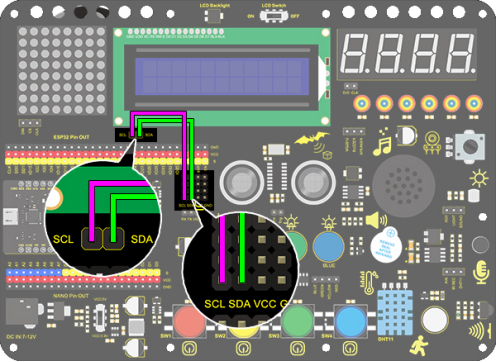
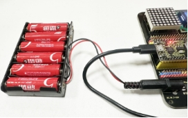
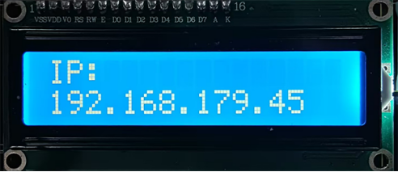

### Progetto 31 Collegare la scheda ESP32 al WiFi

**1. Descrizione**

ESP32 vanta un modulo Wi-Fi e Bluetooth integrato, ampiamente utilizzato nell'Internet delle Cose (IoT). Grazie a questa funzione, può controllare a distanza la trasmissione dei dati tramite la rete wireless.

Nelle applicazioni, ESP32 può essere utilizzato come client per connettersi a una rete Wi-Fi, oppure come hotspot per creare una propria rete. Attraverso queste connessioni, ESP32 riceve comandi per controllare dispositivi esterni, come accendere/spegnere luci e regolare la temperatura. Nel codice, vengono utilizzati protocolli come HTTP e MQTT per comunicare con il server al fine di inviare e ricevere dati, permettendo così il controllo e il monitoraggio remoto.

**2. WiFi ESP32**

La scheda di sviluppo ESP32 è dotata di Wi-Fi integrato (2.4G) e Bluetooth (4.2), che le consentono di connettersi facilmente a una rete Wi-Fi e comunicare con altri dispositivi nella rete. È possibile visualizzare pagine web nel browser tramite ESP32.

· Modalità stazione base (STA / modalità client Wi-Fi): ESP32 è connesso a un hotspot Wi-Fi (AP).

· Modalità AP (Soft-AP / modalità hotspot Wi-Fi): uno o più dispositivi Wi-Fi sono connessi a ESP32.

· Modalità AP-STA: ESP32 è sia hotspot Wi-Fi che dispositivo Wi-Fi connesso a un'altra rete Wi-Fi.

· Queste modalità supportano molteplici modalità di sicurezza, inclusi WPA, WPA2 e WEP.

· È in grado di scansionare hotspot Wi-Fi (attivi o passivi).

· Supporta la modalità promiscuous per monitorare i pacchetti Wi-Fi IEEE802.11.

**3. Schema di collegamento**



**Note:**

1. È necessario preparare un WiFi a frequenza 2.4GHz (non 5GHz). Può essere un hotspot mobile o un router.

2. La scheda ESP32 consuma più energia quando è connessa alla rete, quindi è necessario collegare un'alimentazione esterna a questo kit. Forniamo un supporto per 6 batterie AA (batterie non incluse), che puoi collegare alla porta DC della scheda integrata ESP32.

   

3. Ricorda il nome e la password della tua rete WiFi e inseriscili nel codice prima di caricarlo.

```
const char* ssid = "your_SSID"; // Inserisci il nome WiFi, ad esempio,= "KEYES"
const char* password = "your_password"; // Inserisci la password WiFi, ad esempio,= "123456"
```

**4. Caricamento del codice**

```
/*
  keyestudio ESP32 Inventor Learning Kit
  Project 31 ESP32 WiFi
  http://www.keyestudio.com
*/
#include <WiFi.h>
#include <LiquidCrystal_I2C.h>

LiquidCrystal_I2C lcd(0x27, 16, 2);
const char* ssid = "your_SSID"; // imposta il nome del tuo WiFi
const char* password = "your_password"; // imposta la password del tuo WiFi
WiFiServer server(80);
int i = 0;

void setup() 
{
  lcd.init();  // inizializza il lcd
  // Iniziamo con la connessione a una rete WiFi
  lcd.backlight();

  lcd.setCursor(0, 0);
  lcd.print("IP:");

  WiFi.begin(ssid, password);

  while (WiFi.status() != WL_CONNECTED) 
  {
    lcd.setCursor(i, 1);
    lcd.print(".");
    delay(500);
    i++;
    if (i > 15) 
    {
      i = 0;
      lcd.setCursor(0, 1);
      lcd.print("                ");
    }
  }
  lcd.setCursor(0, 1);
  lcd.print("                ");
  lcd.setCursor(0, 1);
  lcd.print(WiFi.localIP());
}

void loop() 
{
}
```

**5. Risultato del test**

Dopo aver caricato il codice, LCD1602 mostra l'indirizzo IP della rete WiFi a cui ESP32 è connesso.



**6. Approfondimento**

L'indirizzo IP visualizza “Hello World!”.

```
#include <WiFi.h>
#include <ESPAsyncWebServer.h>
#include <LiquidCrystal_I2C.h>
LiquidCrystal_I2C lcd(0x27, 16, 2);

// Configurazione WiFi

const char* ssid = "your-SSID";     // nome del tuo WiFi
const char* password = "your-PASSWORD";  // password del tuo WiFi
int i = 0;
// Crea un Web Server
AsyncWebServer server(80);

void setup() 
{
  lcd.init();  // inizializza il lcd
  lcd.backlight();
  lcd.setCursor(0, 0);
  lcd.print("IP:");

  // Connessione WiFi
  WiFi.begin(ssid, password);
  while (WiFi.status() != WL_CONNECTED) 
  {
    lcd.setCursor(i, 1);
    lcd.print(".");
    delay(500);
    i++;
    if (i > 15) 
    {
      i = 0;
      lcd.setCursor(0, 1);
      lcd.print("                ");
    }
  }
  lcd.setCursor(0, 1);
  lcd.print("                ");
  lcd.setCursor(0, 1);
  lcd.print(WiFi.localIP());

  // Gestisce la richiesta del client e restituisce la pagina
  server.on("/", HTTP_GET, [](AsyncWebServerRequest* request) {
    String html = generateHTML();
    request->send(200, "text/html", html);
  });
  // Avvia il Web server
  server.begin();
}

String generateHTML()
{
  // Genera la pagina HTML
  String html = "<html><head>";
  html += "<h1>Hello, World!</h1>";
  html += "</head></html>";
  return html;
}

void loop() 
{
}
```

**7. Risultato del test**

Usa un computer o uno smartphone connesso alla stessa rete della scheda ESP32 e accedi all'indirizzo IP mostrato sul LCD1602: vedrai “Hello world”.

