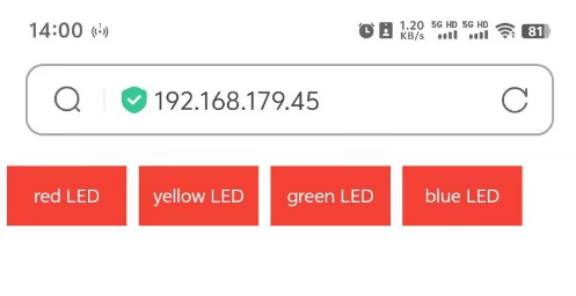

### Project 32 ESP32 WiFi Besturing LED

**1. Beschrijving**

Vervolgens leren we de LED te bedienen via wifi op een mobiele telefoon of een computer.

**Opmerkingen:**

1. Je moet een 2.4GHz frequentie WIFI voorbereiden, geen 5GHz frequentie. Dit kan een mobiele hotspot of een router zijn.

2. De ESP32 board verbruikt meer stroom wanneer verbonden met het netwerk, dus je moet een externe voeding aansluiten op deze kit. We leveren een 6XAA Batterijhouder (batterijen niet inbegrepen), die je kunt aansluiten op de DC-poort van de ESP32 geïntegreerde board.


3. Wanneer je andere apparaten gebruikt om deze kit te bedienen, moet de ESP32 board verbonden zijn met hetzelfde netwerk als je bedieningsapparaat.

4. Onthoud je wifi-netwerknaam en wachtwoord en vul deze in de code in voordat je deze uploadt.

```
const char* ssid = "your_SSID"; // Vul WiFi naam in, bijvoorbeeld,= "KEYES"
const char* password = "your_password"; // Vul WiFi wachtwoord in, bijvoorbeeld,= "123456"
```

**2. Aansluitschema**


**3. Code Uploaden**

```
#include <WiFi.h>
#include <ESPAsyncWebServer.h>
#include <LiquidCrystal_I2C.h>

LiquidCrystal_I2C lcd(0x27, 16, 2);

// WiFi configuratie
const char* ssid = "your-SSID";    // jouw WiFi naam
const char* password = "your-PASSWORD";  // jouw WiFi wachtwoord

// Maak een Web Server aan
AsyncWebServer server(80);

// LED pin configuratie
#define redLED 12
#define yellowLED 13
#define greenLED 14
#define blueLED 15

// LED status
bool redLEDState = false;
bool yellowLEDState = false;
bool greenLEDState = false;
bool blueLEDState = false;
int i = 0;

// Maak HTML pagina
String generateHTML() 
{
  String html = "<html><head><style>";
  html += "button { font-size: 30px; padding: 15px; margin: 10px; border: none; cursor: pointer; width: 200px; height: 100px; }";
  html += "button.on { background-color: #4CAF50; color: white; }";   // kleur van LED aan
  html += "button.off { background-color: #f44336; color: white; }";  // kleur van LED uit
  html += "</style></head><body>";

  // Concatenatie na het converteren van een constante String naar een String object met String()
  html += "<button id='btn0' class='" + String(redLEDState ? "on" : "off") + "' onclick='toggleLed(0)'>rode LED</button>";
  html += "<button id='btn1' class='" + String(yellowLEDState ? "on" : "off") + "' onclick='toggleLed(1)'>gele LED</button>";
  html += "<button id='btn2' class='" + String(greenLEDState ? "on" : "off") + "' onclick='toggleLed(2)'>groene LED</button>";
  html += "<button id='btn3' class='" + String(blueLEDState ? "on" : "off") + "' onclick='toggleLed(3)'>blauwe LED</button>";
    
  html += "<script>";
  html += "function toggleLed(led) {";
  html += "  var xhr = new XMLHttpRequest();";
  html += "  xhr.open('GET', '/toggle?led=' + led, true);";
  html += "  xhr.send();";
  html += "  var button = document.getElementById('btn' + led);";
  html += "  if (button.classList.contains('off')) {";
  html += "    button.classList.remove('off');";
  html += "    button.classList.add('on');";
  html += "  } else {";
  html += "    button.classList.remove('on');";
  html += "    button.classList.add('off');";
  html += "  }";
  html += "}";
  html += "</script></body></html>";
  return html;
}

void setup() 
{
  // Initialiseer seriële poort
  Serial.begin(115200);

  // Zet LED pinnen op output
  pinMode(redLED, OUTPUT);
  pinMode(yellowLED, OUTPUT);
  pinMode(greenLED, OUTPUT);
  pinMode(blueLED, OUTPUT);
  digitalWrite(redLED, LOW);  // Aanvankelijk zijn alle leds uit
  digitalWrite(yellowLED, LOW);
  digitalWrite(greenLED, LOW);
  digitalWrite(blueLED, LOW);

  lcd.init();  // initialiseer de lcd
  // We beginnen met verbinden met een WiFi netwerk
  lcd.backlight();
  lcd.setCursor(0, 0);
  lcd.print("IP:");

  // WiFi verbinding
  WiFi.begin(ssid, password);
  while (WiFi.status() != WL_CONNECTED) {
    lcd.setCursor(i, 1);
    lcd.print(".");
    delay(500);
    i++;
    if (i > 15) {
      i = 0;
      lcd.setCursor(0, 1);
      lcd.print("                ");
    }
  }
  lcd.setCursor(0, 1);
  lcd.print("                ");
  lcd.setCursor(0, 1);
  lcd.print(WiFi.localIP());

  // Verwerk client verzoeken
  server.on("/", HTTP_GET, [](AsyncWebServerRequest* request) {
    request->send(200, "text/html", generateHTML());  // Terug naar HTML pagina
  });

  // Bestuur LED status
  server.on("/toggle", HTTP_GET, [](AsyncWebServerRequest* request) {
    if (request->hasParam("led")) {
      int led = request->getParam("led")->value().toInt();
      if (led == 0) {
        redLEDState = !redLEDState;
        digitalWrite(redLED, redLEDState ? HIGH : LOW);
      } else if (led == 1) {
        yellowLEDState = !yellowLEDState;
        digitalWrite(yellowLED, yellowLEDState ? HIGH : LOW);
      } else if (led == 2) {
        greenLEDState = !greenLEDState;
        digitalWrite(greenLED, greenLEDState ? HIGH : LOW);
      } else if (led == 3) {
        blueLEDState = !blueLEDState;
        digitalWrite(blueLED, blueLEDState ? HIGH : LOW);
      }
    }
    request->send(200, "text/plain", "OK");  // Terug antwoord
  });

  // Start de Web server
  server.begin();
}

void loop() 
{
  // Er hoeft niets te gebeuren in loop(), alle verwerking wordt gedaan door de asynchrone Web server
}
```

**4. Testresultaat**

Na het uploaden van de code toont LCD1602 het IP-adres van de wifi. Gebruik een computer of mobiele telefoon die verbonden is met hetzelfde netwerk als de ESP32 board, open de browser en voer het IP-adres in, je ziet de bedieningspagina.

