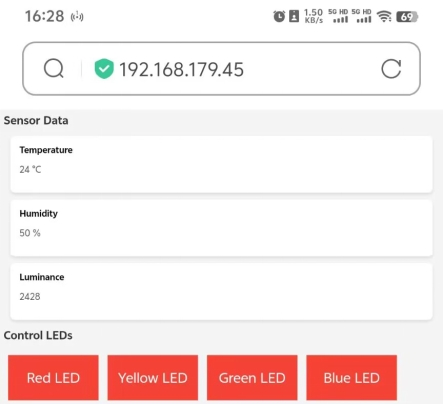

### Projekt 34 Smart Home

**1. Beschreibung**

In diesem Projekt simulieren wir das Smart Home mit dem Inventor-Kit.

**Hinweise**

1. Sie müssen ein 2,4-GHz-WLAN vorbereiten, kein 5-GHz-Netzwerk. Es kann ein mobiler Hotspot oder ein Router sein.  
2. Das ESP32-Board verbraucht mehr Strom, wenn es mit dem Netzwerk verbunden ist, daher müssen Sie eine externe Stromversorgung an dieses Kit anschließen. Wir stellen Ihnen einen 6XAA-Batteriehalter (Batterien nicht enthalten) zur Verfügung, den Sie an den DC-Anschluss des integrierten ESP32-Boards anschließen können.


3. Wenn Sie andere Geräte zur Steuerung dieses Kits verwenden, muss das ESP32-Board mit demselben Netzwerk wie Ihr Steuergerät verbunden sein.

4. Merken Sie sich Ihren WLAN-Netzwerknamen und das Passwort und tragen Sie diese vor dem Hochladen in den Code ein.

```
const char* ssid = "your_SSID"; // WLAN-Name eintragen, z.B. "KEYES"
const char* password = "your_password"; // WLAN-Passwort eintragen, z.B. "123456"
```

**2. Schaltplan**


**3. Code hochladen**

```
#include <WiFi.h>
#include <ESPAsyncWebServer.h>
#include <xht11.h>
#include <LiquidCrystal_I2C.h>

LiquidCrystal_I2C lcd(0x27, 16, 2);

// WiFi-Konfiguration
const char* ssid = "your-SSID";     // Ihr WLAN-Name
const char* password = "your-PASSWORD";  // Ihr WLAN-Passwort

// DHT11-Konfiguration
xht11 xht(26);                         // DHT11-Sensor-Pin auf IO26 setzen
unsigned char dat[] = { 0, 0, 0, 0 };  // Array zur Speicherung von Temperatur- und Feuchtigkeitswerten definieren
int i = 0;

// Fotowiderstand Analog-Pin
#define LDR_PIN 34  // Fotowiderstand an GPIO 34 anschließen

// LED-Pins
#define redLED_PIN 12
#define yellowLED_PIN 13
#define greenLED_PIN 14
#define blueLED_PIN 15
// LED-Zustand
bool redLEDState = false;
bool yellowLEDState = false;
bool greenLEDState = false;
bool blueLEDState = false;

// Webserver
AsyncWebServer server(80);

String generateHTML() {
  String html = "<html><head><style>";

  // Grundformat
  html += "body { font-family: Arial, sans-serif; background-color: #f4f4f4; }";
  html += "h2 { color: #333; }";
  html += "div.sensor { background-color: #fff; padding: 20px; margin: 15px; border-radius: 10px; box-shadow: 0px 4px 6px rgba(0, 0, 0, 0.1); }";
  html += "div.sensor h3 { margin: 0; }";
  html += "div.sensor p { font-size: 20px; color: #555; }";

  // Button-Format
  html += "button { font-size: 30px; padding: 15px; margin: 10px; border: none; cursor: pointer; width: 200px; height: 100px; }";
  html += "button.on { background-color: #4CAF50; color: white; }";   // Farbe der eingeschalteten LED
  html += "button.off { background-color: #f44336; color: white; }";  // Farbe der ausgeschalteten LED

  html += "</style>";
  html += "<meta http-equiv='refresh' content='5'>";  // Automatisches Aktualisieren alle 5 Sekunden
  html += "</head><body>";

  // Temperatur
  html += "<h2>Sensor-Daten</h2>";

  html += "<div class='sensor'>";
  html += "<h3>Temperatur</h3>";
  html += "<p>" + String(dat[2]) + " &deg;C</p>";
  html += "</div>";
  // Luftfeuchtigkeit
  html += "<div class='sensor'>";
  html += "<h3>Feuchtigkeit</h3>";
  html += "<p>" + String(dat[0]) + " %</p>";
  html += "</div>";

  // Anzeige des Fotowiderstand-Werts
  int lightValue = analogRead(LDR_PIN);  // Wert des Fotowiderstands
  html += "<div class='sensor'>";
  html += "<h3>Helligkeit</h3>";
  html += "<p>" + String(lightValue) + "</p>";
  html += "</div>";

  // LED-Steuerungstasten
  html += "<h2>LEDs steuern</h2>";
  html += "<button id='btn0' class='" + String(redLEDState ? "on" : "off") + "' onclick='toggleLed(0)'>Rote LED</button>";
  html += "<button id='btn1' class='" + String(yellowLEDState ? "on" : "off") + "' onclick='toggleLed(1)'>Gelbe LED</button>";
  html += "<button id='btn2' class='" + String(greenLEDState ? "on" : "off") + "' onclick='toggleLed(2)'>Grüne LED</button>";
  html += "<button id='btn3' class='" + String(blueLEDState ? "on" : "off") + "' onclick='toggleLed(3)'>Blaue LED</button>";

  // JavaScript zur Steuerung der LEDs Ein/Aus
  html += "<script>";
  html += "function toggleLed(led) {";
  html += "  var xhr = new XMLHttpRequest();";
  html += "  xhr.open('GET', '/toggle?led=' + led, true);";
  html += "  xhr.send();";

  html += "  var button = document.getElementById('btn' + led);";
  html += "  if (button.classList.contains('off')) {";
  html += "    button.classList.remove('off');";
  html += "    button.classList.add('on');";
  html += "  } else {";
  html += "    button.classList.remove('on');";
  html += "    button.classList.add('off');";
  html += "  }";
  html += "}";
  html += "</script>";

  html += "</body></html>";

  return html;
}

void setup() 
{
  // Serielle Schnittstelle initialisieren
  Serial.begin(115200);

  lcd.init();  // LCD initialisieren
  lcd.backlight();
  lcd.setCursor(0, 0);
  lcd.print("IP:");

  // WLAN-Verbindung
  WiFi.begin(ssid, password);
  while (WiFi.status() != WL_CONNECTED) {
    lcd.setCursor(i, 1);
    lcd.print(".");
    delay(500);
    i++;
    if (i > 15) {
      i = 0;
      lcd.setCursor(0, 1);
      lcd.print("                ");
    }
  }
  lcd.setCursor(0, 1);
  lcd.print("                ");
  lcd.setCursor(0, 1);
  lcd.print(WiFi.localIP());

  // LED-Pins als Ausgang setzen
  pinMode(redLED_PIN, OUTPUT);
  pinMode(yellowLED_PIN, OUTPUT);
  pinMode(greenLED_PIN, OUTPUT);
  pinMode(blueLED_PIN, OUTPUT);

  // Web-Anfragen verarbeiten
  server.on("/", HTTP_GET, [](AsyncWebServerRequest* request) {
    if (!xht.receive(dat)) {
      Serial.println("sensor error");
    }
    String html = generateHTML();
    request->send(200, "text/html", html);
  });

  // Steuerung der LEDs
  server.on("/toggle", HTTP_GET, [](AsyncWebServerRequest* request) {
    String led = request->getParam("led")->value();
    int ledNum = led.toInt();
    if (ledNum == 0) {
      redLEDState = !redLEDState;
      digitalWrite(redLED_PIN, redLEDState ? HIGH : LOW);  // LED 1
    } else if (ledNum == 1) {
      yellowLEDState = !yellowLEDState;
      digitalWrite(yellowLED_PIN, yellowLEDState ? HIGH : LOW);  // LED 2
    } else if (ledNum == 2) {
      greenLEDState = !greenLEDState;
      digitalWrite(greenLED_PIN, greenLEDState ? HIGH : LOW);  // LED 3
    } else if (ledNum == 3) {
      blueLEDState = !blueLEDState;
      digitalWrite(blueLED_PIN, blueLEDState ? HIGH : LOW);  // LED 4
    }
    request->redirect("/");  // Zurück zur Startseite
  });

  // Webserver starten
  server.begin();
}

void loop() 
{
  // Temperatur- und Feuchtigkeitswerte lesen und Webseite aktualisieren
  if (!xht.receive(dat)) 
  {
    Serial.println("sensor error");
  }
    delay(2000);  // Seite alle 2 Sekunden aktualisieren
}
```

**4. Testergebnis**

Nach dem Hochladen des Codes zeigt das LCD1602 die IP-Adresse an. Öffnen Sie den Browser, geben Sie die IP-Adresse ein und Sie sehen die Steuerungsseite.

Sie können nun mit dem Steuergerät die vom Sensor gelesenen Werte auslesen und die LEDs ein- und ausschalten.

