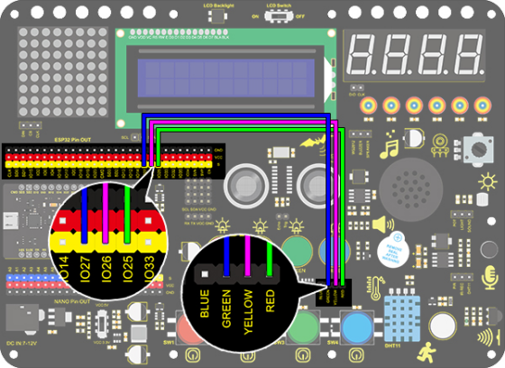

### Projet 4 Feu de Circulation

**1. Description**

Le module de feu de circulation est un dispositif utilisé pour contrôler le passage des piétons et des véhicules. Il comprend une lumière rouge, une jaune et une verte, chacune impliquant des consignes différentes.

**Rouge pour Stop :** Les piétons et les véhicules doivent s’arrêter.

**Jaune pour Prudence :** Les piétons et les véhicules doivent se préparer à s’arrêter. Si la circulation est déjà en cours, la vitesse doit être réduite.

**Vert pour Passage :** Les piétons et les véhicules peuvent continuer en respectant le code de la route.

Dans ce projet, vous pouvez utiliser Arduino pour écrire un code afin de contrôler les feux de circulation. Par exemple, définir la durée de chaque feu et l’intervalle entre eux. De plus, vous pouvez également ajouter un minuteur pour changer les couleurs des feux selon un planning.

**2. Schéma de câblage**



**3. Code de test**

```
/*
  keyestudio ESP32 Inventor Learning Kit 
  Project 4 Traffic Light
  http://www.keyestudio.com
*/
int greenPin = 27;   //Green LED connects to IO27
int yellowPin = 26; //Yellow LED connects to IO26
int redPin = 25;   //Red LED connects to IO25

void setup() 
{
  //Set all LED interfaces to output mode
  pinMode(greenPin, OUTPUT);
  pinMode(yellowPin, OUTPUT);
  pinMode(redPin, OUTPUT);
}

void loop() 
{
  digitalWrite(greenPin, HIGH); //Light green LED up 
  delay(5000);  //Delay 5s
  digitalWrite(greenPin, LOW); //Turn green LED off 
  for (int i = 1; i <= 3; i++) //Execute for 3 times
  {  
    digitalWrite(yellowPin, HIGH); //Light yellow LED up
    delay(500); //Delay 0.5s
    digitalWrite(yellowPin, LOW); // Turn yellow LED off
    delay(500); //Delay 0.5s
  }
  digitalWrite(redPin, HIGH); //Light red LED up 
  delay(5000);  //Delay 5s 
  digitalWrite(redPin, LOW); //Turn red LED off 

}
```

**4. Résultat du test**

Après avoir téléversé le code, la LED verte s’allumera pendant 5s, la LED jaune clignotera 3 fois, et la LED rouge s’allumera pendant 5s, en boucle.