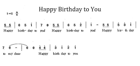

### Projekt 8 Musikspieler

**1. Beschreibung**

In diesem Projekt verwenden wir einen Leistungsverstärker-Lautsprecher, um Musik abzuspielen. Dieser Lautsprecher kann nicht nur einfache Lieder wiedergeben, sondern auch das performen, was Sie wünschen. So können Sie im Projekt weitere interessante Codes programmieren, um großartige Lernergebnisse zu erzielen.

**2. Funktionsprinzip**


Das elektrische Signal wird an Pin 1 von RP1 eingespeist (regelt die Signalstärke, was auch die Lautstärke des Tons ist).

Nach der Kopplung in C4 und dem Durchlaufen von R5 erreicht das Signal den IN- Pin des 8002B, wo es operativ verstärkt und an den BEE1 Lautsprecher ausgegeben wird.

**Frequenzvergleichstabelle in C**

|    Note     | Frequenz(Hz) |      Note      | Frequenz(Hz) |     Note     | Frequenz(Hz) |
| :---------: | :----------: | :------------: | :----------: | :----------: | :----------: |
| B  1  Do    |      262     | Natürlich  1  Do |      523     | Kreuz  1  Do |     1047     |
| B  2  Re    |      294     | Natürlich  2  Re |      587     | Kreuz  2  Re |     1175     |
| B  3  Mi    |      330     | Natürlich  3  Mi |      659     | Kreuz  3  Mi |     1319     |
| B  4  Fa    |      349     | Natürlich  4  Fa |      698     | Kreuz  4  Fa |     1397     |
| B  5  So    |      392     | Natürlich  5  So |      784     | Kreuz  5  So |     1568     |
| B  6  La    |      440     | Natürlich  6  La |      880     | Kreuz  6  La |     1760     |
| B  7  Si    |      494     | Natürlich  7  Si |      988     | Kreuz  7  Si |     1967     |

**3. Schaltplan**


**4. Testcode**

```
/*
  keyestudio ESP32 Inventor Learning Kit 
  Project 8.1 Music Performer 
  http://www.keyestudio.com
*/
int beeppin = 5; //Define the speaker pin to IO5

void setup() 
{
  pinMode(beeppin, OUTPUT);//Define the IO5 port to output mode 
}

void loop() 
{
  tone(beeppin, 262);//Flat DO plays 500ms
  delay(500);
  tone(beeppin, 294);//Flat Re plays 500ms
  delay(500);
  tone(beeppin, 330);//Flat Mi plays 500ms
  delay(500);
  tone(beeppin, 349);//Flat Fa plays 500ms
  delay(500);
  tone(beeppin, 392);//Flat So plays 500ms
  delay(500);
  tone(beeppin, 440);//Flat La plays 500ms 
  delay(500);
  tone(beeppin, 494);//Flat Si plays 500ms 
  delay(500);
  noTone(beeppin);//Stop for 1s 
  delay(1000);
}
```

**5. Testergebnis**

Nach dem Hochladen des Codes und Einschalten spielt der Verstärker zyklisch Musiknoten mit den entsprechenden Frequenzen: DO, Re, Mi, Fa, So, La, Si.

**Lautstärkeanpassung des Leistungsverstärkers:**

**Neben dem Lautsprecher befindet sich ein Potentiometer. Wir können die Lautstärke des Lautsprechers durch Drehen einstellen.** (Hinweis: Bitte verwenden Sie angemessene Kraft, um das Potentiometer nicht zu beschädigen)


**6. Wissensvertiefung**

Lassen Sie uns ein Geburtstagslied spielen. Die Verkabelung bleibt unverändert.

**Nummerierte Notenschrift:**



**Vergleichsdiagramm von B, natürlich und Kreuz**


```
/*
  keyestudio ESP32 Inventor Learning Kit  
  Project 8.2 Music Performer
  http://www.keyestudio.com
*/
int beeppin = 5; //Define the speaker pin to IO5
// do、re、mi、fa、so、la、si

int doremi[] = {262, 294, 330, 370, 392, 440, 494,      //Falt 0-6
                523, 587, 659, 698, 784, 880, 988,      //Natural 7-13
                1047,1175,1319,1397,1568,1760,1967};    //Sharp 14-20
int happybirthday[] = {5,5,6,5,8,7,5,5,6,5,9,8,5,5,12,10,8,7,6,11,11,10,8,9,8};   //Find the number in arrey doremi[] according to the numbered musical notation 
int meter[] = {1,1,2,2,2,4, 1,1,2,2,2,4, 1,1,2,2,2,2,2, 1,1,2,2,2,4};    // Beats

void setup() 
{
  pinMode(beeppin, OUTPUT); //Set IO5 pin to output mode 
}

void loop() 
{
  for( int i = 0 ; i <= 24 ;i++)
  {       //i<=24, because there are only 24 tones in this song
    //Use tone()function to generate a waveform in "frequency"
   tone(beeppin, doremi[happybirthday[i] - 1]);
   delay(meter[i] * 200); //Wait for 1000ms
   noTone(beeppin);//Stop singing
  }
}