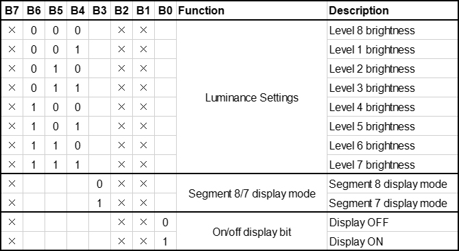

### Progetto 9 Display a Tubo Digitale

**1. Descrizione**

Questo display a tubo digitale a 4 cifre è un dispositivo utilizzato per visualizzare conteggi o tempo, in grado di mostrare numeri da 0 a 9 e lettere semplici. È composto da quattro tubi digitali, ognuno dei quali ha sette diodi emettitori di luce (LED).

Inoltre, molteplici funzioni possono essere realizzate collegando i loro pin alla scheda di sviluppo Arduino, come la misurazione del tempo e alcuni giochi memorizzati.

**2. Principio di Funzionamento**


TM1650 utilizza il protocollo IIC e adotta due linee bus (SDA e SCL).

**Comando Dati:** 0x48.  
Questo comando indica al TM1650 di accendere i tubi digitali anziché effettuare la scansione dei tasti.

**Comando Display:**



In realtà, è un byte di dati con bit diversi che rappresentano funzioni differenti.  
**bit[6:4]:** Imposta la luminosità del LED. Nota che 000 indica la massima luminosità.  
**bit[3]:** Determina se è presente un punto decimale.  
**bit[0]:** Determina se accendere il display.

**Accensione del Tubo Digitale**  
Prendiamo un esempio: luminosità livello 8 senza punto decimale corrisponde a 0x05.  
Passaggi: Segnale di inizio — Invia 0x48 — Dispositivo slave riceve — Invia 0x05 — Dispositivo slave riceve — Segnale di fine  
Dopo l’accensione, non è necessario inviare ripetutamente 0x48, poiché la funzione del tubo digitale è stata confermata.  
Inoltre, la luminosità e i metodi di visualizzazione possono essere elencati con più dati in un unico punto, rendendo il tutto chiaro e salvaspazio.

**Spegnimento del Tubo Digitale**  
Passaggi: Segnale di inizio — Invia 0x48 — Dispositivo slave riceve — Invia 0x00 — Dispositivo slave riceve — Segnale di fine

**Visualizzazione Numeri sul Tubo Digitale**  
Prima diciamo al TM1650 di visualizzare numeri sul tubo predeterminato. Successivamente il numero verrà mostrato. I suoi otto bit corrispondono a otto segmenti, con 1 per accendere e 0 per spegnere. Se ci sono dubbi sulla corrispondenza, è possibile accendere bit per bit in un ciclo.

Ad esempio, quando il bit 1 è acceso e visualizza 8, il dato è 0x68. Se è presente un punto, 8 verrà comunque visualizzato inviando 0x7f.  
Passaggi: Segnale di inizio — Invia 0x68 — Dispositivo slave riceve — Invia 0x7f — Dispositivo slave riceve — Segnale di fine  
Risultato: 8 viene visualizzato sul Bit 1.

Per comodità, può essere creata una matrice di valori corrispondenti da 0 a 9. Dopo ulteriori miglioramenti, è possibile visualizzare numeri, regolare la luminosità, spostare il punto decimale e i tubi.

**3. Schema di Collegamento**


**4. Codice di Test**

```
/*
  keyestudio ESP32 Inventor Learning Kit 
  Project 9.1 Digital Tube Display 
  http://www.keyestudio.com
*/
#include "TM1650.h"
#define CLK 22    //pins definitions for TM1650 and can be changed to other ports       
#define DIO 21
TM1650 DigitalTube(CLK,DIO);

void setup()
{
  for(char b=0;b<4;b++)
  {
    DigitalTube.clearBit(b);      //DigitalTube.clearBit(0 to 3); Clear bit display.
  }
}

void loop()
{
    DigitalTube.displayFloatNum(9999);   //Values or variables added to the parentheses can be displayed through the digital tube 
}
```

**5. Risultato del Test**

Dopo aver collegato i cavi e caricato il codice, il display a tubo digitale mostra "9999", come mostrato di seguito.


**6. Codice Esteso**

```
/*
  keyestudio ESP32 Inventor Learning Kit 
  Project 9.2 Digital Tube Display 
  http://www.keyestudio.com
*/
#include "TM1650.h"
#define CLK 22    //pins definitions for TM1650 and can be changed to other ports       
#define DIO 21
TM1650 DigitalTube(CLK,DIO);

void setup()
{
  for(char b=0;b<4;b++)
  {
    DigitalTube.clearBit(b);      //DigitalTube.clearBit(0 to 3); Clear bit display.
  }
}

void loop()
{
  for(int num=0; num<10000; num++)
  {   //Se num è inferiore a 10000, num aumenterà di 1 ad ogni ciclo
    DigitalTube.displayFloatNum(num);   //Valori o variabili nelle parentesi possono essere visualizzati tramite il tubo digitale
    delay(100);
  }
}
```

**7. Risultato del Test**

Dopo aver caricato il codice, il tubo digitale visualizza i numeri da 1 a 9999 tramite il ciclo "for".