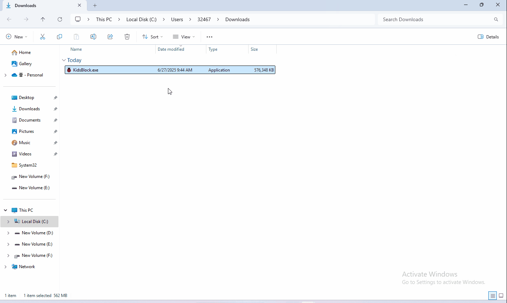
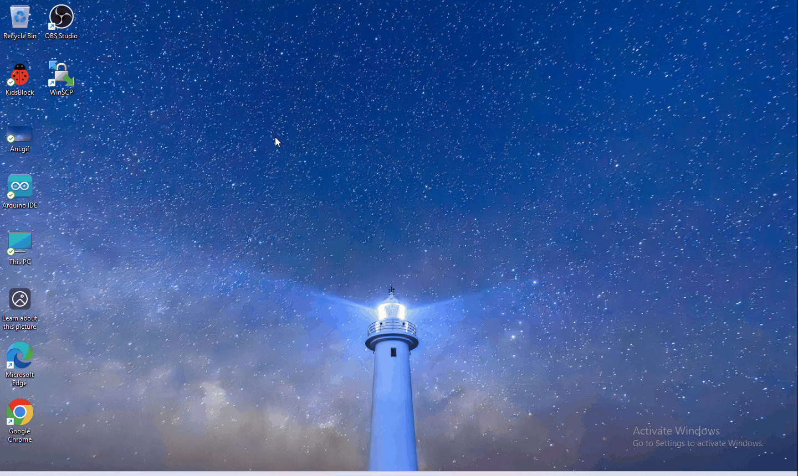

# 4.2 Installare il software

### Installazione del software su sistema Windows

1. Scaricare kidsblock: <https://xiazai.keyesrobot.cn/KidsBlock.exe>

2. Installazione del software

### Installazione del software su sistema Mac

1. Scaricare kidsblock: <https://xiazai.keyesrobot.cn/KidsBlock.dmg>

### Utilizzo di KidsBlock

1. Avviare il software

Collegare prima la scheda di sviluppo al computer

2. Se non riesci a caricare il codice, consulta il seguente tutorial per installare il driver (lettura opzionale)

Installare il driver (Windows)

Installare il driver (MAC)

