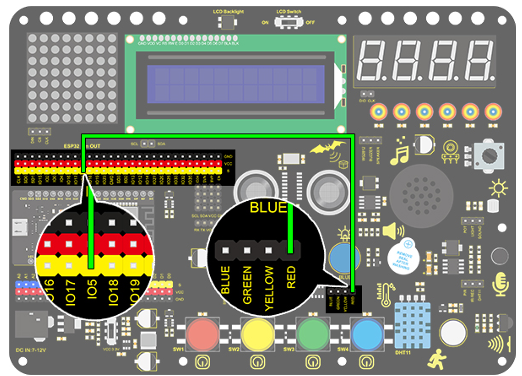
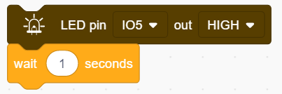
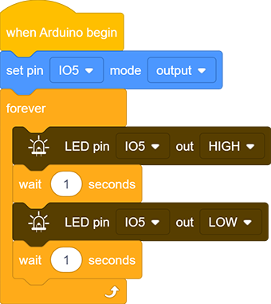

### Projet 1 Clignotement de LED

**1. Description**

Le clignotement de LED est un projet simple conçu pour les débutants. Il suffit d’installer une LED sur la carte Arduino et de téléverser le code via l’IDE Arduino. Ce projet renforce l’apprentissage du cadre conceptuel Arduino et des méthodes d’utilisation pour les débutants.

**2. Principe de fonctionnement**

**LED :** De manière générale, le courant de sortie limité des ports IO peut entraîner une faible luminosité de la LED, c’est pourquoi un transistor NPN (Q2) est utilisé dans le circuit comme interrupteur. Dans ce cas, la LED s’allume si la base (broche 1) du transistor est à un niveau haut. À l’inverse, la LED s’éteint lorsque la base est à un niveau bas.

**Interrupteur transistor :** En résumé, la LED s’allume lorsque la base (broche 1) est à un niveau haut. Dans le même temps, le collecteur (broche 3) et l’émetteur (broche 2) sont connectés, puis le VCC passe à travers une résistance de limitation de courant vers la LED et enfin vers la masse (GND), formant ainsi un circuit. À l’inverse, la LED s’éteint lorsque la base est à un niveau bas. Dans ce cas, le collecteur et l’émetteur sont déconnectés et la LED reste éteinte.

**3. Schéma de câblage**

**4. Code de test**

Selon les principes précédents, nous pouvons contrôler la LED via les niveaux des broches sur la carte de développement.

1. Faites glisser le bloc suivant dans la partie « Événements ».

2. Faites glisser le bloc suivant dans la partie « Contrôle ».

3. Faites glisser le bloc suivant dans la partie « Broches » et configurez la broche IO5 en sortie.

   

4. Faites glisser le bloc suivant dans la partie « LED » et réglez la broche IO5 sur HIGH.

5. Faites glisser le bloc suivant dans la partie « Contrôle ».

6. Faites glisser les blocs suivants et réglez la broche IO5 sur LOW.

**Code complet :**

**5. Résultat du test**

Après avoir téléversé le code et mis sous tension, la LED s’allumera pendant 1 seconde puis s’éteindra pendant 1 seconde.

**6. Explication du code**

Note : Le mode de la broche doit être réglé sur « output » lors de l’utilisation du module LED.

1. Les blocs de code ne s’exécuteront pas si le bloc suivant n’existe pas.

2. Les blocs de code dans le bloc suivant s’exécuteront en boucle.

3. Il s’agit d’un module utilisé pour définir le mode de la broche (contrôler la LED et le buzzer en mode « output », et lire le module capteur en mode « input »).

4. Il s’agit d’un module utilisé pour définir la broche et les niveaux (« HIGH » et « LOW »).

5. Il s’agit d’un module utilisé pour définir le temps de délai.

