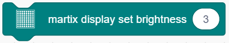
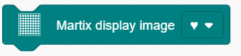
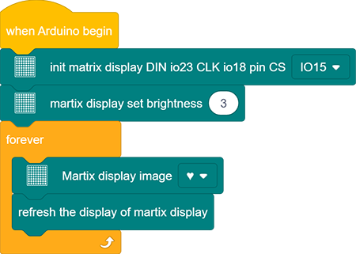
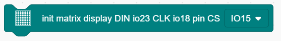
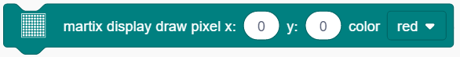
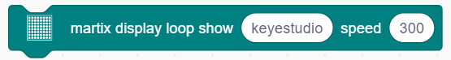
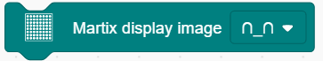
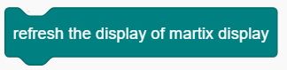
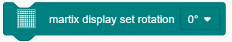

### Projekt 10 Punktmatrix-Display

**1. Beschreibung**

Dieses Modul besteht aus einer 8x8 LED-Punktmatrix mit jeweils einem Steuerpin für jede Reihe sowie jede Spalte, um die Helligkeit der LEDs anzupassen. In Verbindung mit einem Arduino-Board wird die Helligkeit der LEDs über Arduino-Programmierung gesteuert, um Zeichen und Figuren anzuzeigen. Auf diese Weise können einfache Zeichen, Zahlen und Figuren dargestellt werden. Es kann auch in Spielgeräten oder Bildschirmen eingesetzt werden.

Der MAX7219 ist ein IC mit SPI-Kommunikation und kann zur Steuerung der 8x8 Punktmatrix verwendet werden. Die MAX7219 SPI-Kommunikation ist in unseren Bibliotheken integriert und kann direkt aufgerufen werden.

**2. Schaltplan**

**3. Testcode**

1. Ziehen Sie die beiden grundlegenden Codeblöcke.

2. Ziehen Sie einen „init matrix display“ Block aus „Matrix“ und setzen Sie CS auf IO15. DIN und CLK sind jeweils fest auf IO23 und IO18 gelegt.

3. Ziehen Sie einen „set brightness“ Block und setzen Sie ihn auf 3.

4. Ziehen Sie einen „image“ Block und wählen Sie das Herzsymbol.

5. Fügen Sie am Ende einen „refresh“ Block hinzu.

**Vollständiger Code：**

**4. Testergebnis**

Nach dem Anschluss der Verkabelung und dem Hochladen des Codes wird ein Herz auf der Punktmatrix angezeigt, wie unten dargestellt.

**5. Code-Erklärung**

1. Setzen Sie den CS-Pin. Im Code ist DIN fest auf IO23 und SLK auf IO18 gelegt, während der CS-Pin optional ist. Für eine bequeme Verkabelung wählen wir IO15.

2. Pixel zeichnen. Dieser Codeblock schaltet Pixel auf der Punktmatrix an oder aus, basierend auf den Achsen x und y, wobei Rot für an und Schwarz für aus steht.

3. Linie zeichnen. Die Linie wird durch zwei Gruppen von Koordinatenpunkten definiert, ebenfalls mit Rot für an und Schwarz für aus.

4. Zeichen anzeigen. Wir haben Zeichensatzbibliotheken hinzugefügt, sodass Sie nur einen Buchstaben eingeben müssen, um ihn auf der Punktmatrix anzuzeigen. Außerdem muss dieser Block zusammen mit einem „rotation 180°“ Block verwendet werden.

5. Zahlen anzeigen. Ähnlich müssen Sie nur eine Zahl eingeben, um sie auf der Punktmatrix anzuzeigen, und auch hier muss der „rotation 180°“ Block verwendet werden.

6. Laufende Zeichenketten anzeigen. In Kombination mit einem „rotation 180°“ Block werden die angegebenen Lauftextzeichenketten nach Einstellung der Geschwindigkeit angezeigt.

7. Bild anzeigen. Zur Vereinfachung haben wir einige Emoticons integriert, die direkt ausgewählt werden können.

8. Füllfarben anzeigen. Sie können Schwarz (LED aus) oder Rot (LED an) einstellen.

9. Display aktualisieren. Die Punktmatrix muss aktualisiert werden, wenn etwas angezeigt wird. Andernfalls kann ein Fehler auftreten.

10. Helligkeit einstellen. Sie können die Helligkeit beim Debuggen reduzieren, um Ihre Augen zu schonen.

11. Rotationswinkel einstellen. Für eine hohe Kompatibilität mit mehr Code benötigen einige Daten und Symbole eine Rotation, um eine invertierte Anzeige zu vermeiden. Deshalb ist ein „rotation 180°“ Block im Code notwendig.

