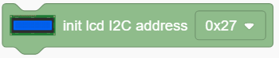
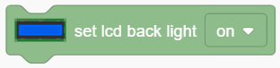
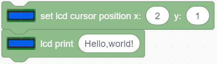
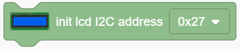
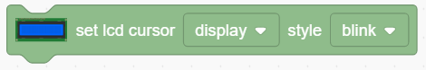

### Project 11 LCD

**1. Description**

Arduino I2C 1602 LCD is a commonly-used auxiliary device for MCU development board to connect with external sensors and modules. It features a 16-bit wide character, 2-line LCD screen and adjustable brightness. This programable module is convenient for data editing, display and management . Besides, it can display not only characters and figures but sensors value, like temperature, humidity or pressure value. 

As a result of its usability, the display is wildly applied in many fields, including smart home products, industrial monitoring systems, robot control systems and automotive electronics systems.

**2. Working Principle**

It is the same as IIC communication principle. Underlying functions have been packaged in libraries so that you can recall them directly. If you are interested in these, you may have a further look of underlying driving principles. 

**3.  Wiring Diagram**

**4. Test Code**

1. Drag the two basic code blocks.

2. Drag “init LCD” block from “LCD” and set the I2C address to 0x27.

3. Drag the "LCD back light" block and set it to ON. Characters are not easy to read if there is no back light.

4. Drag a "LCD cursor position" block and set x to 3 and y to 0. Add an "LCD print" block and type “keyestudio” in the blank. 

5. Drag a "LCD cursor position" and set x to 2 and y to 1. Add an "LCD print" and type “Hello,world!” in the blank.

**Complete Code：**

**5.  Test Result**

After connecting the wiring and uploading code, turn on the LCD, and "Hello, world!" and "keyestudio!" will be displayed on the LCD.

If the characters are unclear, please fix the backlight potentiometer by the small slotted screwdriver.

**6. Code Explanation**

1.  Set the IIC communication address. In this project, the address of LCD 1602 is 0x27.

2. Control the LCD backlight. The displayed characters will be seen much clearly if the back light is on. 

3. Set the cursor position. It will provide an accurate position through axis x and y. Possible values are X: 0-15 and Y: 0-1.

4. Print characters on LCD. The blank can be filled with characters or variables, which is convenient for displaying the values from sensors and modules. 

5. Blink the cursor at the display position. By default, the cursor is in inactive. 

