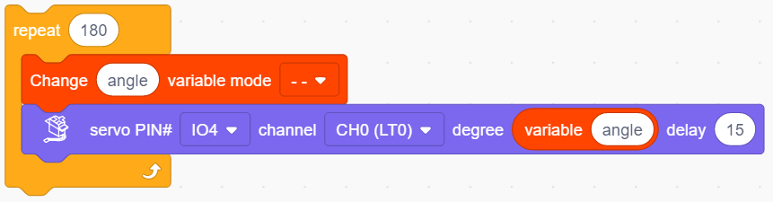
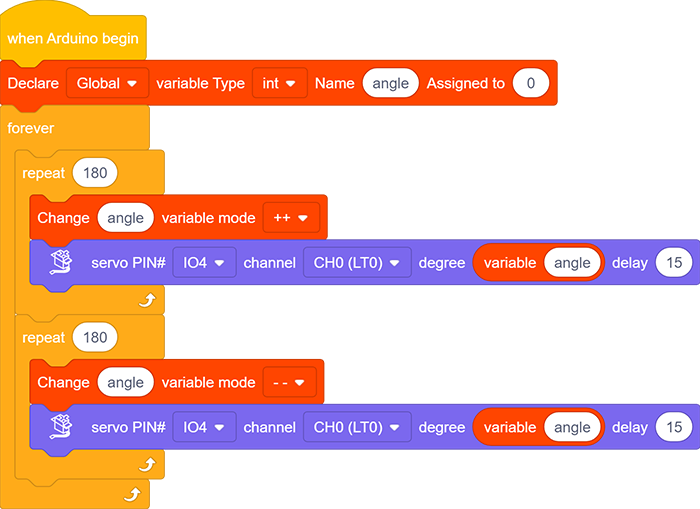

### Projet 12 Servo

**1. Description**

Ce servo offre des performances élevées et une grande précision avec un angle de rotation maximal de 180°. Pesant seulement 9g, il est parfaitement adapté à tout mini dispositif dans de multiples occasions. De plus, il bénéficie d’un temps de démarrage court, d’un faible bruit et d’une grande stabilité.

**2. Principe de fonctionnement**

**Plage d’angle :** 180° (360°, 180° et 90°)

**Tension d’alimentation :** 3.3V ou 5V

**Broche :** Trois fils

**GND :** Masse (marron)

**VCC :** Une broche rouge connectée à une alimentation +5V (3.3V)

**S :** Une broche signal orange contrôlée via un signal PWM

**Principe de contrôle** : L’angle de rotation est contrôlé via le rapport cyclique du PWM. Théoriquement, le cycle PWM standard est de 20ms (50Hz), donc la largeur d’impulsion doit se situer entre 1ms et 2ms. Cependant, la largeur d’impulsion réelle varie de 0.5ms à 2.5ms, ce qui correspond à 0° à 180°. Notez que, pour un même signal, l’angle de rotation peut varier selon les marques de servo.

**3. Schéma de câblage**

**4. Code de test**

1. Faites glisser les deux blocs de base et placez un bloc "variable" entre eux. Définissez le type de variable sur int, nommez-la angle, et assignez 0 comme valeur initiale.

2. **Le servo tourne progressivement de 0° à 180° :**

Ajoutez un bloc de répétition et réglez le nombre de répétitions à 180 (180 angles). Faites glisser un bloc "changer variable" et un bloc "servo" et placez-les dans le bloc de répétition. Nommez la variable "angle" et sélectionnez le mode "++". Réglez la broche Servo sur IO4 et le degré sur la variable nommée. N’oubliez pas de mettre un délai de 15ms.

3. **Le servo tourne progressivement de 180° à 0° :** Répétez l’étape 2, mais réglez le mode de la variable sur "--".

**Code complet :**

**5. Résultat du test**

Après avoir connecté le câblage et téléversé le code, le servo commence à tourner de 0° à 180° puis de 180° à 0°.

**6. Explication du code**

1. Définir les valeurs du Servo. La broche Servo et l’angle de rotation peuvent être contrôlés en réglant les paramètres de ce bloc.

2. Lire le degré actuel du Servo.

