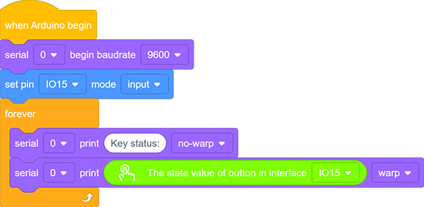
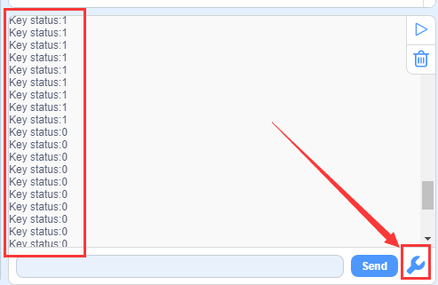
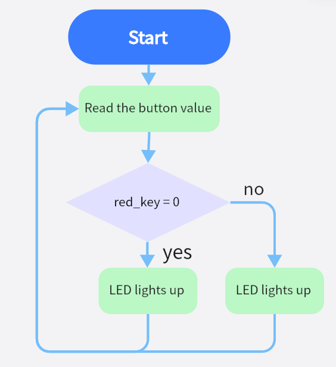
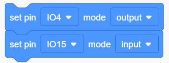
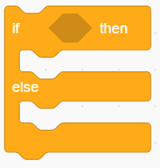

### Projet 13 Mini Lampe

**1. Description**

Dans ce projet, nous allons contrôler une lampe via Arduino UNO et un bouton. Lorsque nous appuyons sur le bouton, l’état de la lampe changera (ALLUMÉ ou ÉTEINT).

**2. Principe de fonctionnement**

Lorsque le bouton est relâché, une tension VCC passant par R29 fournit un niveau haut pour la borne S. Lorsqu’il est pressé, les broches 1 et 3, ainsi que 2 et 4 sont connectées et la tension sur S1 arrive à la masse (GND) en niveau bas. À ce moment, R29 évite un court-circuit entre VCC et GND.

**3. Schéma de câblage**

**4. Code de test**

1. Ajoutez deux blocs de base.

2. Faites glisser un bloc "baud rate" depuis “Serial” et réglez-le à 9600.

3. Ensuite, faites glisser un bloc "print" depuis “Serial”, tapez “Key status:” dans le champ vide et réglez-le sur "no-warp".

4. Configurez la broche IO15 en “input”.

5. Faites glisser un autre bloc “Serial print” depuis “Serial” et réglez le mode sur "warp". Ajoutez un bloc "state value of button" depuis “Button” et réglez la broche sur IO15.

**Code complet :**

**5. Résultat du test**

Après avoir connecté le câblage et téléversé le code, ouvrez le moniteur série et réglez le baud rate à 9600.  
Lorsque nous appuyons sur le bouton, le port série affiche "Key status: 0" ; lorsque nous relâchons le bouton, le port série affiche "Key status: 1".

**6. Extension des connaissances**

Ensuite, nous allons contrôler la LED via l’état des boutons.

**Organigramme :**

**Schéma de câblage :**

**Code :**

1. Faites glisser deux blocs de base.

2. Réglez la broche LED en “output” et la broche bouton en “input”.

3. Faites glisser un bloc "if else" depuis “Control”. Ajoutez un bloc "button pin" depuis “Button” après "if" et réglez sa broche sur IO15. Placez un bloc "LED output" sous "if" et réglez la sortie sur HIGH, puis un autre sous "else" et réglez-le sur LOW. Les broches LED sont toutes deux sur IO4.

**Code complet :**

**8. Explication du code**

**Note : Le mode de la broche doit être réglé sur "input" lors de l’utilisation du module bouton.**

1. Détermine si le bouton est pressé. Si oui, ce bloc renvoie vrai.

2. Lit la valeur du bouton. Lorsque le bouton n’est pas pressé, la valeur est 1. Sinon, elle est 0.

3. Si la condition dans l’hexagone est vraie, le bloc "if" sera exécuté. Sinon, le programme exécute le bloc "else".

4. Réglez le baud rate. Veuillez vous assurer que le baud rate série correspond à celui du moniteur série, sinon rien ne s’affichera. Les baud rates couramment utilisés sont 9600 et 115200, ici nous réglons à 9600.

5. Affiche des caractères sur le moniteur série. Les mots affichés sont ceux que vous tapez dans le champ vide. De plus, trois modes d’impression sont inclus : warp, no-warp et HEX (hexadécimal).

