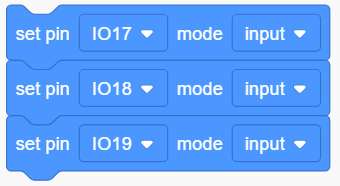
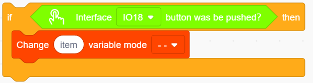
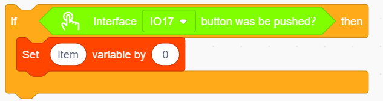
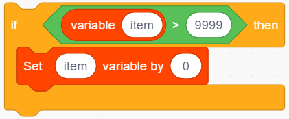
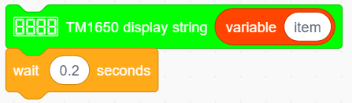
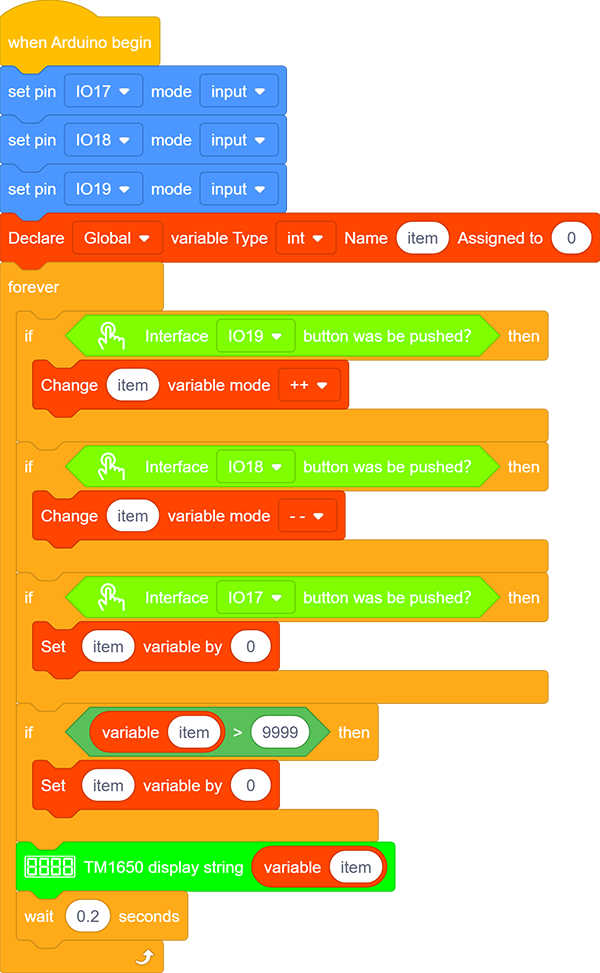

### Projet 14 Compteur

**1. Description**

Le compteur à tube numérique Arduino 4 bits peut enregistrer des nombres de 0 à 9999. Il dispose d’une vitesse d’affichage, d’un réglage du mode de comptage ainsi que d’une fonction de réinitialisation. Ce module est largement utilisé dans les compteurs en temps réel (comme le comptage d’appuis sur bouton et la rotation de moteur DC), les jeux et les équipements expérimentaux.

**2. Organigramme**

**3. Schéma de câblage**

**4. Code de test**

1. Faites glisser les deux blocs de base.

2. Réglez la broche du bouton sur « input ».

3. Placez un bloc « variable ». Définissez le type de variable sur int et nommez-la item. Assignez 0 comme valeur initiale.

4. Faites glisser un bloc « if » depuis « Control » (il s’exécute uniquement lorsque sa condition est satisfaite). Mettez un bloc « Button pressed » depuis « Button » dans la zone condition (le losange) et réglez la broche sur IO19. Faites glisser un bloc « variable mode » et placez-le après « then », définissez-le comme « item » et réglez le mode sur « ++ ».

5. Répétez l’étape 4, mais réglez l’interface sur IO18 et le mode sur « – – ».

6. Faites glisser un autre bloc « if » depuis « Control » et définissez sa condition : « le bouton de l’interface IO17 a-t-il été pressé ? ». Placez un bloc de réglage de variable après « then » et réglez la variable à 0.

7. Faites glisser un bloc « if » depuis « Control ». Trouvez le bloc « ＞ » dans « Operators » et remplissez le champ gauche avec la variable item et le champ droit avec « 9999 ». Placez également un bloc de réglage de variable après « then » et réglez la variable à 0.

8. Faites glisser un bloc « TM1650 display » depuis « Digital tube » et réglez la chaîne affichée sur la variable item. Enfin, n’oubliez pas d’ajouter un délai de 0,2 s.

**Code complet :**

**5. Résultat du test**

Après avoir connecté le câblage et téléchargé le code, appuyez sur le bouton vert pour ajouter 1, sur le jaune pour soustraire 1, et sur le rouge pour réinitialiser.

**6. Explication du code**

Le bloc **">"** est utilisé pour comparer deux valeurs. Ces deux champs peuvent être remplacés par des nombres ou des variables.

