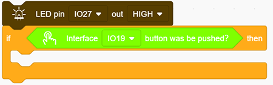
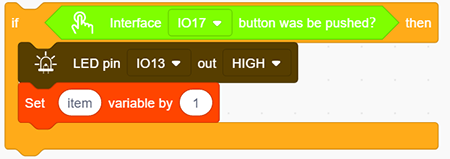
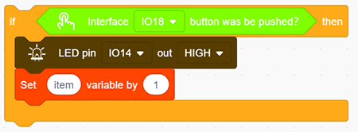

### Progetto 15 Risponditore

**1. Descrizione**

Questo risponditore programmabile riceve e invia segnali tramite la scheda di sviluppo Arduino e un gruppo di pulsanti, e valuta la correttezza delle risposte tramite un LED. È un ottimo strumento per esercitare la capacità di reazione degli studenti e catturare la loro attenzione sulle domande. Se la risposta è corretta, il rispondente ottiene molti punti.

Inoltre, semplifica la gestione da parte degli insegnanti dei "question-grabbers" e riduce il disordine delle risposte. Può persino stimolare l’interesse degli studenti nell’apprendimento.

**2. Diagramma di flusso**

**3. Schema di collegamento**

**4. Codice di test**

1. Trascina i due blocchi base e inserisci un blocco "variabile" tra di essi. Imposta il tipo di variabile su int e il nome su item con un’assegnazione iniziale di 0. Imposta il pin del LED su “output” e il pin del pulsante su “input”.

2. Aggiungi un blocco "LED output", definisci il suo pin su IO27 e imposta l’output su HIGH.  
3. Trascina un blocco "if" e aggiungi la condizione "interface IO19 button was be pushed?".

4. Aggiungi un’impostazione di variabile e quattro blocchi LED output sotto "then". Tra questi, nominiamo la variabile "item" con assegnazione "0", e impostiamo tutti gli output su LOW rispettivamente ai pin 12, 13, 14 e 27 (Il risponditore funziona solo quando tutti i LED sono spenti). Allo stesso modo, non dimenticare un ritardo di 0,2s.

5. Aggiungi un blocco "repeat until" e imposta "until" su "item = 1", come mostrato sotto. Quando item = 1, esci dal ciclo.

6. Trascina un altro blocco "if" e imposta la condizione "Interface IO16 button was be pushed?". Aggiungi un blocco "LED output" sotto "then" e imposta l’output su HIGH al pin IO12. Aggiungi inoltre un "set item variable by 1" per uscire da questo blocco condizionale.

7. Ripeti il passo 6, ma imposta l’interfaccia su IO17 e il pin LED su IO13.

8. Ripeti nuovamente il passo 6, ma imposta l’interfaccia su IO18 e il pin LED su IO14.

**Codice completo:**

**5. Risultato del test**

Collega i cablaggi e carica il codice. Le risposte dei partecipanti sono valide solo quando il LED rosso è spento (pulsante rosso premuto).

Quando qualcuno preme il proprio pulsante (giallo, verde o blu), si accende il LED corrispondente insieme al LED rosso. A questo punto, gli altri LED non possono accendersi premendo i pulsanti. L’azione di risposta può essere eseguita solo quando il pulsante rosso viene premuto di nuovo.

**6. Spiegazione del codice**

1. Modulo ciclo condizionale. Quando le condizioni nel riquadro a diamante del modulo sono soddisfatte, il ciclo termina.

2. Il blocco "=" viene usato per verificare se i due valori sono uguali.

