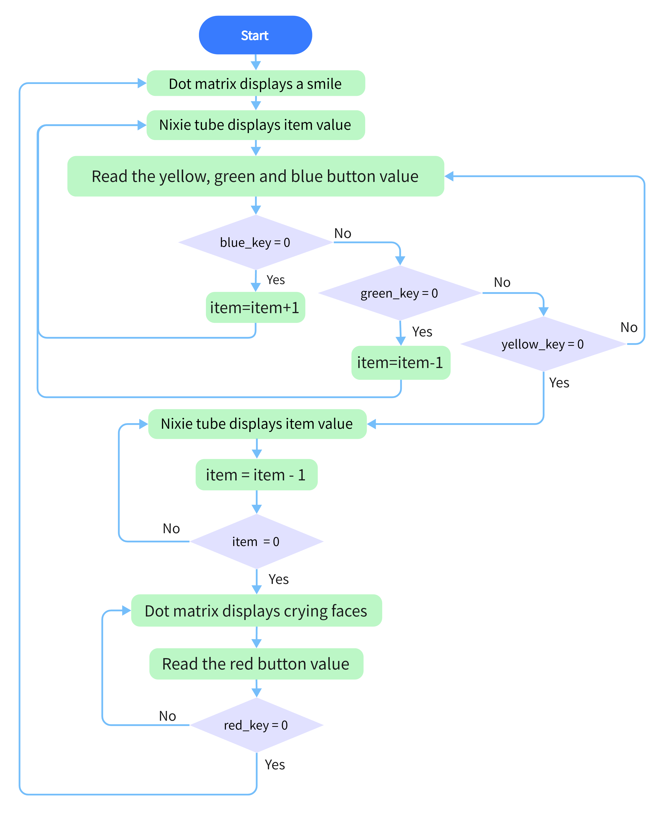
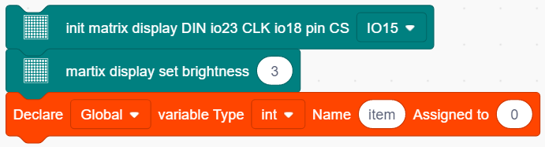
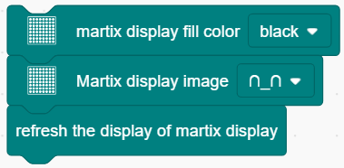
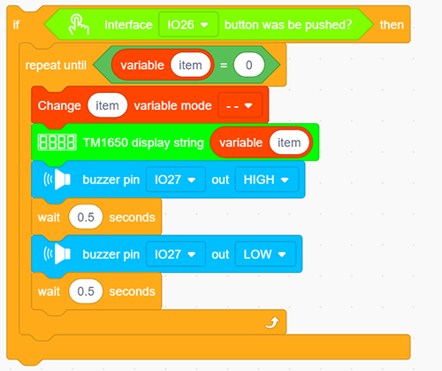
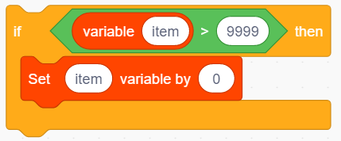
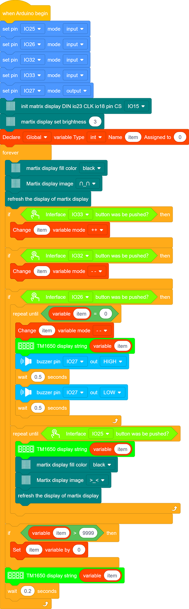

### Projekt 16 Zeitbombe

**1. Beschreibung**

Dieses Projekt bietet Ihnen die Möglichkeit, ein interessantes Zeitbomben-Spiel zu erleben.  

In diesem Projekt stellt die Punktmatrix Ihre Zeitbombe dar, während die digitale Röhre die verbleibende Zeit anzeigt. Die Tasten können nicht nur die Bombe steuern, sondern auch die Zeit einstellen. Sie können einen Countdown festlegen, um die Bombe zu kontrollieren, die explodiert, wenn der Countdown abgelaufen ist. Darüber hinaus wird ein Summer zur Alarmierung verwendet. 

Durch die Programmierung mehrerer Sensoren kann Ihre umfassende Fähigkeit zum logischen Denken verbessert werden. 

**2. Flussdiagramm**

**3. Schaltplan**

**4. Testcode**

1. Ziehen Sie die beiden Grundblöcke.

2. Stellen Sie den Button-Pin auf „input“.

3. Fügen Sie einen „init matrix display“-Block aus „Matrix“ hinzu und setzen Sie den Pin CS auf IO15. Danach folgen ein „brightness“-Block mit dem Wert 3 und ein „variable“-Block (Variablentyp auf int setzen, Name auf item und Anfangswert 0 zuweisen).

4. Ziehen Sie in „Matrix“ einen „fill color“-Block und wählen Sie „black“ (d.h. alle LEDs gehen aus, um die vorherige Anzeige zu löschen). Fügen Sie einen „display image“-Block hinzu, um ein Smiley-Gesicht zu definieren. Anschließend setzen Sie einen Refresh-Block, um die Anzeige zu aktualisieren.

5. Ziehen Sie einen „if“-Block und füllen Sie das Bedingungsfeld mit „interface IO33 button was be pushed?“. Fügen Sie nach „then“ einen „variable mode“-Block hinzu, setzen Sie den Namen auf item und den Modus auf „++“.

6. Wiederholen Sie die Operation aus Schritt 5, setzen Sie jedoch die Schnittstelle auf IO32 und den Modus auf „--“.

7. Ziehen Sie einen „if“-Block, um zu prüfen, ob Pin IO26 gedrückt wurde. In diesem „if“ fügen Sie einen Wiederholungsblock hinzu und setzen die Bedingung auf „item = 0“. 

Im „repeat until“-Loop setzen Sie einen „variable mode“-Block und stellen „item“ auf „--“, wie unten gezeigt. Ziehen Sie einen „TM1650 display“-Block aus „Digital tube“ und definieren Sie die anzuzeigende Zeichenfolge als „variable item“-Block. Fügen Sie dann einen „buzzer output“-Block hinzu und setzen Sie den Ausgang auf HIGH am Pin IO27, gefolgt von einer 0,5s Verzögerung. Wiederholen Sie den letzten Vorgang, setzen Sie jedoch den Ausgang auf LOW.

8. Programmieren Sie einen weiteren Loop-Code und definieren Sie die Bedingung als „interface IO25 button was be pushed?“. Die folgenden Ausführungen erfolgen in dieser Schleife. Fügen Sie einen „TM1650 display“-Block hinzu und definieren Sie die anzuzeigende Zeichenfolge als „variable item“-Block. Wiederholen Sie dann Schritt 4, aber hier setzen Sie das Bild auf ein weinendes Gesicht.

9. Ziehen Sie einen „if then“-Block und füllen Sie das Feld mit der Bedingung: item ＞ 9999. Fügen Sie in diesem Bedingungsblock die Anweisung „set item variable by 0“ hinzu.

10. Ziehen Sie einen „TM1650 display“-Block aus „Digital tube“ und definieren Sie die anzuzeigende Zeichenfolge als „variable item“. Vergessen Sie nicht, eine Verzögerung von 0,2s einzubauen.

**Vollständiger Code:**

**5. Testergebnis**

Nach dem Anschluss der Verkabelung und dem Hochladen des Codes drücken Sie die blaue Taste, um Zeit hinzuzufügen, die grüne, um zu reduzieren, und die rote, um zurückzusetzen. Drücken Sie die gelbe Taste zum Herunterzählen. Wenn der Countdown abgelaufen ist, explodiert die Bombe.