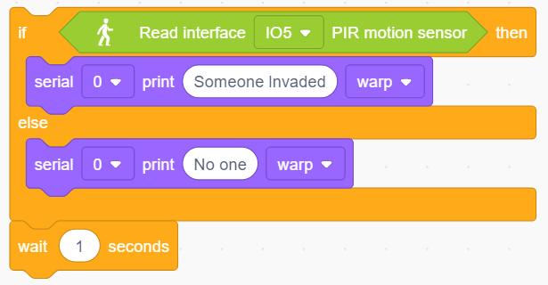
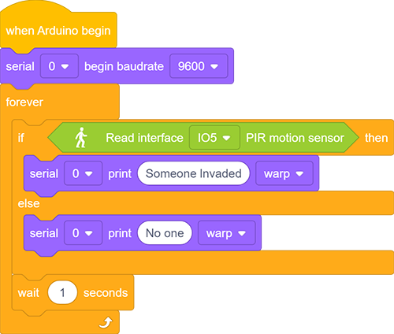

### プロジェクト17 侵入警報

**1. 説明**

この侵入警報システムは、住宅や小規模オフィス内の侵入者を検知し、ホストに警告して適時対策を取れるようにします。

本プロジェクトでは、センサーが特定のエリアを監視します。Arduinoボード上のデバイスが、そのゾーンで動きを検知するとLEDを点灯させ、ブザーを鳴らして注意を促します。さらに、感度は調整可能で、より正確な検出が可能です。

実際、このモジュールは実用性が高く、設置が簡単でコストも低いです。住宅やオフィスだけでなく、工場、倉庫、市場などにも適用でき、財産の安全を大いに守ります。

**2. 動作原理**

人体（37°C）は常に波長10μmの赤外線を放射しており、これはセンサーが検出する波長に近いです。

このため、このモジュールは人体の動きを検知できます。動きがあるとPIRセンサーは約3秒間ハイレベルを出力し、その後ローに戻ります。

**3. 配線図**

**4. テストコード**

1. 2つの基本ブロックを追加し、その間に「Serial」から「baud rate」ブロックをドラッグします。シリアルのボーレートを9600に設定します。

2. 「if else」ブロックを追加します。六角形のボックスに「read PIR motion sensor」ブロックを入れ、インターフェースをIO5に設定します。これで人体の動きを判定します。「then」と「else」の後にそれぞれ「serial print」ブロックを2つ追加し、両方のモードを「warp」に設定します。条件が満たされた場合は「Someone Invaded」と表示し、そうでなければ「No one」と表示します。最後に1秒の遅延時間を追加します。

**完成コード：**

**5. テスト結果**

配線を接続しコードをアップロードした後、シリアルモニターを開きボーレートを9600に設定します。センサーが動きを検知するとシリアルポートに「Someone Invaded」と表示され、動きがなければ「No One」と表示されます。

**6. 拡張コード**

侵入警報を作りましょう。PIRセンサーが人体を検知するとLEDが点灯し、ブザーが鳴ります。逆に、LEDは消灯しブザーは静かになります。

**フローチャート：**

**配線図：**

**コード：**

**7. コード説明**

PIRが人体の動きを感知するとハイレベルを出力します。したがって、このセンサーに接続された開発ボードのピンを読み取ることで動きの有無を判断できます。

