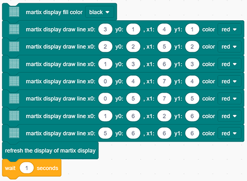

### Projekt 18 Schlagendes Herz

**1. Beschreibung**

In diesem Projekt wird ein schlagendes Herz über ein Arduino-Board, ein 8x8 Punktmatrix-Display, eine Schaltung und einige elektronische Bauteile dargestellt. Durch Programmierung können Sie die Schlagfrequenz, die Herzgröße und die Helligkeit steuern.

**2. Schaltplan**

**3. Testcode**

1. Ziehen Sie die beiden Basisblöcke.

2. Initialisieren Sie das Punktmatrix-Display. Setzen Sie den CS-Pin auf IO15 und die Helligkeit auf 3. Fügen Sie diese beiden Ausführungen zwischen die Basisblöcke ein.

Die folgenden Ausführungen befinden sich alle im „forever“-Block.

3. Löschen Sie das Display. Steuern Sie das Display, um Linien zu zeichnen und ein Koordinatensystem sowie dessen Ursprung wie folgt festzulegen. Aktualisieren Sie dann das Display, um das kleinere Herz mit einer Verzögerung von 1 Sekunde anzuzeigen.

4. Wiederholen Sie Schritt 3, zeichnen Sie jedoch die Linien wie im folgenden Bild, um ein größeres Herz anzuzeigen.

**Vollständiger Code:**

**4. Testergebnis**

Nach dem Verbinden der Verkabelung und Hochladen des Codes werden die beiden Herzgrößen abwechselnd angezeigt.

