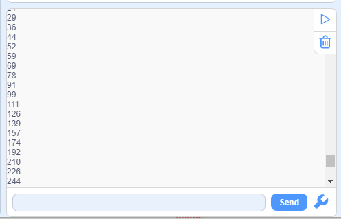

### Proyecto 19  Lámpara Regulable

**1. Descripción**

La lámpara regulable ajusta el brillo del LED mediante un potenciómetro y un controlador Arduino. El brillo depende del valor de resistencia, que puede ser leído y ajustado conectando los extremos del potenciómetro a pines digitales o analógicos en la placa.  
Además, este sistema se aplica para controlar el voltaje o corriente de otros dispositivos como ventiladores, bombillas y calentadores.

**2. Principio de Funcionamiento**

Esencialmente, el potenciómetro es un elemento que puede cambiar el valor de la resistencia. Según la ley de Ohm (U=I*R), la resistencia afecta el voltaje. Nuestro potenciómetro es de 10K.

En este proyecto, la resistencia máxima es 10K. La placa ESP32 dividirá igualmente el voltaje de 3V en 4095 partes (3/4095=0.0007326007326). El voltaje analógico se obtiene multiplicando el valor leído por 0.0007326007326.

**3. Diagrama de Conexiones**

**4. Código de Prueba**

Se puede leer el valor analógico del potenciómetro:

1. Arrastra los dos bloques básicos. Coloca el bloque de configuración de baud rate entre ellos y configúralo a 9600.

2. Añade un bloque de "serial print" dentro del bucle "forever", y selecciona "warp" como modo de impresión.

3. Arrastra un bloque de "read the value" desde “pot” al serial print, y configura el pin en IO33.

**5. Resultado de la Prueba**

Después de conectar el cableado y subir el código, abre el monitor serial, ajusta el baud rate a 9600, y el valor analógico se mostrará dentro del rango de 0-4095.

**6. Código de Expansión**

Controlaremos el brillo del LED mediante un potenciómetro. Como sabemos, esto se ve influenciado por PWM. Sin embargo, el rango del valor analógico es 0-4095 mientras que el de PWM es 0-255. Por lo tanto, se necesita una función "map(value, fromLow, fromHigh, toLow, toHigh)".

**Diagrama de Conexiones：**

1. Arrastra los dos bloques básicos.  
2. Añade un bloque de variable y configúralo como local. Selecciona "int" como tipo y nómbralo "pot".

3. Arrastra una función "map" desde “Data” y colócala en la posición de asignación. Configura el valor de "map" para que sea "read the value of pot IO33", cuyo rango es de (0,4095) a (0,255).

4. Finalmente, añade un bloque "LED analogWrite". Configura el pin en IO25 y el valor analógico a la variable "pot".

**Código Completo:**

**7. Explicación del Código**

1. Función **map**. El rango del valor analógico puede convertirse de 0-4095 a 0-255.

2. Lee el valor analógico del potenciómetro configurando su pin.

