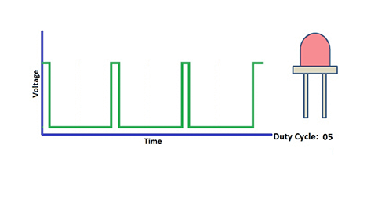
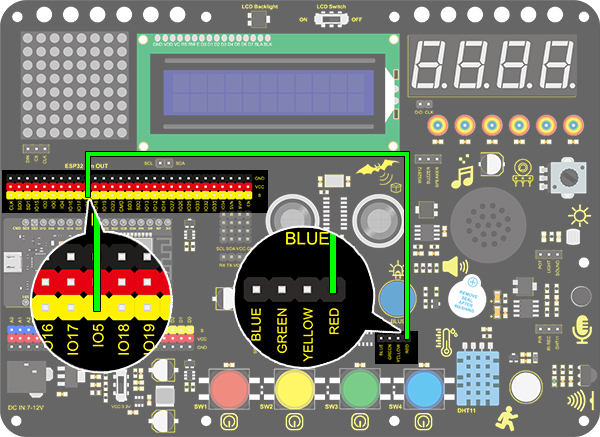
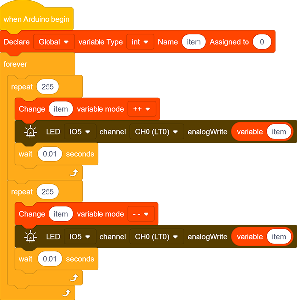

### Proyecto 2 LED Respiratorio

**1. Descripción**

El LED respiratorio de Arduino utiliza PWM programable a bordo para emitir una forma de onda analógica. Después de encender, el brillo del LED puede ajustarse mediante el ciclo de trabajo de la forma de onda para finalmente lograr el efecto de LED respiratorio.

De esta manera, se puede simular la luz ambiental cambiando el brillo del LED con el tiempo. Además, el LED respiratorio puede formar una mini luz colorida para construir un ambiente tranquilo y cálido.

**2. ¿Qué es PWM?**

PWM controla la salida analógica mediante medios digitales, lo que permite ajustar el ciclo de trabajo de la onda (una señal que cambia circularmente entre nivel alto y nivel bajo).

Para Arduino, los puertos digitales de salida de voltaje son LOW y HIGH, que corresponden respectivamente a 0V y 5V. Generalmente, definimos LOW como 0 y HIGH como 1. Arduino emitirá 500 señales de 0 o 1 en 1s. Si son "1", se emitirá 5V. Por el contrario, si son todas 0, la salida será 0V. O si son 010101010101..., el promedio de salida será 2.5V.

En otras palabras, la proporción de salida de 0 y 1 afecta el valor del voltaje; mientras más señales 0 y 1 se emitan por unidad de tiempo, más preciso será el control.

**3. Diagrama de Conexiones**

**4. Código de Prueba**

Utilizamos la instrucción "for" para incrementar una variable de 0 a 255, y definimos la variable como salida PWM (analogWrite(pin, value)). Por cierto, un tiempo de retardo puede reforzar el control del tiempo de encendido del LED. Luego, usamos otra instrucción "for" para disminuirla de 255 a 0 con un tiempo de retardo para controlar el proceso de atenuación del LED.

1. Arrastra los dos bloques de código.

2. Arrastra el siguiente bloque desde la parte "Variables" y define el nombre como "item" con una asignación inicial de "0". Coloca este bloque dentro del bloque "forever".

3. Arrastra el siguiente bloque desde la parte "Control" y configúralo para 255 veces, que es el valor máximo de PWM.

4. Arrastra el siguiente bloque desde la parte "Variables", pon "item" como el objeto a cambiar y configura el modo a "++".

5. Arrastra el siguiente bloque desde la parte “LED” y configura el pin del LED a IO5. Luego añade un bloque de "variable" dentro y rellena el espacio con "item".

6. Arrastra el siguiente bloque desde la parte "Control" y configura el tiempo a 0.01s, es decir, 10ms.

7. Según los pasos anteriores, construye otro bloque de código con la única diferencia de que el modo de la variable sea "– –".

**Código Completo：**

**5. Resultado de la Prueba**

Después de subir el código, podemos ver que el LED se atenúa gradualmente. "Respira" de manera uniforme.

**6. Explicación del Código**

1. Este bloque se usa para establecer el rango utilizable de la variable, tipo de variable, nombre y su valor inicial.

2. El número de repeticiones puede asignarse en el espacio en blanco de este bloque de repetición.

3. Ingresa un nombre de variable en el espacio en blanco y su valor aumentará en 1 cada vez que se ejecute el código. "++" puede cambiarse a "– –".

4. Ingresa un nombre de variable en el espacio en blanco y su valor disminuirá en 1 cada vez que se ejecute el código. "– –" puede cambiarse a "++".

5. Este es un módulo de salida PWM, y el recuadro blanco es el valor de la salida PWM.

