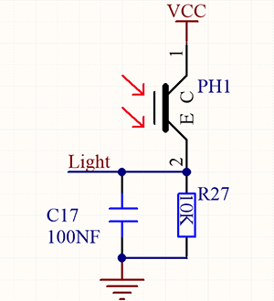
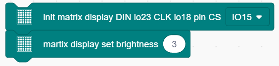
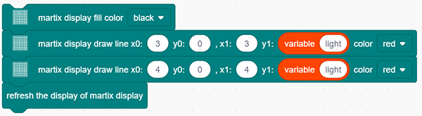

### Projekt 20 Lichtsäule

**1. Beschreibung**

Der Widerstand (weniger als 1KΩ) des Fotowiderstands variiert mit dem Licht, wodurch die Helligkeit der Punktmatrix gesteuert werden kann. Beim Steuern verbinden wir diesen Widerstand mit einem analogen Pin auf dem Board, um die Widerstandsänderung zu überwachen. Auf diese Weise steuert das Licht automatisch die Helligkeit der Anzeige.

Außerdem wird der Fotowiderstand in unserem täglichen Leben häufig angewendet. Zum Beispiel öffnet oder schließt sich ein Vorhang automatisch entsprechend der äußeren Lichtintensität.

**2. Funktionsprinzip**

Wenn es völlig dunkel ist, beträgt der Widerstand 0,2MΩ, und die Spannung am Signalausgang (Punkt 2) nähert sich 0V an. Je stärker das Licht ist, desto kleiner werden Widerstand und Spannung.

**3. Schaltplan**

**4. Testcode**

Der analoge Wert des Fotowiderstands kann ausgelesen werden:

1. Ziehen Sie die beiden Basisblöcke. Setzen Sie den Baudraten-Block dazwischen und stellen Sie ihn auf 9600 ein.

2. Fügen Sie im „forever“-Loop einen „serial print“-Block mit dem Modus „warp“ hinzu.

3. Ziehen Sie einen „read the value“-Block aus „Light“ in den „serial print“-Block und setzen Sie den Pin auf IO33.

**5. Testergebnis**

Nach dem Anschließen der Verkabelung und Hochladen des Codes öffnen Sie den seriellen Monitor und stellen die Baudrate auf 9600 ein. Der analoge Wert wird im Bereich von 0-4095 angezeigt.

**6. Erweiterungscode**

In diesem Erweiterungsprojekt verwenden wir den Fotowiderstand, um die Umgebungslichtintensität zu erfassen. Die mittleren zwei Spalten sind in diesem Experiment enthalten, um die Lichtintensität darzustellen. Je heller es ist, desto mehr LEDs leuchten. So entsteht eine „Lichtsäule“.

**Schaltplan:**

1. Ziehen Sie die beiden Basisblöcke.

2. Initialisieren Sie im Bereich „Matrix“ die Punktmatrix-Anzeige und setzen Sie den Pin CS auf IO15. Fügen Sie einen „brightness setting“-Block hinzu und weisen Sie den Wert 3 zu.

3. Ziehen Sie einen „variable“-Block. Stellen Sie den Bereich auf Lokal, den Typ auf int und den Namen auf light ein.

4. Weisen Sie der Variablen eine map-Funktion zu. Fügen Sie „read the value of light IO33“ aus „Light“ als Wert der map-Funktion hinzu, deren Bereich von (0,4095) auf (0,7) abgebildet wird.

5. Finden Sie die folgenden Blöcke in „Matrix“. Löschen Sie zuerst die Anzeige, und zeichnen Sie dann Linien auf der Anzeige an den Punkten (x0:3  y0:0, x1:3  y1: Variable light) und (x0:4  y0:0, x1:4  y1: Variable light). Aktualisieren Sie abschließend die Matrix-Anzeige.

**Vollständiger Code:**

**7. Code-Erklärung**

Liest den analogen Wert des Fotowiderstands durch Setzen des Pins aus.

