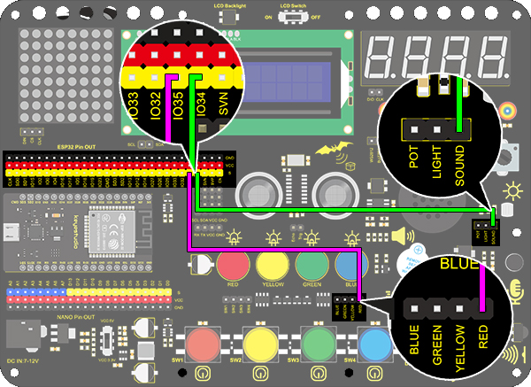
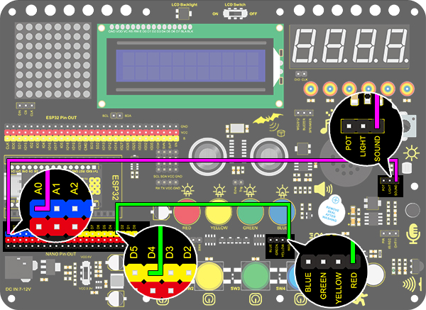
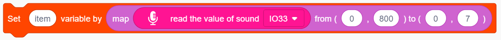
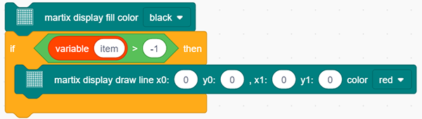

### Projekt 21 Soundgesteuerte LED

**1. Beschreibung**

Die soundgesteuerte LED ist ein Gerät, das Schall erkennt und die Helligkeit der LED steuert. Es besteht aus einem Arduino-Board und einigen Komponenten. Es kann mit mehreren Sensoren wie Mikrofonen verbunden werden. Der Schall wird in ein sich änderndes Spannungssignal umgewandelt, das vom Arduino empfangen wird, um die LED ein- und auszuschalten.

**2. Funktionsprinzip**

Beim Erkennen eines Schalls vibriert die Elektretfolie im Mikrofon, was die Kapazität ändert und eine subtile Spannungsänderung erzeugt.

Anschließend verwenden wir den LM386-Chip, um eine geeignete Schaltung zu bauen, die den erfassten Schall bis zu 200-fach verstärkt, was über ein Potentiometer eingestellt werden kann. Drehen Sie es im Uhrzeigersinn, um die Verstärkung zu erhöhen.

**3. Schaltplan**

**4. Testcode**

Finden Sie den Block „read the value“ im Bereich „Sound“ und geben Sie den gelesenen Schallwert über die serielle Schnittstelle aus. Konstruieren Sie die Blöcke wie folgt. Achten Sie darauf, beim Einsatz des Schallsensors keine Verzögerung hinzuzufügen.

**5. Testergebnis**

Nach dem Anschluss der Verkabelung und dem Hochladen des Codes öffnen Sie den seriellen Monitor und stellen die Baudrate auf 9600 ein. Der analoge Wert wird angezeigt.

**6. Erweiterungscode**

Das häufig zu sehende Flurlicht ist eine Art soundgesteuertes Licht. Gleichzeitig enthält es auch einen Fotowiderstand.

Im Unterschied dazu erstellen wir hier ein Modell, bei dem eine LED nur vom Schall beeinflusst wird. Wenn die analoge Lautstärke 100 überschreitet, leuchtet die LED für 2 Sekunden und geht dann aus.

**Flussdiagramm：**

**Schaltplan：**

**Code：**

1. Ziehen Sie zwei Basisblöcke.

2. Ziehen Sie einen „if else“-Block und füllen Sie das Sechseck mit einem item＞100-Block. Setzen Sie den Wert auf „read the value of sound IO33“. Wenn die Bedingung erfüllt ist, gibt die LED am Pin IO25 ein HIGH-Signal mit einer Verzögerung von 2 Sekunden aus; andernfalls gibt sie am gleichen Pin ein LOW-Signal ohne Verzögerung aus.

**Vollständiger Code:**

**7. Codeerklärung**

Liest den Wert des Schallsensors über den zugehörigen Pin aus.

  
Projekt 22 Geräuschpegelmesser

**1. Beschreibung**

Der Arduino-Geräuschpegelmesser stellt das Schallsignal als eine Reihe von Punkten dar, die in Mustern auf einer Punktmatrix angezeigt werden.

**2. Schaltplan**

**3. Testcode**

1. Ziehen Sie die Basisblöcke und initialisieren Sie das Display. Setzen Sie den Pin CS auf IO15 und die Helligkeit auf 3. Fügen Sie dann einen Variablenblock hinzu, wählen Sie int und benennen Sie ihn „item“ mit einer Anfangszuweisung von 0.

2. Fügen Sie einen Variablenblock hinzu und benennen Sie ihn „item“. Verwenden Sie eine Map-Funktion, um den gelesenen Schallwert von 0-4095 auf 0-7 zu konvertieren, wobei der angenommene Maximalwert des Schalls 800 beträgt.

3. Löschen Sie das Display.

4. Programmieren Sie eine Bedingung. Wenn die Variable item größer als -1 ist, zeigt die Punktmatrix (x0:0  y0:0 x1:1  y1:0) in roter Farbe an.

5. Wiederholen Sie Schritt 4, aber die Bedingung lautet, ob item größer als 0 ist. Wenn ja, leuchten die Punkte bei (x0:1  y0:0  x1:1  y1:1) auf. Nach diesem Prinzip bauen Sie die Codeblöcke entsprechend den folgenden Koordinaten auf.

6. Aktualisieren Sie abschließend das Display.

**Referenzkoordinaten:**

**Vollständiger Code:**

**4. Testergebnis**

Nach dem Anschluss der Verkabelung und dem Hochladen des Codes wird der Geräuschpegel auf der Punktmatrix angezeigt, wie unten dargestellt.