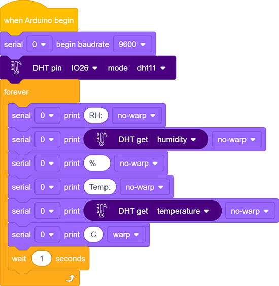
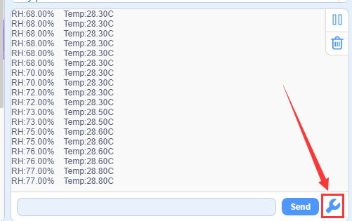
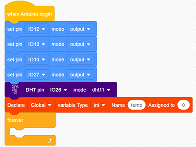
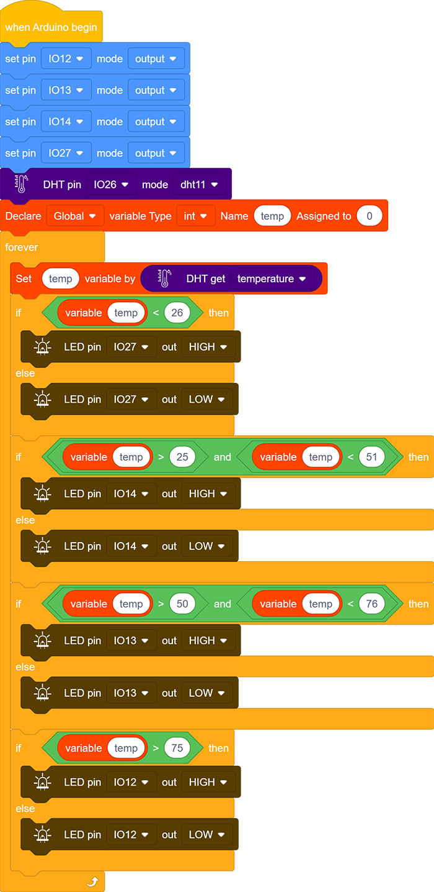
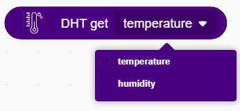

### Progetto 23 Smart Cup

**1. Descrizione**

In questo progetto, utilizziamo principalmente la scheda di sviluppo Arduino per creare una smart cup programmabile, che mostra la temperatura del liquido interno tramite un indicatore RGB. È possibile controllare la luminosità della luce impostando una soglia di temperatura. Se la soglia viene superata, la luce si illumina di più. Altrimenti, si attenua.

La smart cup aiuta gli utenti a controllare meglio la temperatura dell’acqua da bere e a prevenire efficacemente il surriscaldamento o il congelamento.

**2. Principio di funzionamento**

Le impostazioni relative al DHT11 sono fornite dai produttori, quindi è sufficiente leggere e processare i dati in ordine secondo il suo diagramma di sequenza.

Inoltre, i codici pertinenti sono inclusi nelle nostre librerie, rendendo comodo impostare i pin e leggere i valori.

**3. Schema di collegamento**

**4. Codice di test**

1. Trascina due blocchi base. Aggiungi il modulo di impostazione della velocità di trasmissione seriale e imposta il baud rate a 9600.

2. Trascina il modulo DHT dalla sezione “Temperatura e umidità” e imposta il pin su IO26, modalità su dht11.

3. Aggiungi il modulo di stampa seriale senza a capo, imposta la stampa su “RH:”, poi segui i passaggi successivi e aggiungi un ritardo di 1s.

**Codice completo:**

**5. Risultato del test**

Dopo aver collegato i cavi e caricato il codice, cliccaper aprire il monitor seriale, imposta il baud rate a 9600 e verranno visualizzati i valori di temperatura e umidità.

**6. Codice di espansione**

In questo esperimento di espansione, realizzeremo una smart cup che può mostrare la temperatura del liquido. Dividiamo 100 in quattro parti con un LED che rappresenta ciascuna:

- **LED rosso:** 100-75°C

- **LED giallo:** 75-50°C

- **LED verde:** 50-25°C

- **LED blu:** 25-0°C

**Diagramma di flusso：**

**Schema di collegamento：**

**Codice：**

1. Trascina due blocchi base. Poi imposta i 4 pin dei LED su “output”, il pin del DHT11 su IO26, modalità su dht11 e il nome della variabile su temp.

2. Assegna il valore di temperatura del DHT11 alla variabile temp.

3. Usa il blocco "if else" per valutare la variabile temp. Se le condizioni sono soddisfatte, il LED corrispondente si accende, altrimenti si spegne.

**Codice completo:**

**7. Spiegazione del codice**

1. In questo blocco di codice, il numero indicato può essere inserito nello spazio vuoto per collegare più sensori di temperatura e umidità. Dopo aver impostato il pin e la modalità, è possibile leggere il valore. In questo progetto, impostiamo la modalità su DHT11.

2. Blocco di codice per leggere temperatura e umidità.

