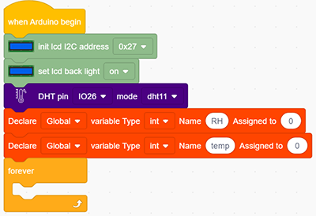
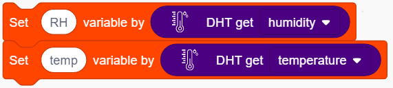

### プロジェクト24 天気観測ステーション

**1. 説明**

この天気観測ステーションは、Arduinoボードと温湿度センサーを使って周囲の温度と湿度の値を記録します。

さらに、環境パラメータに応じて温度と湿度の値を調整することで、快適な環境条件を実現します。

**2. 配線図**

**3. テストコード**

1. 2つの基本モジュールを追加します。LCD 1602を初期化し、LCD 1602のバックライトをONにします（LCDをONに切り替えることを忘れないでください）。dhtのピンをIO26に設定し、モードをdht11に設定します。2つのint変数「RH」と「temp」を0に設定します。

2. 湿度の値を変数RHに、温度の値を変数tempに割り当てます。

3. LCDの表示位置をx: 0、y: 0に設定します。lcd表示モジュールを追加し、表示文字を「humidity:」に設定します。もう一度lcd表示モジュールを追加し、変数RHを白いボックスに追加します。

4. ステップ3を繰り返しますが、yを1に設定し、表示文字を「temperature:」にして、変数tempを白いボックスに追加します。

**完成コード:**

**4. テスト結果**

配線を接続しコードをアップロードすると、LCD表示に周囲の湿度と温度の値が直接表示されます。

