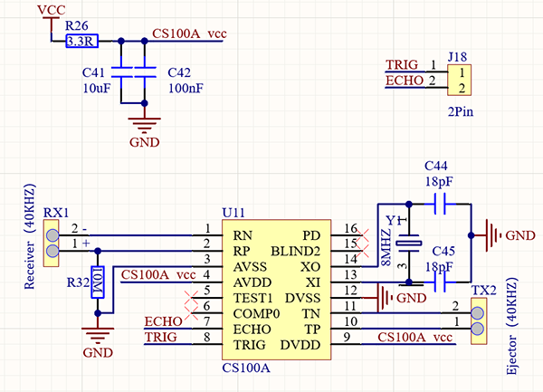
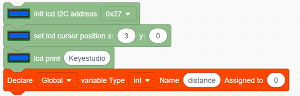
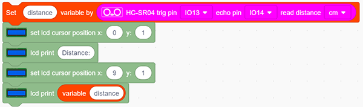
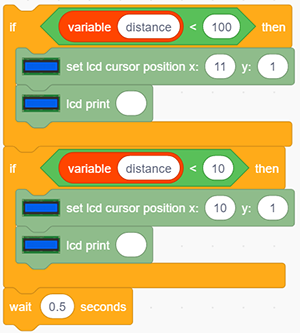

### Projet 25 Télémètre Ultrasonique

**1. Description**

Ce télémètre ultrasonique mesure la distance des obstacles en émettant des ondes sonores puis en recevant l’écho. Autrement dit, la distance n’est pas une valeur immédiate, mais une valeur observée par un calcul théorique de la différence de temps entre l’émetteur et le récepteur.

L’ultrason permet de détecter la forme des objets, de configurer des portes automatiques et d’estimer la vitesse d’écoulement ainsi que la pression.

De plus, il supporte un travail coopératif avec des ordinateurs. Ainsi, la valeur mesurée peut être transmise aux ordinateurs via une carte Arduino.

Dans la vie quotidienne, il est largement utilisé pour les moteurs, servos et LEDs ainsi que dans des systèmes (navigation automatique, contrôle et systèmes de surveillance de sécurité).

**2. Principe de fonctionnement**

Comme nous le savons tous, l’ultrason est un type d’onde sonore inaudible à haute fréquence. À l’image d’une chauve-souris, ce module mesure la distance des obstacles en calculant la différence de temps entre l’émission de l’onde et la réception de l’écho.

- **Distance maximale :** 3M

- **Distance minimale :** 5cm

- **Angle de détection :** ≤15°

**3. Schéma de câblage**

**4. Code de test**

Dans le bloc "forever", construisez deux blocs "serial print" et glissez un bloc "read distance" depuis “Ultrasonic”. Réglez la broche trig sur IO13 et la broche echo sur IO14, tous deux en cm. N’oubliez pas un délai de 0,5s.

**5. Résultat du test**

Après avoir connecté le câblage et téléversé le code, ouvrez le moniteur série, réglez le débit en bauds à 9600, et le port série commence à afficher la valeur de la distance.

**6. Extension des connaissances**

Faisons un télémètre.

Nous affichons des caractères sur un LCD 1602. Programme pour afficher "Keyestudio" en (3,0) et “distance :” en (0,1) suivi de la valeur de la distance en (9,1).

Lorsque la valeur est inférieure à 100 (ou 10), un résidu du troisième (ou du deuxième) chiffre subsiste encore. Par conséquent, un test "if" est nécessaire pour déterminer une condition précise.

**Schéma de câblage :**

**Code :**

1. Glissez les deux blocs de base.

2. Dans "LCD", initialisez le LCD. Glissez un bloc “LCD print” et ajoutez la chaîne de caractères “Keyestudio” (cela peut aussi être placé hors du bloc "forever" car cet affichage est fixe). Ajoutez un bloc "variable", définissez le type en int et nommez-le "distance" avec une affectation initiale à 0.

3. Affectez la valeur lue de la distance à la variable "distance". Configurez le LCD pour afficher “Distance :” suivi de la valeur de la distance (et il faut calculer à l’avance les caractères affichés devant pour positionner un curseur après eux).

4. Construisez un bloc "effacer les résidus d’affichage" lorsque le nombre de chiffres affichés diminue. Nous utilisons d’abord une condition pour vérifier si la distance est inférieure à 100 (ou 10). Si c’est le cas, un espace sera imprimé à la place du résidu du troisième (ou du deuxième) chiffre pour effacer l’affichage précédent. Enfin, n’oubliez pas d’ajouter un délai de 0,5s.

**Code complet :**

**7. Explication du code**

Lisez la distance après avoir configuré la broche trig et la broche echo. L’unité de la valeur affichée est optionnelle (cm ou pouce).

