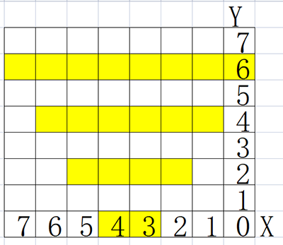

### Projet 27 Stationnement Intelligent

**1. Description**

Ce système de stationnement intelligent détecte et optimise la position de stationnement grâce à un capteur ultrasonique. Avec ce système, les erreurs de stationnement sont largement évitées.

Tout d'abord, vous devez installer le capteur autour du parking. Ensuite, il détectera la distance entre la voiture et ses bords et enverra l'information à la carte de développement afin de contrôler la voiture pour qu'elle s'ajuste automatiquement à la position de stationnement optimale.

**2. Diagramme de flux**

**3. Schéma de câblage**

**4. Code de test**

Attribuez la valeur de distance détectée à une variable, et vérifiez si elle est supérieure à la valeur seuil définie. Si c'est le cas, les lignes correspondantes sur la matrice de points s'allument. De cette manière, une distance peut être indiquée par l'allumage des lignes.

**Coordonnées de référence :**

**Code complet :**

**5. Résultat du test**

Après avoir connecté le câblage et téléchargé le code, des lignes s'afficheront sur la matrice de points. Si la distance détectée est inférieure à 50 cm, il y aura moins de lignes.

