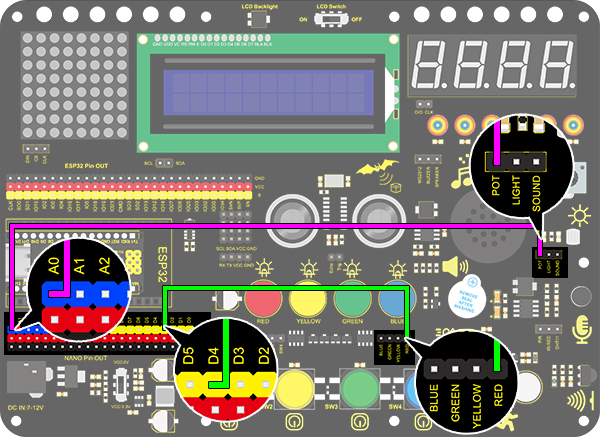
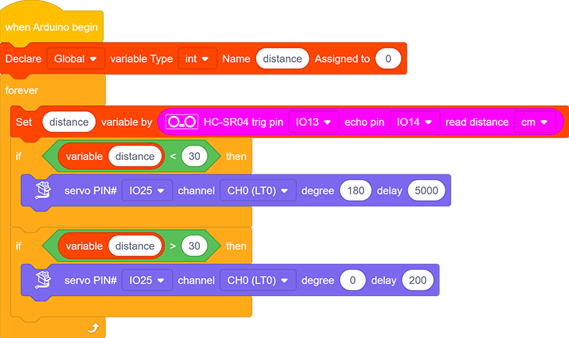

### Project 28 Intelligente Poort

**1. Beschrijving**

De intelligente poort is een intelligent parkeersysteem dat een MCU en ultrasone sensor integreert, welke automatisch de poort bestuurt op basis van de afstand van auto's, om zo de toegang van voertuigen beter te regelen.

Wanneer een bepaalde afstand wordt bereikt, ontvangt de MCU het signaal van de sensor en schat de afstand via de signaalsterkte. Als de auto nadert of vertrekt, zal de MCU de poort openen of sluiten via een servo.

**2. Stroomschema**

**3. Aansluitschema**

**4. Testcode**

Definieer een variabele "distance" met de toewijzing van de gedetecteerde afstandswaarde door de ultrasone module.

Vergelijk vervolgens de afstandswaarde met 30 cm. Als deze kleiner is dan 30 cm, zal de servo 180° draaien gedurende 5 seconden. Anders keert de servo terug naar 0°.

**5. Testresultaat**

Na het aansluiten van de bedrading en het uploaden van de code zal de servo 180° draaien gedurende 5 seconden als de gedetecteerde afstand minder is dan 30 cm. Anders zal de servo naar 0° draaien.