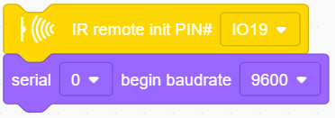
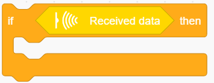
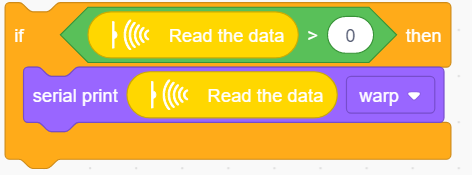
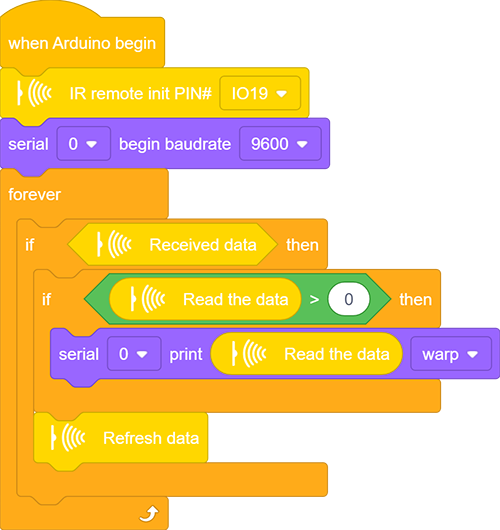
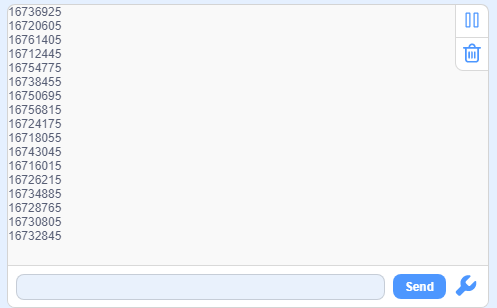
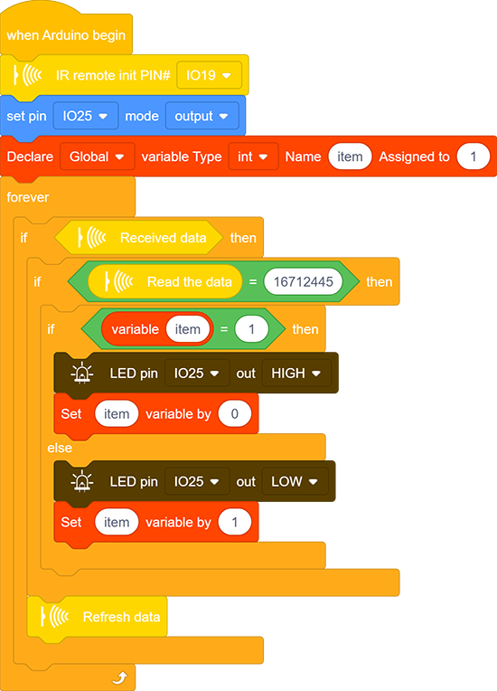

### Project 29 IR Afstandsbediening

**1. Beschrijving**

De IR-afstandsbediening gebruikt IR-signalen om een LED te bedienen, wat het proces van het aansturen van een LED aanzienlijk vereenvoudigt.

**2. Werking**

In dit project gebruiken we vaak een draaggolf van ongeveer 38K voor modulatie.

Het IR-afstandsbedieningssysteem omvat modulatie, uitzenden en ontvangen. Het verzendt data door modulatie, wat de transmissie-efficiëntie verbetert en het energieverbruik vermindert.

Over het algemeen ligt de frequentie van de draaggolfmodulatie tussen 30kHz en 60kHz (meestal 38kHz). De duty cycle van de vierkante golf is 1/3, zoals hieronder weergegeven, wat wordt bepaald door de 455kHz kristaloscillator aan de zendzijde.  
Een gehele frequentiedeling is essentieel voor de kristaloscillator aan deze kant, en de frequentiefactor is meestal 12. Daarom is 455kHz ÷ 12 ≈ 37,9kHz ≈ 38kHz.

38kHz draaggolf (volledig) zenddiagram:

- **Draaggolffrequentie:** 38kHz

- **Golflengte:** 940nm

- **Ontvangshoek:** 90°

- **Bedieningsafstand:** 6M

**Schema van afstandsbedieningsknoppen:**

**3. Aansluitschema**

**4. Testcode**

1. Sleep de twee basisblokken.

2. Zoek en sleep het blok "IR remote init" uit “IR Remote” en stel de pin in op IO19. Voeg een "baud rate" blok toe uit "serial" en stel deze in op 9600.

、

3. Sleep een "if" blok en vul de voorwaarde met "Received data". Alleen wanneer de IR-module data ontvangt, worden de codeblokken binnen "if" uitgevoerd.

4. Sleep nog een "if" blok en stel de voorwaarde in op "Read the data ＞ 0". Alleen wanneer aan deze voorwaarde wordt voldaan, begint de seriële poort met het afdrukken van data.

   Deze sensor werkt zo snel dat de code mogelijk twee keer of vaker wordt uitgevoerd terwijl je de bedieningsknoppen indrukt. De tweede keer dat hetzelfde commando wordt verzonden, wordt echter een waarde van 0 uitgezonden, dus een ">" blok is noodzakelijk om duplicatie te voorkomen.

5. Voeg een "serial print" blok toe na "then". Stel in om de gelezen data van de "IR remote" module af te drukken in de modus "warp".

6. Vergeet tot slot niet om de data te verversen na uitvoering.

**Volledige code:**

**5. Testresultaat**

Na het aansluiten van de bedrading en het uploaden van de code, open je de seriële monitor en stel je de baudrate in op 9600. Druk op de knop van de afstandsbediening en je ziet de waarde in hexadecimale notatie.

**6. Uitbreidingscode**

In deze uitbreidingscode maken we een lamp die wordt bediend door een IR-afstandsbedieningsschakelaar. Druk op OK om de LED aan te zetten en druk nogmaals om deze uit te schakelen.

Om deze herhaalbare werking te realiseren, is de variabele "item" essentieel in de hele code. De eerste keer is item = 0, zodat de code in "else" wordt uitgevoerd om 1 als nieuwe waarde toe te wijzen. De tweede keer, wanneer item = 1 is, wordt het "if" blok uitgevoerd om deze afwisselend weer op 0 te zetten.

**Aansluitschema:**

**Code:**

**7. Code-uitleg**

1. Initialiseer de IR remote module na het instellen van de ontvangpin.

2. Controleer of de sensor data heeft ontvangen. Zo ja, worden de gerelateerde codeblokken uitgevoerd.

3. Lees de ontvangen data van de IR-afstandsbediening.

4. Vernieuw de ontvangen data na elke volledige ontvangstuitvoering.

